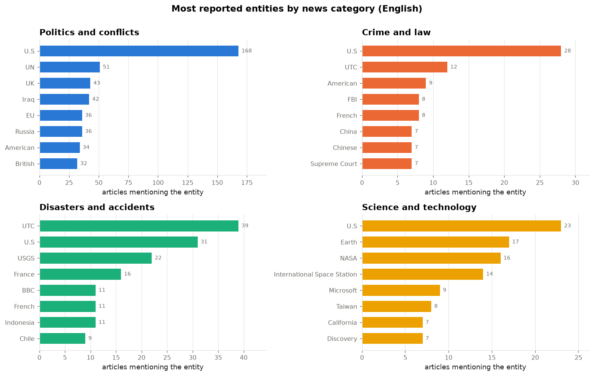
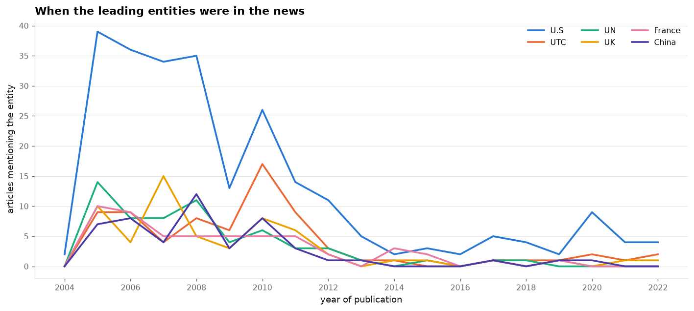
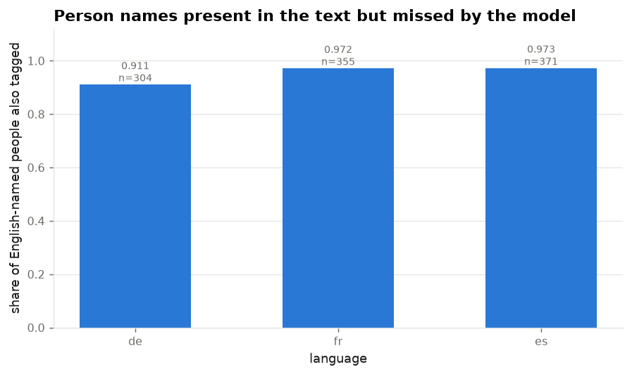
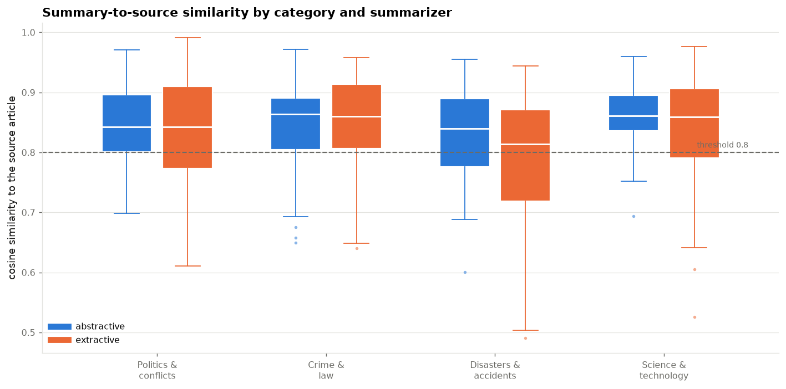
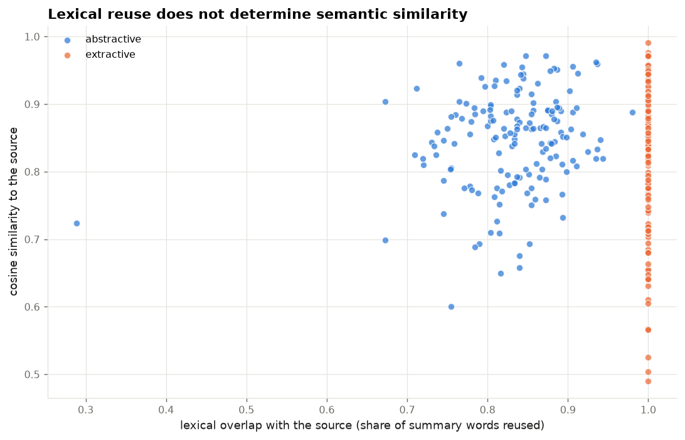
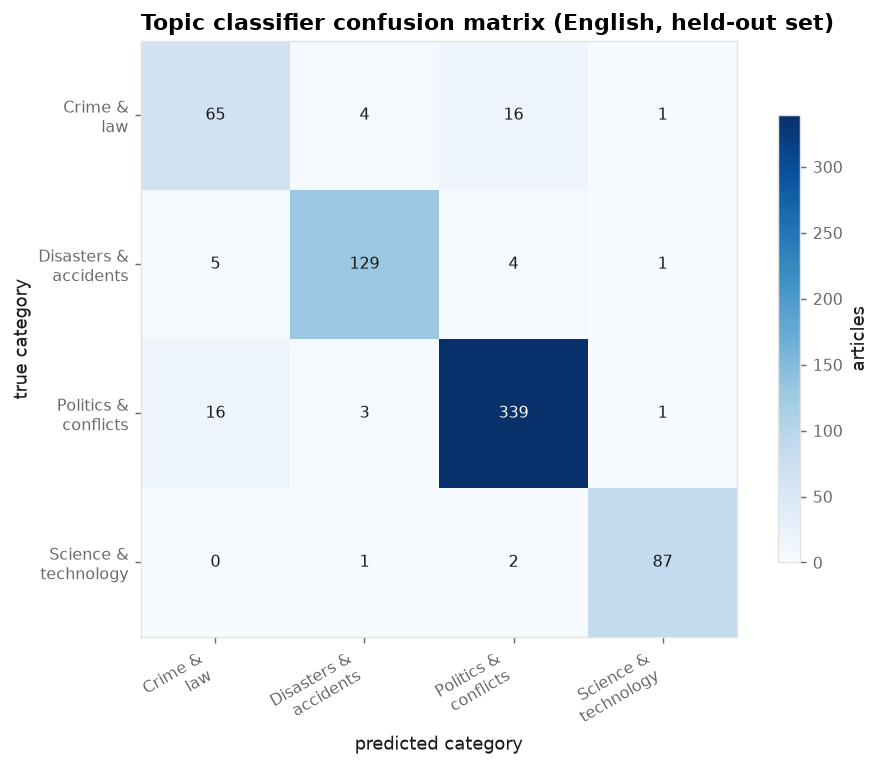

# WikiNews NLP: findings

Generated by `make report` from the pipeline's output tables.

## 1. Scope and data

The analysis covers **3,200 articles** in 4 languages
(de, en, es, fr) across 4 news
categories, published between 2004 and 2022.

They were drawn from the WikiNews corpus, capped at 800 per
language and sampled at random with a fixed seed. Random rather than stratified sampling preserves
the corpus's own category and year distribution.

Articles per language and category:

| lang   |   Crime and law |   Disasters and accidents |   Politics and conflicts |   Science and technology |   total |
|:-------|----------------:|--------------------------:|-------------------------:|-------------------------:|--------:|
| de     |             100 |                       194 |                      422 |                       84 |     800 |
| en     |             106 |                       165 |                      431 |                       98 |     800 |
| es     |             117 |                       173 |                      424 |                       86 |     800 |
| fr     |              84 |                       146 |                      469 |                      101 |     800 |
| total  |             407 |                       678 |                     1746 |                      369 |    3200 |

Pre-processing produced **1,074,437 tokens** with part-of-speech, dependency and lemma
annotation, at a median of 11 sentences per article.

One normalisation was a precondition for the rest. The raw corpus assigns ISO dates only to
English pages; translations retain a local-format string. Articles sharing a `pageid` describe the
same event, so the English date applies to its translations. That is what makes any time analysis
outside English possible.

## 2. Pre-processing (requirement 1)

Every article was sentence-split, tokenized, POS-tagged, dependency-parsed and lemmatized using
the language's own spaCy pipeline. All four pipelines are the `sm` size, which holds model
capacity constant for the cross-language comparison in section 4.

Share of tokens by part of speech (%):

| pos   |   de |   en |   es |   fr |
|:------|-----:|-----:|-----:|-----:|
| PROPN |  7.2 | 11.6 | 10.4 |  6.7 |
| NOUN  | 21.1 | 18.2 | 18.6 | 21   |
| VERB  |  8   | 10.5 |  8.3 |  8.7 |
| ADJ   |  5.7 |  5.8 |  6   |  6   |
| DET   | 13.5 |  9.4 | 13.1 | 13.4 |

The proper-noun row is the relevant one. English tags **11.6%** of its
tokens as proper nouns, against **7.2%** for German and
**6.7%** for French. Articles covering the same events should not differ
this much in name density, which indicates that the non-English taggers identify fewer names. The
NER error analysis in section 4 confirms this.

## 3. Named entity recognition (requirement 2)

**75,855 entity mentions** were extracted, covering
28,886 distinct entities at an average of
23.7 mentions per article.
Each mention carries its source article: `pageid`, title, language, category, publication date,
the character offsets of the span, and the containing sentence.

The four pipelines use different label sets. English uses OntoNotes (18 labels); the other three
use WikiNER (4). All labels were mapped onto a common coarse scheme (PERSON, ORGANISATION,
LOCATION, OTHER). OntoNotes numeric and temporal labels were dropped, since the other three
pipelines cannot produce them and retaining them would overstate English coverage.

Coarse label share by language (%):

| label        |   de |   en |   es |   fr |
|:-------------|-----:|-----:|-----:|-----:|
| LOCATION     | 45.3 | 31.5 | 35.4 | 40   |
| ORGANISATION | 16.5 | 29   | 14.1 | 19.2 |
| OTHER        | 19.5 | 15.1 | 24.1 | 13.6 |
| PERSON       | 18.8 | 24.4 | 26.4 | 27.2 |

### 3.1 Aggregated view

Entities are ranked by the number of articles mentioning them rather than by raw mention count: a
name repeated eleven times within one article represents one article.

| category                | surface                     | label        |   articles |   mentions |
|:------------------------|:----------------------------|:-------------|-----------:|-----------:|
| Politics and conflicts  | U.S                         | LOCATION     |        168 |        446 |
| Politics and conflicts  | UN                          | ORGANISATION |         51 |        105 |
| Politics and conflicts  | UK                          | LOCATION     |         43 |         80 |
| Politics and conflicts  | Iraq                        | LOCATION     |         42 |        127 |
| Disasters and accidents | UTC                         | ORGANISATION |         39 |         53 |
| Politics and conflicts  | EU                          | ORGANISATION |         36 |        107 |
| Disasters and accidents | U.S                         | LOCATION     |         31 |         43 |
| Crime and law           | U.S                         | LOCATION     |         28 |         65 |
| Science and technology  | U.S                         | LOCATION     |         23 |         31 |
| Disasters and accidents | USGS                        | ORGANISATION |         22 |         58 |
| Science and technology  | Earth                       | LOCATION     |         17 |         42 |
| Science and technology  | NASA                        | ORGANISATION |         16 |         51 |
| Disasters and accidents | France                      | LOCATION     |         16 |         18 |
| Science and technology  | International Space Station | ORGANISATION |         14 |         22 |
| Crime and law           | UTC                         | ORGANISATION |         12 |         13 |
| Disasters and accidents | French                      | OTHER        |         11 |         27 |
| Science and technology  | Microsoft                   | ORGANISATION |          9 |         24 |
| Crime and law           | American                    | OTHER        |          9 |         12 |
| Crime and law           | FBI                         | ORGANISATION |          8 |          9 |
| Crime and law           | French                      | OTHER        |          8 |         16 |

The United States leads every category, so what separates the profiles is what sits below it.
Disasters and accidents runs on **UTC** and **USGS**, the timestamps and the US Geological Survey
in its earthquake reports. Science and technology is **Earth**, **NASA** and the **International
Space Station**. Politics and conflicts is dominated by states rather than individuals.

### 3.2 Dynamics over time

Articles per year for the most reported entities:

|   year |   American |   China |   France |   French |   UK |   UN |   U.S |   UTC |
|-------:|-----------:|--------:|---------:|---------:|-----:|-----:|------:|------:|
|   2004 |          0 |       0 |        0 |        0 |    0 |    0 |     2 |     0 |
|   2005 |          8 |       7 |       10 |       10 |   10 |   14 |    39 |     9 |
|   2006 |          8 |       8 |        9 |        8 |    4 |    8 |    36 |     9 |
|   2007 |          8 |       4 |        5 |        6 |   15 |    8 |    34 |     4 |
|   2008 |          9 |      12 |        5 |        4 |    5 |   11 |    35 |     8 |
|   2009 |          7 |       3 |        5 |        4 |    3 |    4 |    13 |     6 |
|   2010 |          4 |       8 |        5 |        4 |    8 |    6 |    26 |    17 |
|   2011 |          0 |       3 |        5 |        4 |    6 |    3 |    14 |     9 |
|   2012 |          2 |       1 |        2 |        1 |    2 |    3 |    11 |     3 |
|   2013 |          1 |       1 |        0 |        1 |    0 |    1 |     5 |     1 |
|   2014 |          0 |       0 |        3 |        1 |    1 |    0 |     2 |     1 |
|   2015 |          0 |       0 |        2 |        2 |    1 |    1 |     3 |     0 |
|   2016 |          0 |       0 |        0 |        0 |    0 |    0 |     2 |     0 |
|   2017 |          1 |       1 |        1 |        1 |    1 |    1 |     5 |     1 |
|   2018 |          0 |       0 |        0 |        0 |    0 |    1 |     4 |     1 |
|   2019 |          0 |       1 |        1 |        1 |    1 |    0 |     2 |     1 |
|   2020 |          0 |       1 |        0 |        0 |    0 |    0 |     9 |     2 |
|   2021 |          0 |       0 |        0 |        1 |    1 |    0 |     4 |     1 |
|   2022 |          1 |       0 |        0 |        1 |    1 |    0 |     4 |     2 |

The series correspond to real events. Entities tied to a specific political period appear and
disappear with it, while state-level entities persist across the whole span.

The decline after 2011 is a property of the corpus rather than of the news. WikiNews published
substantially less after that point, so the later years rest on few articles and should not be
read as a trend.

### 3.3 Semantic groups

The 120 most reported English entities were embedded with a multilingual sentence
encoder and clustered with K-means (silhouette 0.196).

|   cluster |   size | dominant label   | members                                                                      |
|----------:|-------:|:-----------------|:-----------------------------------------------------------------------------|
|         0 |     29 | ORGANISATION     | U.S, UTC, UN, New York, Reuters, Wikinews, Associated Press                  |
|         1 |     23 | LOCATION         | France, French, Russia, EU, Russian, German, European                        |
|         2 |     21 | LOCATION         | Iraq, Afghanistan, Iraqi, Israel, Iran, Baghdad, Israeli                     |
|         3 |     19 | OTHER            | American, George W. Bush, Bush, Senate, Washington, Democratic, Barack Obama |
|         4 |     17 | LOCATION         | UK, British, BBC, Australia, Pakistan, London, Australian                    |
|         5 |     11 | LOCATION         | China, Chinese, Japan, Japanese, Indonesia, Taiwan, South Korea              |

No labels were supplied, and the smaller clusters still read as coherent groups: one per world
region, and one collecting the people and institutions of a single national politics.

The largest cluster is a residual, collecting entities that sit close to nothing else -- news
organisations and bare abbreviations. K-means over strings this short produces clusters that
overlap at their boundaries, which is what the silhouette score records, so the grouping is
indicative rather than a partition to rely on.

## 4. Wrongly predicted entities (requirement 3)

The corpus contains no gold NER annotation, so accuracy cannot be measured directly. It does
contain structure: articles sharing a `pageid` describe the same event. Three checks are built on
that.

### 4.1 Missed entities

Take a person named in the English article. If that name appears verbatim in the other language's
article text and the pipeline did not tag it, the model missed it. The presence of the name in the
text is what distinguishes a miss from a difference in editorial coverage. Place names are
excluded, because they are translated (London, Londres), which would produce false misses.

| lang   |   checked |   found |   recall_proxy |
|:-------|----------:|--------:|---------------:|
| de     |       304 |     277 |          0.911 |
| es     |       371 |     361 |          0.973 |
| fr     |       355 |     345 |          0.972 |

**de** is weakest at 0.911, against
0.973 for **es**, over 304 and
371 checked names respectively. This is consistent with the proper-noun
rates in section 2.

Matching is at token level, not substring: a substring test counts "Ross" as found inside
"Crossing" and places every language above 0.96.

### 4.2 Label disagreements

A name given different coarse labels by two pipelines means at least one is wrong. `Vereinigte
Staaten` is LOCATION to the German model and PERSON to the French one. `Twitter` is PERSON to the
English model and OTHER elsewhere.

Organisations are the weakest category. English assigns 29% of its mentions to
ORGANISATION against 14% for Spanish, and the Spanish organisations that are
missing reappear largely as OTHER.

### 4.3 Surface issues

| lang   |    ok |   determiner_included |   lowercase_span |   stray_punctuation |
|:-------|------:|----------------------:|-----------------:|--------------------:|
| de     | 90.78 |                  1.43 |             7.64 |                0.15 |
| en     | 89.09 |                 10.14 |             0.51 |                0.26 |
| es     | 85    |                 12.6  |             2.09 |                0.32 |
| fr     | 96.39 |                  1.84 |             1.71 |                0.06 |

Two of these are errors. `lowercase_span`, a span beginning with a lowercase common word, occurs
at 7.6% for German against
0.5% for English. German capitalises all nouns, so a model
relying on capitalisation has a weaker signal. `stray_punctuation` marks spans that absorbed a
comma or slash.

`determiner_included` is an annotation convention rather than an error: OntoNotes includes the
article in names such as "the United States", WikiNER does not. It is measured because it is why
entity keys strip leading articles, without which English and German would never aggregate to the
same entity. "Den Haag" is counted under it even though the article belongs to the city's name;
the stripping is consistent across German, so the entity counts stay correct.

A third error type appears in the mention table: the English pipeline tags untranslated quoted
Spanish inside English articles as PERSON, giving spans such as "tomar medidas de prevención".

## 5. Summarization (requirement 4)

10 articles were summarized for each of the four categories in each of
the four languages, giving **160 articles and 320 summaries**, by two methods:

- **Extractive (TextRank).** Sentences form a graph weighted by TF-IDF cosine similarity, ranked
  by PageRank, with the top three returned in document order. The vectorizer is fitted per article,
  so no per-language stop-word list is needed.
- **Abstractive (LLM via OpenRouter).** A fixed prompt at low temperature, summarizing in the
  article's own language, with every response cached on disk.

Section 6 compares the two.

Median compression (summary length divided by source length):

| method      |    de |    en |    es |    fr |
|:------------|------:|------:|------:|------:|
| abstractive | 0.296 | 0.243 | 0.258 | 0.288 |
| extractive  | 0.302 | 0.32  | 0.377 | 0.426 |

### 5.1 Grammar and style

No Java runtime is available here, so LanguageTool was not used. The checks are readability with
each language's own Flesch coefficients, and deterministic detection of the defects summarizers
produce.

Share of summaries exhibiting each fault (%):

| method      |   truncated |   repeated_sentence |   opens_with_pronoun |   has_preamble |   overlong_sentence |
|:------------|------------:|--------------------:|---------------------:|---------------:|--------------------:|
| abstractive |         0   |                 0.6 |                  0   |              0 |                   0 |
| extractive  |         6.9 |                 0.6 |                  1.9 |              0 |                  40 |

Mean words per sentence:

| method      |   words per sentence |
|:------------|---------------------:|
| abstractive |                 18.9 |
| extractive  |                 27.2 |

The two methods fail differently. Extractive summaries carry the faults of the sentences they
lift: 40% contain a sentence over 40 words, and
6.9% end without terminal punctuation because the sentence
splitter cut an abbreviation. They also open with an unresolved pronoun when the sentence naming
the subject was not selected.

The abstractive summaries show neither fault, at 18.9 words per sentence.
That follows from the prompt: asked only for three sentences, the model returned three of about
50 words each, and the explicit word target is what produced the figures above.

## 6. Similarity between summaries and sources (requirement 5)

Similarity is the cosine between multilingual embeddings of the summary and of the full source
article. Long articles are chunked at sentence boundaries and the chunk vectors averaged; without
that the encoder's input window truncates each article and every score would compare a summary
against the article's opening paragraph.

**Lexical overlap**, the share of the summary's words that appear in the source, is reported
alongside it.

| method      | category                |   n |   median |   p10 |   max |   pct_above_0.8 |
|:------------|:------------------------|----:|---------:|------:|------:|----------------:|
| abstractive | Crime and law           |  40 |    0.864 | 0.707 | 0.972 |            77.5 |
| abstractive | Disasters and accidents |  40 |    0.84  | 0.749 | 0.955 |            65   |
| abstractive | Politics and conflicts  |  40 |    0.843 | 0.759 | 0.971 |            77.5 |
| abstractive | Science and technology  |  40 |    0.861 | 0.791 | 0.96  |            85   |
| extractive  | Crime and law           |  40 |    0.86  | 0.744 | 0.958 |            75   |
| extractive  | Disasters and accidents |  40 |    0.814 | 0.654 | 0.944 |            52.5 |
| extractive  | Politics and conflicts  |  40 |    0.842 | 0.702 | 0.991 |            67.5 |
| extractive  | Science and technology  |  40 |    0.859 | 0.734 | 0.976 |            72.5 |

Share of summaries at or above the 0.8 threshold (%):

| method      |   pct_at_or_above_0.8 |
|:------------|----------------------:|
| abstractive |                  76.2 |
| extractive  |                  66.9 |

Spearman correlation of the similarity score with candidate explanatory features, computed
within each method:

| method      |   compression |   lexical_overlap |   source_chars |   summary_chars |
|:------------|--------------:|------------------:|---------------:|----------------:|
| abstractive |         0.566 |             0.162 |         -0.569 |          -0.103 |
| extractive  |         0.426 |           nan     |         -0.238 |           0.176 |

Within a method the correlations are read straight off. Across the pooled table they cannot be:
extractive overlap is 1.0 by construction, so a pooled coefficient measures the distance between
the two methods rather than any relationship inside either. Pooled, lexical overlap correlates
with similarity at roughly zero; within the abstractive summaries it is positive. The extractive
cell is empty because the feature does not vary there.

Compression is the one feature that behaves the same way for both methods: the more of the source
a summary keeps, the closer its vector sits to the source. That is arithmetic, not evidence of
quality, and it is why the threshold has to be read together with the compression column.

### 6.1 Highest and lowest scoring summaries

Highest:

| method      | lang   | category               |   similarity |   lexical_overlap |   compression |
|:------------|:-------|:-----------------------|-------------:|------------------:|--------------:|
| abstractive | de     | Politics and conflicts |       0.9626 |            0.9348 |         0.65  |
| abstractive | en     | Politics and conflicts |       0.9712 |            0.8478 |         0.578 |
| abstractive | fr     | Crime and law          |       0.9717 |            0.8727 |         0.753 |
| extractive  | fr     | Science and technology |       0.9727 |            1      |         0.952 |
| extractive  | es     | Science and technology |       0.9762 |            1      |         0.787 |
| extractive  | es     | Politics and conflicts |       0.9912 |            1      |         0.707 |

Lowest:

| method      | lang   | category                |   similarity |   lexical_overlap |   compression |
|:------------|:-------|:------------------------|-------------:|------------------:|--------------:|
| extractive  | en     | Disasters and accidents |       0.4904 |            1      |         0.067 |
| extractive  | de     | Disasters and accidents |       0.504  |            1      |         0.332 |
| extractive  | en     | Science and technology  |       0.5254 |            1      |         0.49  |
| abstractive | en     | Disasters and accidents |       0.6003 |            0.7544 |         0.126 |
| abstractive | es     | Crime and law           |       0.6497 |            0.8163 |         0.206 |
| abstractive | de     | Crime and law           |       0.6581 |            0.84   |         0.059 |

### 6.2 Interpretation

| method      |   median lexical overlap |   median similarity |   % at or above 0.8 |
|:------------|-------------------------:|--------------------:|--------------------:|
| abstractive |                    0.838 |               0.856 |                76.2 |
| extractive  |                    1     |               0.844 |                66.9 |

The two measures separate the methods in opposite directions. Extractive summaries reuse the
source's wording almost completely, at a median lexical overlap of 1.000, yet
clear the threshold less often than the abstractive summaries, whose median overlap is only
0.838.

Verbatim reuse therefore does not guarantee semantic closeness. TextRank selects three sentences
that are central within the article's own sentence graph, but three sentences cannot represent an
article developing several points, and the document embedding averages over all of them. The
abstractive summarizer compresses across the whole article instead of selecting from it, so its
vector sits closer to the document average.

That does not make the extractive scores the more trustworthy of the two. Where an extractive
summary scores highly, part of the score is mechanical: the encoder is comparing a text against a
document that contains it, as `similarity_vs_overlap.png` shows directly. A high abstractive score
carries more information, because the wording changed and the meaning still matched.

Read as a screening filter, the 0.8 threshold has to be taken together with the lexical
overlap. A summary passing it at an overlap near 1.0 has demonstrated copying, not comprehension.
On abstractive output, where overlap is well below 1.0, it passes 76.2% of
summaries.

The lowest-scoring cases share a shape: a long, multi-topic source compressed heavily. When an
article covering several developments is reduced to three sentences, the summary keeps one of them
while the document embedding averages over all. That is a property of single-vector similarity
rather than evidence of a poor summary. The highest scores go to short, single-topic articles where
three sentences cover the whole piece.

## 7. Topic prediction

A TF-IDF and logistic-regression classifier trained per language on articles carrying exactly one
topic label. About a quarter of the corpus carries two or more, and an article that is genuinely
both political and criminal cannot be scored fairly against a single-label prediction.

| lang   |   n_train |   n_test |   accuracy |   macro_f1 |   baseline_macro_f1 |
|:-------|----------:|---------:|-----------:|-----------:|--------------------:|
| en     |      2021 |      674 |      0.92  |      0.9   |               0.174 |
| es     |       579 |      194 |      0.897 |      0.867 |               0.173 |
| fr     |       537 |      180 |      0.917 |      0.891 |               0.185 |
| de     |       440 |      147 |      0.905 |      0.87  |               0.175 |

The baseline is a most-frequent-class classifier. One category holds more than half the articles,
so accuracy alone carries no information; macro F1 against the baseline is what shows the smaller
categories were learned.

The confusion matrix shows one substantial error mode: Crime and law against Politics and
conflicts, in both directions. That reflects genuine overlap in the source material -- the trial of
a former head of state belongs to both -- rather than a modelling failure.

## 8. Limitations

- **No gold NER labels.** The recall figures in section 4 are a proxy built from cross-lingual
  agreement. They support the ordering between languages, not a precise accuracy figure.
- **Small spaCy models.** The `sm` pipelines hold model capacity constant across languages. Larger
  pipelines shift the absolute figures; the ordering between languages is unlikely to change.
- **Entity aliasing is not entity linking.** A short alias table merges the most common
  abbreviations. Entities that are neither identical nor in that table still rank separately.
- **Similarity uses one vector per document**, which penalises correct summaries of multi-topic
  articles, as section 6.2 describes.
- **The corpus thins after 2011.** Year-on-year figures for the later period rest on few articles.

### 8.1 What the error rates mean for using this

The stated business use is screening news for brand health, competitors and political affairs.
Three measured properties of this pipeline bear on that.

The entity table is an index of named individuals built by a model with a measured error rate.
Section 4.3 shows spans that are not names at all, and section 4.2 shows names given the wrong
type by one pipeline and the right one by another. A count of how often a person appears is
therefore an estimate, and attaching it to a person without review would attribute to them the
model's mistakes as well as the corpus's coverage.

The error rate is not the same in every language. Section 4.1 puts German recall below Spanish and
French on the same events, so the same person is indexed less often when the coverage is German.
A monitoring system built on this would under-report German-language subjects, and would do so
silently, since nothing in the output distinguishes a subject who was absent from one the model
missed.

Abstractive summarization sends article text to a third-party API. That is acceptable for
published journalism and would not be for internal documents; the extractive path exists partly
because it runs entirely offline.

The corpus itself is published WikiNews text under its own licence, and the people named in it are
named in public reporting. Nothing here infers anything about a person that the articles do not
state.

## 9. Figures

**Most reported entities by news category**

**When the leading entities were in the news**

**Person names present in the text but missed by the model**

**Summary-to-source similarity by category and summarizer**

**Lexical reuse does not determine semantic similarity**

**Topic classifier confusion matrix**

