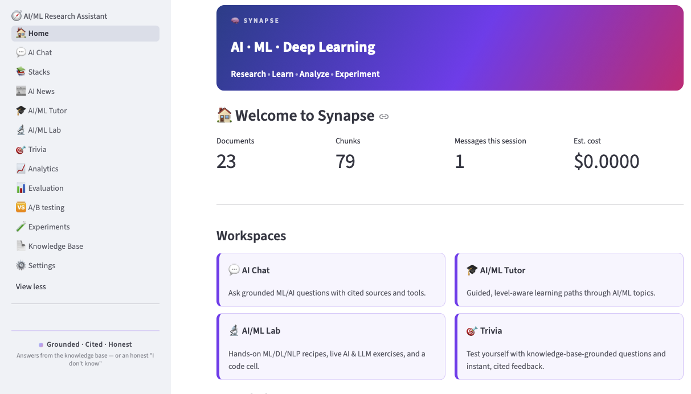

# 🧠 Synapse — *where AI, ML & deep learning connect*

[](https://github.com/TuringCollegeSubmissions/bidanu-AE.AFA.3.5/actions/workflows/check.yml)

Synapse is a **domain-specialised RAG chatbot** that assists with machine learning, deep learning, and AI engineering concepts. Instead of guessing, it **retrieves** answers from a curated knowledge base and **cites its sources**. When it doesn't know the answer, it says so plainly rather than inventing one.

> **Grounded · Cited · Honest** — every factual answer either points to the passages it came
> from, or states its uncertainty. Off-topic questions and prompt-injection attempts are
> refused.

Built with **Python 3.11+, Streamlit, LangChain, LangGraph, and Chroma**. This project was developed as part of the Turing College Sprint 2 programme, based on the assignment brief in [125.md](125.md).

<details>
<summary><b>New to the terms?</b> — A simply put English glossary (click to expand)</summary>

The following terminology is not required to use the app. It is included to make the rest of this README easier to read, regardless of your background.

| Term | In simple terms|
|---|---|
| **RAG(retrieval-augmented generation)**  | Before answering, the app looks up relevant passages in its own library and answers *from* them — grounded, not guessed. |
| **Knowledge base (KB)** | That curated library of documents the app answers from. |
| **Embedding** | A piece of text turned into a list of numbers, so the app can measure which passages are closest *in meaning*. |
| **Chunk** | A document sliced into smaller passages — the unit that actually gets retrieved and cited. |
| **Vector store** (Chroma) | The database that holds those number-lists and finds the closest matches to a question. |
| **Hybrid search / BM25** | Combines meaning-based matching with plain keyword matching, so exact terms (an acronym, a name) aren't missed. |
| **Corrective RAG (CRAG)** | If the looked-up passages look too weak, the app fetches more from outside (arXiv, the web) instead of bluffing. |
| **Structured output** | The model is made to reply in a fixed, checkable shape (like a form), so the app never has to guess-parse free text. |
| **LangGraph** | A library for writing the pipeline as an explicit graph of steps you can draw and inspect. |
| **MCP** (Model Context Protocol) | A standard way to let the app borrow extra tools from a remote server. |
| **RAGAs** | A way to *score* answer quality (faithfulness, relevancy, precision, recall) using an LLM as the judge. |
| **Prompt injection** | A message that tries to trick the model into ignoring its rules; the app screens for it before doing anything else. |

</details>

---

## 📚 Contents
1. [Get started in 4 simple steps](#get-started-in-4-simple-steps)
2. [What makes Synapse different?](#what-makes-synapse-different)
3. [How Synapse finds an answer](#how-synapse-finds-an-answer)
4. [Features at a glance](#features-at-a-glance)
5. [Explore the workspaces](#explore-the-workspaces)
6. [Project structure](#project-structure)
7. [Configuration](#configuration)
8. [Testing](#testing)
9. [Evaluation results](#evaluation-results)
10. [Technology Stack](#technology-stack)
11. [Tasks checklist](#tasks-checklist)
12. [Current limitations](#current-limitations)
13. [AI/ML Assistant App Preview](#ai/ml-assistant-app-preview)

---

## Get started in 4 simple steps

**Prerequisites:** Python 3.11+, the [`uv`](https://docs.astral.sh/uv/) package manager, and an
[OpenRouter API key](https://openrouter.ai/keys).

```bash
# 1 — create the single uv-managed virtual environment
make sync

# 2 — add your key to a .env file in the project root (never commit it; it is git-ignored)
#     OPENROUTER_API_KEY=...
#     GOOGLE_API_KEY=...          # optional — enables the Gemini model
#     EMBEDDING_BACKEND=api       # "API" (default) or "local" (free, fully offline)

# 3 — build the vector store from the documents in data/
make ingest

# 4 — launch the app
make run
```

> **Step 3 is required before your first question** — the app can't search an empty index.
> Re-run `make ingest` whenever you change documents in `data/` **or** switch the embedding
> backend/model (a different embedder produces number-lists of a different size, so the old index
> no longer lines up and must be rebuilt).

| Command | Description |
|---|---|
| `make help` | List every target with a one-line description (also what bare `make` prints) |
| `make sync` | Create/update `.venv` from `pyproject.toml` |
| `make run` | Launch the Streamlit app (`src/app.py`) |
| `make ingest` | Build the Chroma vector store from `data/` (confirms first: it spends embedding tokens) |
| `make doctor` | Read-only readiness report: index drift, credentials, accounts. Spends nothing |
| `make test` | Run the pytest suite (**fully offline tests**). One test: `make test T=tests/test_x.py::test_y` |
| `make mcp-serve` | Optional — publish Synapse's own tools as an MCP server (`src/mcp_server.py`) |
| `make lint` / `make format` | Ruff check / format on `src tests conftest.py` |
| `make fix` | Auto-fix whatever `make check` would reject (Ruff `--fix`, then format) |
| `make format-check` | Verify formatting without rewriting files (what CI runs) |
| `make check` | The full gate: lint + format check + tests — run this before pushing |
| `make clean` | Remove caches, leaving `.venv` alone (`make clean-venv` removes that too) |

`make check` is exactly what CI runs: [`.github/workflows/check.yml`](.github/workflows/check.yml)
repeats lint → format → pytest on every push to `main` and every pull request. The badge at the
top of this README reflects the latest run on `main` — click it (or open
[Actions → check](https://github.com/TuringCollegeSubmissions/bidanu-AE.AFA.3.5/actions/workflows/check.yml)) to see which runs
passed or failed, and the full logs for each step. The gate needs **no secrets** — the test
suite is fully offline (fake LLM, KB, tools), so no API key is ever exposed to Actions.

---

## What makes Synapse different?

Ask it something like *"How do transformers use attention?"* or *"Explain LoRA to a
beginner."* — and three rules govern every reply:

- **In the knowledge base** → answered **from the retrieved passages**, with inline citations
  (`[1]`, `[2]`, …) you can expand to read the source.
- **On-topic but *not* in the knowledge base** → answered from general knowledge, but only
  behind an explicit *"(Not covered by the knowledge base…)"* disclaimer, so you always know
  when it left its sources.
- **Off-topic, or a prompt-injection attempt** → **politely refused**.

You also steer *how* it teaches, from ⚙️ Settings:

| Dial | Options |
|---|---|
| **Subject** | Machine Learning · Deep Learning · AI Engineering · their shared Overlap · All |
| **Learner level** | Beginner · Practitioner · Researcher |
| **Prompt technique** | Standard · Chain-of-Thought · Few-shot · Socratic · Analogy-first |
| **Response length** | Concise · Balanced · Detailed |

Choosing a subject simply filters which documents are in play; the shared-foundation topics in
`data/overlap/` (embeddings, optimisation, evaluation) show up whichever single subject you pick,
because they underpin all of them.

---

## How Synapse finds an answer

Every question follows the same simple process: first it's checked for safety, then the app decides what kind of question it is, and finally it generates the best answer. Here's the complete journey:

```
User question
     │
     ▼
1. Input validation  ───────────────► reject empty / oversized input
     │
     ▼
2. Injection screening (classifier + regex patterns)  ──► refuse if malicious   ← always first
     │
     ▼
3. Route classification (structured output + confidence)
     │
     ├── knowledge → retrieve → grade sufficiency → [augment if weak] → generate (cited)
     ├── tool      → tool-calling answer (arXiv · calculator · token/cost)
     ├── meta      → answer about the app itself ("what can you do?")
     ├── agent     → bounded plan → act → observe loop  (opt-in)
     └── off_topic → polite domain refusal
     │
     ▼
Cited answer + sources + tool cards + full trace  →  rendered in Streamlit
```

A couple of things to know:


- **Safety always comes first.** Every question is checked before anything else, so unsafe or malicious prompts are filtered out before they reach the rest of the app.
- **Smart routing keeps costs low.** A small, fast AI model decides how to handle your question. The larger chat model is only used when it's actually needed.


<details>
<summary><b>Want the technical details?(click to expand)</b></summary>

The app's processing pipeline is written in Python (`src/core/`) and is completely separate from the user interface, making it easy to test on its own.

It supports two ways of running the same pipeline:

- **Linear** (default) – a simple step-by-step workflow.
- **Graph** – the same workflow built with LangGraph, making it easier to visualise and debug.

Both versions use the same processing steps and are tested to ensure they produce identical results (`tests/test_engine_parity.py`). You can switch between them in **⚙️ Settings**.

The routing model is also independent of the chat model, so you can choose one model to classify questions and another to generate answers.

</details>


---

## Features at a glance

[125.md](125.md) lists the main requirements and optional Easy, Medium, and Hard tasks. This is a brief overview of what Synapse app implements and where its features are found.


### Core requirements — implemented

| Requirement  |How the app supports it | Code |
|---|---|---|
| **1 · RAG with a KB, embeddings, chunking, similarity search** | Front-matter-tagged docs → `RecursiveCharacterTextSplitter` (1200/200) → Chroma (cosine). Retrieval is **hybrid**: dense vectors blended with a hand-written BM25 keyword scorer. | `src/rag/` |
| **2 · At least 3 domain tool calls** | **arXiv search**, a **SymPy symbolic/numeric calculator** (killable, timeout-guarded subprocess), and a **token & cost estimator** — run in a bounded tool loop. | `src/tools/`, `src/generation.py` |
| **3 · Domain specialisation + prompts + security** | Curated AI/ML KB; a grounded system prompt with learner-level/technique/length styling; a layered security stack. | `src/generation.py`, `src/config.py`, `src/security.py` |
| **4 · LangChain + OpenRouter, error handling, input validation** | `ChatOpenAI` via OpenRouter (optional native Gemini); length/empty validation; graceful degradation is enforced, not incidental. | `src/llm.py`, `src/security.py` |
| **5 · Intuitive UI: context, sources, tool results, progress** | Multi-page Streamlit studio: cited-source expanders and tool-call cards. **No blocking call hangs silently** — every network/LLM surface shows progress: a spinner for single calls, live per-node status for the LangGraph engine, and a `done/total` progress bar for batch eval/A-B runs; per-stage timings surface in the 🧪 Experiments trace. | `src/ui/`, `utils.py` |


#### Every sub-requirement checklist item:

A checklist version of the table above. Each item from the [125.md](125.md) core list is linked to its exact location, making it easy to verify at a glance.


**RAG implementation**
- [x] Domain knowledge base — `data/{ml,dl,ai,overlap}/` (front-matter-tagged AI/ML notes)
- [x] Document retrieval with embeddings — `src/rag/embeddings.py` (API `OpenAIEmbeddings` + offline `LocalEmbeddings`)
- [x] Chunking strategy — `src/rag/ingest.py:99` (`RecursiveCharacterTextSplitter`, 1200/200)
- [x] Similarity search — `src/rag/retriever.py` (Chroma cosine **+** BM25 hybrid blend)

**Tool calling**
- [x] arXiv paper search — `src/tools/arxiv.py:122` (`@tool search_arxiv`)
- [x] Token & cost estimator — `src/tools/tokens.py:11` (`@tool estimate_tokens_and_cost`)
- [x] SymPy calculator — `src/tools/calculator.py:115` (`@tool math_calculator`)
- [x] Tools run in a bounded LLM tool loop — `src/generation.py`

**Domain specialisation**
- [x] Focused domain + KB — AI/ML; subjects/techniques in `src/config.py`
- [x] Domain-specific prompts & responses — `src/generation.py` (level/technique/length styling)
- [x] Domain security measures — `src/security.py` (injection patterns + domain vocabulary), screened
  in `src/core/router.py:257` (`screen_injection`) and run **first** by `src/core/steps.py:217`, before routing

**Technical implementation**
- [x] LangChain + OpenRouter (OpenAI-compatible SDK) — `src/llm.py:46` (`ChatOpenAI`, `base_url=OPENROUTER_BASE_URL`)
- [x] Proper error handling / graceful degradation — `src/core/service.py:112,152`, `src/generation.py:155`
- [x] User input validation — `src/security.py:283` (`validate_input`), called at `src/core/service.py:99`

**User interface (Streamlit)**
- [x] Intuitive multi-page UI — `src/app.py` + `src/ui/pages/`
- [x] Shows context & sources — `src/ui/pages/chat.py` (📎 cited-source expanders, `bundle.sources`)
- [x] Displays tool-call results — `src/ui/pages/tools.py` (tool playground) + 🛠️ tool-call cards in chat
- [x] Progress indicators for long ops — `st.spinner` / `st.status` / `st.progress` across 10 pages; per-stage timings in 🧪 Experiments (`utils.py`)


### Retrieval that goes beyond the basics

Instead of searching once and hoping for the best, the app takes a few extra steps to improve its answers.

- **It rewrites follow-up questions.** If you ask something like *"How is it trained?"*, app uses the conversation to turn it into a complete search query before looking for information(`rag/retriever.py`).
- **It checks whether it found enough information.** If the retrieved sources aren't strong enough to answer your question, app searches for more information from trusted external sources, including **arXiv** and **live web search**, and cites them in its answer (the *corrective RAG*; `core/steps.py`, `core/sources.py`.)
- **It works the same in both modes.** Whether you use the default pipeline or the LangGraph version, the same retrieval process is used, and tests ensure they produce the same results.


---

### User authentication & personalisation

The spec's medium task 4 has two halves — the app implements both, but they work in different
ways, so it's worth being precise about each.

**Personalisation — always on, no account needed.** Every answer is shaped by the dials in
⚙️ Settings (subject, learner level, prompt technique, response length, chat model, and which
engine runs). These are held in Streamlit **session state**, so each visitor gets their own
independent, in-memory setup for the length of their visit; the choices ride along in the
conversation export too. There is no per-user profile stored on disk — the personalisation is
*per session*, which is exactly the right grain for a stateless, single-visit study tool.

**Authentication — real accounts on a deployed app.** Synapse supports two independent doors,
and which one you get depends only on what is in secrets. With neither configured the app runs
fully open, which is what `make run` on a laptop should do.

**Native OpenID Connect is the deployment path.** `st.login()` / `st.user` (Streamlit ≥ 1.42,
`authlib`) puts **Log in** and **Sign up for free** in the top bar and sends a visitor to Google,
Auth0, Microsoft or Okta. Both buttons start the same flow, and that is not a placeholder standing
in for a registration form: with an identity provider there *is* no separate sign-up — a visitor
without an account creates one at the provider and arrives back here signed in. Synapse stores no
passwords, keeps no user table, and never sees a credential.

- **Configured entirely in `[auth]`** — `redirect_uri`, `cookie_secret` and the provider's
  `client_id` / `client_secret`. On Streamlit Community Cloud that goes in the app's Secrets box;
  `.streamlit/secrets.toml.example` has the Google walkthrough and the multi-provider layout.
- **Sessions survive a refresh**, and signing out is `st.logout()` from the account menu.

**The built-in password gate is the fallback**, for a host with no identity provider.
`src/auth.py` still offers the `streamlit-authenticator` username/password guard in front of the
whole app, with cookie-persisted sessions. It now reads **`[password_auth]`** rather than
`[auth]`, because Streamlit parses any unrecognised `[auth]` sub-table as the *name of a
provider* — an old `[auth.credentials]` block would be read as a provider called "credentials".
A legacy `[auth]` section that carries `credentials` is still honoured, so existing installs keep
working. There is deliberately no self-service sign-up on this path: `st.secrets` is read-only on
Community Cloud, so a registration form would accept an account and then silently lose it.

**Use a key — bring your own credential.** A popover in the same top-bar row takes an OpenRouter
key so a visitor's questions are billed to them rather than to whoever deployed the app. The key
is **validated against OpenRouter before it is accepted** (a key with one character missing would
otherwise fail *quietly*: Synapse retrieves and cites before it generates, so the run looks fine
right up until the answer). It lives in that browser session's server-side store only — never
written to disk, never logged, never in a URL — and **Forget my key** drops it before the tab
closes. Internally it is a *thread-local* override in `src/config.py`, not a module global: each
Streamlit session runs in its own thread, and a global would let one visitor's key pay for
another visitor's question.

**Personalisation and saved conversations.** ⚙️ Settings is still per-session. What is now kept
across a visit is the **conversation**: 🕘 Past chats in the sidebar lists every thread, newest
first, with a per-thread delete and a **Delete all**, each taking two presses. Threads are one
JSON file each under `outputs/chat_history/`, in a **directory per visitor** keyed by a hash of
their identity — on a deployment everyone shares one filesystem, and that is the only thing
keeping their questions apart. On Community Cloud that filesystem is **ephemeral**: threads
survive refreshes and reconnections and are wiped on reboot or redeploy, so point
`SYNAPSE_CHAT_DIR` at a mounted volume if they need to outlive one.

### The app's top-right controls

Two groups share the header strip, and they belong to different applications.

**Synapse's own row**, lifted onto the header beside the Deploy button by a single CSS rule
(`theme.TOP_BAR_CSS`, `@media (min-width: 900px)`):

| Control | What it does |
|---|---|
| 🆕 **New chat** | Starts a fresh conversation. Nothing is deleted — the current thread is written out first, so what just left the screen is the top row of 🕘 Past chats. |
| **Log in** | `st.login()` to the configured provider. Disabled, with the reason in its tooltip, when none is configured. |
| **Sign up for free** | The same flow. A visitor without an account creates one at the provider and returns signed in. |
| **Use a key** | A popover taking an OpenRouter key for this browser session, checked before it is accepted. |

Once someone is identified the four collapse to their **name**, with the account menu (email,
log out, own-key controls) behind it — one line until they ask it to take more. Below 900px the
header has no room to share, so the rule is dropped and the row falls back into the page, where
it still fits. The right offset clears Streamlit's **Stop** button as well as Deploy; Stop is the
one neighbour it must never cover, since a reader watching a long retrieval has to be able to
stop it.

**Streamlit's own menu** is unchanged and still to their right: *Rerun*, *Settings* — where the
**Light / Dark / Use-system-setting** theme switch lives, along with wide mode — *Print* and
*About*. Synapse ships no custom theme toggle; its hero banner and CSS are styled to read cleanly
under both themes, so the native switch just works.


---

## Explore the workspaces

A multi-page Streamlit studio. The sidebar is **grouped**, in the shape most chat apps have
settled on: **🧭 AI/ML Research Assistant** (🏠 Home, 💬 AI Chat) at the top, then **Learn**
(🎓 Tutor, 🔬 Lab, 🎯 Trivia), **Analyse** (📈 Analytics, 📊 Evaluation, 🆚 A/B testing,
🧪 Experiments), **Knowledge** (📰 AI News, 📚 Stacks, 📄 Knowledge Base), and **System**
(⚙️ Settings) last. The sidebar and the 🏠 Home cards are both built from the same
`get_sections()` grouping, so they cannot drift apart. Adding a workspace is one file in
`src/ui/pages/` with a `@register_page` decorator — the sidebar and Home update automatically.

| Area | Workspace | Intended use |
|---|---|---|
| **Workspaces** | 🏠 Home | Landing dashboard: KB/session status and jump-in cards |
| | 💬 AI Chat | The main assistant — cited answers, tool cards, model + per-answer settings, export |
| | 🎓 AI/ML Tutor | Guided, level-aware learning paths |
| | 🔬 AI/ML Lab | Hands-on recipes, LLM exercises, and a live code cell |
| | 🎯 Trivia | KB-grounded quizzes with instant feedback |
| **Knowledge** | 📚 Stacks | Evergreen **courses, tools & references** per subject (→ 🎓 Tutor for lessons, 📰 AI News for live papers) |
| | 📰 AI News | Stay **current** — live arXiv papers, plus lab newsrooms, digests, and voices to follow |
| **Analyze & Experiment** | 📈 Analytics | **Session-wide** token usage and cost across every answer (per-question breakdown lives in 🧪 Experiments) |
| | 📊 Evaluation | Score **one** RAG configuration in absolute terms over the golden set |
| | 🆚 A/B testing | Compare **two** RAG strategies head-to-head under one shared judge |
| | 🧪 Experiments | Inspect **one** question end-to-end: full trace + a playground to fire each tool call standalone (incl. the arXiv tool call) |
| **System** | 📄 Knowledge Base | Inspect/upload/re-index docs; promote external passages |
| | ⚙️ Settings | Model, generation, RAG tuning, engine, MCP, status |

---

## Project structure

The codebase is a **pure-Python core with a Streamlit UI on top**: everything under `src/core`,
`src/rag`, `src/tools`, `src/eval`, `src/lab`, and `src/quiz` runs without Streamlit and is unit-
tested offline; `src/ui` is the only place the UI framework is imported. Each file below carries a
one-line note on what it does.

```
src/                      # all application code
│
│  ── top-level modules (shared by every workspace) ──
├── app.py                # Streamlit entry point: builds the page registry and sidebar brand
├── config.py             # one home for paths, the model + price list, and tunable defaults
├── generation.py         # learner-level prompts, answer styling, and the RAG + tool-calling loop
├── llm.py                # chat-model factory: OpenRouter by default, native Gemini optional
├── security.py           # input validation, injection screening, and the AI/ML domain gate
├── auth.py               # who is visiting: OIDC sign-in, own-key, password-gate fallback
├── export.py             # turn a conversation into a JSON, CSV, or PDF transcript
├── ratelimit.py          # per-session token-bucket rate limiter
├── runlog.py             # append-only JSONL run log for lightweight monitoring
├── utils.py              # token/cost estimation, stage timing, retry-on-transient-failure
├── doctor.py             # `make doctor`: read-only readiness report (index drift, keys)
├── mcp_server.py         # optional: expose app's own tools to any MCP client (make mcp-serve)
│
├── core/                 # the answer pipeline — pure python, never imports Streamlit
│   ├── schemas.py        #   typed router / injection results (structured-output contracts)
│   ├── router.py         #   the decision layer: pick a route and screen for injection
│   ├── steps.py          #   the shared steps — single source of truth for both engines
│   ├── linear.py         #   engine A — lightweight if/elif router (the default)
│   ├── graph.py          #   engine B — the same steps as an explicit LangGraph StateGraph
│   ├── agent.py          #   opt-in bounded plan → act → observe loop
│   ├── sources.py        #   pluggable external sources for CRAG augmentation (arXiv, web)
│   ├── mcp_client.py     #   remote MCP client: borrow a remote server's tools for the loop
│   └── service.py        #   AssistantService — runs one request, owns its cost + trace
│
├── rag/                  # retrieval: from raw documents to ranked, citable passages
│   ├── embeddings.py     #   pluggable embedding backends (API default, local fallback)
│   ├── ingest.py         #   build the Chroma vector store from data/
│   ├── retriever.py      #   hybrid BM25 + vector search, and LLM query rewriting
│   └── promote.py        #   fold approved external passages back into the curated KB
│
├── tools/                # the tools the model can call inside the answer loop
│   ├── arxiv.py          #   arXiv paper search
│   ├── calculator.py     #   symbolic / numeric maths via SymPy, guarded against abuse
│   └── tokens.py         #   token-count and cost estimation
│
├── eval/                 # self-hosted RAGAs-style evaluation harness
│   ├── schemas.py        #   typed judge results (structured-output contracts)
│   ├── judge.py          #   the LLM-as-judge, over structured outputs
│   ├── metrics.py        #   the four RAGAs metrics, built on the judge
│   ├── dataset.py        #   load the golden question + reference-answer set
│   ├── runner.py         #   answer each sample, score it, aggregate the report
│   └── compare.py        #   diff two runs — powers the 🆚 A/B testing page
│
├── lab/                  # 🔬 AI/ML Lab + 🎓 Tutor: hands-on learning, all offline
│   ├── curriculum.py     #   the shared lesson plan (one source for both Lab and Tutor)
│   ├── datasets.py       #   bundled toy datasets — no downloads
│   ├── recipes.py        #   guided, parameterised ML / DL / NLP recipes
│   ├── challenges.py     #   level-scaled, auto-checked practice challenges
│   ├── understanding.py  #   LLM-graded "check your understanding" for concept lessons
│   ├── seed.py           #   LLM-written starter code for the opt-in advanced cell
│   ├── llm_exercises.py  #   live-model exercises for the AI & LLM topic
│   ├── sandbox.py        #   restricted in-process runner for the code cell
│   └── schemas.py        #   typed contract for the LLM code-seeding
│
├── quiz/                 # 🎯 Trivia: grounded multiple-choice questions + grading
│   ├── quiz.py           #   build quiz items from KB passages, grade deterministically
│   └── schemas.py        #   typed contracts for quiz generation
│
└── ui/                   # the Streamlit layer — the only place Streamlit is imported
    ├── registry.py       #   @register_page + get_sections + go_to_page (cross-page jumps)
    ├── state.py          #   session-state setup and cached access to the knowledge base
    ├── theme.py          #   shared look: brand mark, injected CSS, hero banner, footer
    ├── exporters.py      #   shared JSON / CSV / PDF download buttons
    ├── models.py         #   shared model picker — ⚙️ Settings and the Chat popover, one key
    └── pages/            #   one module per workspace (drop one in and it auto-registers)
        ├── home.py           # 🏠 Home — landing dashboard: status + jump-in links
        ├── chat.py           # 💬 AI Chat — the main assistant, with sources + tool cards
        ├── ml_tutor.py       # 🎓 AI/ML Tutor — guided, level-aware learning paths
        ├── ml_lab.py         # 🔬 AI/ML Lab — recipes, exercises, and a live code cell
        ├── quiz.py           # 🎯 Trivia — KB-grounded quizzes with cited feedback
        ├── resources.py      # 📚 Stacks — curated crash courses and the app's own docs
        ├── ai_news.py        # 📰 AI News — live arXiv feed + a news-source directory
        ├── analytics.py      # 📈 Analytics — token usage and cost for the session
        ├── evaluation.py     # 📊 Evaluation — run the RAGAs harness over the golden set
        ├── ab_testing.py     # 🆚 A/B testing — two RAG strategies head-to-head
        ├── inspector.py      # 🧪 Experiments — full trace of the last question + tool playground
        ├── knowledge_base.py # 📄 Knowledge Base — inspect / upload / re-index; promote passages
        ├── tools.py          # tool playground — run each tool standalone
        └── settings.py       # ⚙️ Settings — model, generation, RAG, engine, MCP, status

data/                     # everything the app reads from disk
├── ml/ dl/ ai/ overlap/  #   the knowledge base — 23 source docs; the folder sets a doc's subject
├── eval/golden.jsonl     #   21-sample golden set for the evaluation harness
└── promoted/             #   notes promoted from external sources (folded in on the next re-ingest)

.streamlit/config.toml    # light and dark variants of the brand violet, and no telemetry
chroma_db/                # generated vector store (git-ignored; rebuilt by make ingest)
tests/                    # 455 offline pytest tests — LLM, KB, tools, and sources all injectable
```

---

## Configuration

Everything is set via `.env` (loaded by `python-dotenv`) and the ⚙️ Settings page (API keys should never be hard-coded, printed, or committed.).

| Variable | Default | Purpose |
|---|---|---|
| `OPENROUTER_API_KEY` | — | **Required.** LLM + embedding access via OpenRouter |
| `GOOGLE_API_KEY` | — | Optional. Enables the native `gemini-native` model |
| `EMBEDDING_BACKEND` | `api` | `api` (Text Embedding 3 Large) or `local` (free, offline sentence-transformers) |
| `API_EMBEDDING_MODEL` | `openai/text-embedding-3-large` | The API embedding model |
| `ROUTER_MODEL` | `openai/gpt-4o-mini` | Cheap model for routing + injection screening |

Chat models and per-1M-token prices live in the model registry in `config.py`; retrieval and
generation knobs live in the `RagSettings` dataclass and are surfaced in ⚙️ Settings.

---

## Testing 

- **`make test` → 455 passing tests, all offline.** The LLM, knowledge base, tools, and
  external sources are injectable, so every route is exercised deterministically with no network
  or API key. Coverage highlights: engine parity, security/injection, hybrid BM25, Corrective
  RAG, the agent loop, evaluation metrics + concurrency, export, and MCP.
- **`make lint` / `make format`** — Ruff, line length 100, target py311. Rules: `E F I UP B`
  plus `SIM C4 RET PERF PTH RUF ICN ERA S TRY`; every exemption in `pyproject.toml` carries
  the reason it is exempt. `make fix` applies whatever is auto-fixable.
- **`make doctor`** reports index drift, credentials and account config without spending a
  token or printing a secret — the fastest way to find out why an answer looked wrong.
- **The root `conftest.py` is intentionally empty** (a docstring only). Under pytest's default
  `prepend` import mode, the directory containing a `conftest.py` is placed on `sys.path`, so its
  mere presence makes `from src…` resolve in every test — no editable install, no `PYTHONPATH`.
- Conventions throughout: **type hints, docstrings, dataclasses/Pydantic models**, and
  **structured LLM outputs validated as typed objects** — the code never parses model prose.

---


## Evaluation results

Because the evaluation harness is self-hosted (`src/eval/`), the scores below come from running
it on this repo rather than from a published benchmark — they are reproducible by anyone with an
API key: open 📊 **Evaluation**, keep the default configuration, and run the golden set.

<!-- TODO: run 📊 Evaluation on the default config and paste the four scores in, then delete
     this comment. Do not ship placeholder numbers. -->

| Metric | What it asks | Score |
|---|---|---|
| **Faithfulness** | Is every claim in the answer supported by the retrieved passages? | _TBD_ |
| **Answer relevancy** | Does the answer actually address the question asked? | _TBD_ |
| **Context precision** | Of the passages retrieved, how many were useful? | _TBD_ |
| **Context recall** | Of what was needed to answer, how much did retrieval find? | _TBD_ |

**Setup:** 21-sample golden set (`data/eval/golden.jsonl`), judge model `openai/gpt-4o-mini`,
default `RagSettings`. Scores are LLM-judged, so expect a few points of run-to-run variance.

**A/B comparison.** The 🆚 page scores two configurations under the same judge and golden set,
which is how the retrieval choices in this project were checked rather than assumed:

<!-- TODO: run one A/B comparison (e.g. hybrid alpha=0.5 vs pure vector, or rerank on vs off)
     and record the two scores plus which won. One concrete row is worth more than the claim. -->

| Comparison | Variant A | Variant B | Winner |
|---|---|---|---|
| _e.g._ hybrid `alpha=0.5` vs pure vector | _TBD_ | _TBD_ | _TBD_ |

---

## Technology Stack

| Component | Technology | Purpose |
|---|---|---|
| **Programming Language** | Python 3.11+ (managed with `uv`, linted and formatted with Ruff) | Core programming language, dependency management, and code quality. |
| **User Interface** | Streamlit (multi-page, registry-driven) | Builds the interactive web application. |
| **AI Orchestration** | LangChain and LangGraph | Manages LLM workflows, prompts, and multi-step AI processes. |
| **Language Model Access** | OpenRouter (OpenAI-compatible SDK), with optional Google Gemini support | Provides access to multiple LLMs through a unified API. |
| **AI-Assisted Development** | Claude Code and ChatGPT | Assisted with development, debugging, refactoring, and documentation. |
| **Vector Database** | Chroma (local and persistent) | Stores embeddings for semantic search and RAG. |
| **Embedding Models** | OpenRouter API (default) and `sentence-transformers` (local fallback) | Generates text embeddings for retrieval. |
| **Document Processing** | `pypdf` | Extracts text from uploaded PDF CVs. |
| **Data Validation** | `pydantic` | Validates structured data and model outputs. |
| **External Tools** | arXiv, SymPy, and optional remote MCP | Supports research, symbolic mathematics, and external tool integration. |
| **Data Export** | `fpdf2` (PDF), JSON, and CSV | Exports reports and structured data. |
| **Testing Framework** | pytest (offline tests) | Supports automated testing and verification. |
| **Standard Library Modules** | `json` | Serialises and deserialises structured data exchanged between application components and configuration files. |
|  | `os` | Handles operating system interactions such as environment variables, file paths, and directory management. |
|  | `re` | Performs regular expression operations for parsing, validating, and cleaning text. |
|  | `io` | Provides in-memory file-like objects for reading and writing data streams without creating temporary files. |
|  | `csv` | Reads and writes comma-separated value files for importing and exporting tabular data. |
|  | `collections` | Supplies specialised container data structures such as `defaultdict`, `Counter`, and `deque` for efficient data manipulation. |
|  | `shutil` | Performs high-level file and directory operations such as copying, moving, and deleting files. |
|  | `pathlib.Path` | Provides an object-oriented and platform-independent approach to working with file system paths. |
|  | `typing` | Defines type hints that improve code readability, maintainability, and static analysis. |
|  | `dataclasses` (`@dataclass`, `field`) | Simplifies the creation of data-holding classes by automatically generating constructors and other utility methods, reducing boilerplate code. |
|  | `__future__  annotations` | Postpones evaluation of type annotations, improving support for forward references, reducing import dependencies, and enhancing compatibility with modern Python typing features. |
---


## Tasks checklist

**Easy**

| # | Task | Status | Where |
|---|---|---|---|
| 1 | Conversation history + export | ✅ | `chat.py`, `export.py` |
| 2 | Visualisation of the RAG process | ✅ | 🧪 Experiments trace (`inspector.py`, `service.py`) |
| 3 | Source citations in responses | ✅ | inline `[n]` in `generation.py`, 📎 Sources expander |
| 4 | Interactive help / guide | ◑ *partial* | `meta` route answers "what can you do?"; Home + tooltips (no scripted tour) |

**Medium**

| # | Task | Status | Where |
|---|---|---|---|
| 1 | Multi-model support | ✅ | model registry in `config.py`, one shared picker (`ui/models.py`) in ⚙️ Settings and the Chat popover, `llm.py` |
| 2 | Real-time KB updates | ✅ | upload + re-index and **live** promotion (`knowledge_base.py`, `rag/promote.py`) |
| 3 | Prompt-injection protection | ✅ | regex patterns + LLM classifier + system-prompt hardening + domain gate (OWASP LLM01) |
| 4 | User authentication + personalisation | ✅ | **opt-in login gate** (`auth.py`, cookie sessions) + rich per-session personalisation via ⚙️ Settings |
| 5 | Token usage + cost display | ✅ | `utils.py`, `tools/tokens.py`, 📈 Analytics |
| 6 | Tool-result visualisation | ✅ | 🛠️ tool-call cards, tool playground |
| 7 | Export to PDF / CSV / JSON | ✅ | `export.py` (PDF via fpdf2; CSV formula-injection guard) |
| 8 | Remote MCP server tools | ✅ | `core/mcp_client.py` (default DeepWiki, opt-in) |
| 9 | Rate limiting + API-key management | ✅ | token-bucket limiter (`ratelimit.py`); keys via `.env` with a live status panel |
| 10 | Logging + monitoring | ✅ | append-only JSONL run log (`runlog.py`) + Settings toggle |

**Hard**

| # | Task | Status | Where |
|---|---|---|---|
| 1 | Hybrid search | ✅ | vector + BM25 blend with an `alpha` dial (`rag/retriever.py`) |
| 2 | A/B testing of RAG strategies | ✅ | `eval/compare.py`, 🆚 A/B testing page |
| 7 | RAG evaluation (RAGAs or otherwise) | ✅ | self-hosted 4-metric LLM-as-judge harness (`src/eval/`) |
| 6 | Tools exposed *as* an MCP server | ✅ | `mcp_server.py` — FastMCP publishes every `ALL_TOOLS` entry; run with `make mcp-serve` |
| 3 | Automated KB updates | ◑ *partial* | CRAG auto-fetches external passages; promotion into the permanent KB is **human-approved**, not scheduled |
| 5 | Advanced analytics dashboard | ◑ *partial* | session token/cost + JSONL log; not a historical/aggregated dashboard |


### Extras not required by the spec

- **🔬 AI/ML Lab** — a hands-on workspace with parameterised recipes (viz, train-a-classifier,
  clustering, a small neural net), six bundled toy datasets, LLM-seeded exercises, and a
  **restricted in-process code runner** with an allow-listed import/builtin surface (a guardrail
  against accidents, explicitly *not* a hardened security sandbox). `src/lab/`
- **🎯 Trivia** — knowledge-base-grounded multiple-choice quizzes: passages are retrieved, an LLM
  writes validated MCQ items via structured output, each carries a source citation, and grading
  is pure/deterministic. `src/quiz/`
- **KB promotion** — approved external passages are written back as curated notes *and* added to
  the live index at once, so good finds become permanent, searchable knowledge. `src/rag/promote.py`


---
## Current limitations
Below, I list some potential areas for improvement that could be considered in future work.


- **Run `make ingest` first**, and re-run it after changing documents *or* the embedding
  backend/model (a different embedder produces differently-sized number-lists, so the old search
  index no longer matches).
- **Costs and token counts are estimates.** Cost comes from a static price table (update it as
  prices change); token counts are heuristic where the provider doesn't return usage. Agent
  planning tokens are approximated and folded onto the exact synthesis usage.
- **Web search and remote MCP cost money / need network,** and are **off by default** — turn them
  on deliberately. MCP additionally needs the optional `langchain-mcp-adapters` dependency and a
  reachable server; it fails soft to an empty tool list.
- **The domain gate is deliberately conservative** — it may occasionally refuse a borderline
  question rather than risk answering off-domain.
- **Prompt-injection defence is layered, not absolute.** Classifier + patterns + system-prompt
  hardening + domain gate reduce risk but do not eliminate it — treat model output accordingly.
- **The starter KB is a curated set of study notes** (23 docs across ml/dl/ai/overlap). Add real
  papers via 📄 Knowledge Base or the `data/` folders and re-index for production use.
- **Evaluation & A/B testing make many LLM calls** — roughly one answer plus ~6 judge calls per
  question — so they cost tokens, and an A/B run costs about double a single evaluation. They run
  **concurrently over a thread pool** (a **⚡ Parallel requests** slider on both pages, default 8),
  which cuts wall-clock sharply since the work is network-bound; every judge call also has
  transient-failure retry with backoff. Set the slider to `1` for strictly sequential behaviour,
  or lower it if a cheap judge model starts rate-limiting.
- **Accounts need a provider, and saved chats need a volume** — sign-in is real but delegated:
  with no `[auth]` provider configured the login buttons render disabled, and the password-gate
  fallback (`[password_auth]`) has no self-service sign-up because `st.secrets` is read-only on
  Community Cloud. 🕘 Past chats are stored per visitor on the local filesystem, which Community
  Cloud wipes on redeploy unless `SYNAPSE_CHAT_DIR` points at a mounted volume. Personalisation
  (⚙️ Settings) remains per-session rather than tied to an account.
- **The Lab's code runner is a guardrail, not a hardened sandbox** — it restricts imports and
  builtins to catch accidents, not to contain a determined adversary. It is a local learning tool.
- **Answers are returned complete, not streamed** token-by-token, because of the tool-calling loop.

---

## AI/ML Assistant App Preview


---


