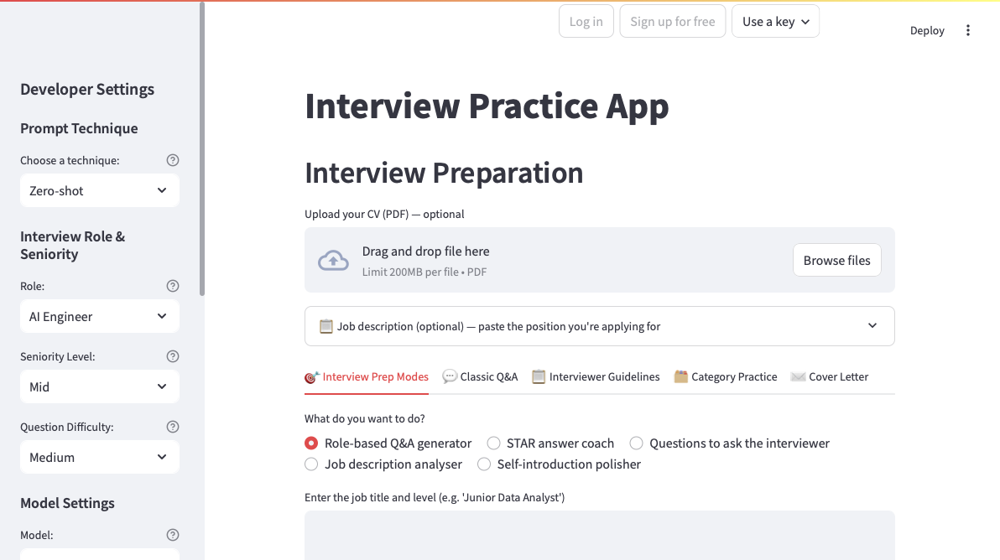

# Interview Practice App

[](https://github.com/BimlaDanu/AI-Engineering/actions/workflows/check-interview-practice-app.yml)

A Streamlit app for practising AI/ML, data and research interviews. It sends your
input through the OpenRouter API (using the OpenAI SDK) and gives you back
role-specific questions, the topics worth revising, and coaching on your answers.
Upload your CV and the advice is written around your actual background instead of
a generic candidate.

The badge shows the last [`check`](https://github.com/BimlaDanu/AI-Engineering/blob/main/.github/workflows/check-interview-practice-app.yml)
run on `main` (Ruff and pytest). Click it for the run history and logs.

## What it does

**Role and seniority aware.** Pick your target role (AI Engineer, Machine Learning
Engineer, Data Scientist, Research Scientist, Data Analyst) and level (Junior, Mid,
Senior). The sidebar builds its role list from the `ROLE_CONTEXT` registry, so the
names you see and the context the prompt gets are always the same thing.

**Five prompt techniques.** Zero-shot, Few-shot, Chain-of-thought, Role-play and
Structured output, so you can watch the same question get answered five different
ways. Role-play adds three interviewer personas (strict, neutral, friendly).
Few-shot sends its examples as real alternating user/assistant messages rather than
pasting them into the system prompt as prose.

**Schema-enforced JSON.** The Structured output technique, question generation and
answer judging all use OpenRouter structured outputs (`response_format` with a
strict `json_schema`). Every reply is validated into a typed model
(`CoachingResponse`, `JudgeFeedback`) before anything is rendered. There are
fallback parsers, but they are a last resort and they log when they fire.

**Your choice of model.** OpenAI `gpt-5-mini`, `gpt-5-nano`, `gpt-5`, or Google
`gemini-2.5-flash` and `gemini-2.5-pro`. All of them go through the same OpenRouter
path.

**One settings object.** The sidebar builds a single immutable `RequestSettings`
(model, temperature, top-p, frequency penalty, token cap) and that object is passed
to every call the app makes: coaching, Classic Q&A, interviewer guidelines, question
generation, judging and CV summarising. No feature quietly overrides your settings.

**Cost per request.** After each call the app shows the prompt and completion tokens
plus an estimated price in USD, using live per-model prices from the
[OpenRouter models endpoint](https://openrouter.ai/api/v1/models), fetched once and
cached.

**CV-aware answers.** Upload a PDF CV. The app summarises it once, then reuses that
summary, which keeps the token bill down. CV text only ever goes into user messages,
never into a system message, so a document can't smuggle in instructions.

**Job description targeting.** Paste the description of the job you're actually
applying for and it gets pulled into the user message of every request, so the
preparation is aimed at that position.

**Concept sketches.** In Category Practice you can generate a whiteboard-style image
for the idea behind any question. Useful if you revise visually. It uses
`google/gemini-2.5-flash-image` through the normal chat-completions endpoint with
`modalities=["image", "text"]`.

**Cover letters.** From the CV summary and the job description, draft a cover letter
you can edit in place and download as `.txt`. The writing rules sit in a fixed system
prompt; your CV and the job ad stay in the user message.

**Category Practice with a judge.** Generate 10 questions in one skill area, answer
them one at a time, and get judged feedback: a 1-5 score, a verdict, strengths,
improvements and a model answer you can reveal when you want it. Each category keeps
its own progress, so switching between them loses nothing.

**Input validation.** A guard rejects empty input, anything over 10,000 characters,
and prompt-injection phrasings. It matches phrasings rather than bare substrings, so
an answer that happens to contain "ignore" or "act as" is fine while "ignore all
previous instructions" is not.

**An eval set.** `evals.py` holds 12 fixed cases and a runner that scores prompt
techniques (or models) against one rubric with one judge, so "this prompt is better"
is a measurement rather than an impression.

**Structured logging.** Every LLM call writes one key=value line with latency, tokens,
model, request id and finish reason. See [Logging](#logging) for turning it on.

## Sidebar settings

```text
Developer Settings
├── Prompt Technique
│   └── Interviewer Persona (strict / neutral / friendly — Role-play only)
├── Interview Role & Seniority
│   ├── Role
│   └── Seniority Level
├── Question Difficulty
├── Model Settings
│   ├── Model (OpenAI gpt-5-mini / gpt-5-nano / gpt-5; Google gemini-2.5-flash / gemini-2.5-pro)
│   ├── Temperature
│   ├── Top-p
│   └── Frequency Penalty
└── Response Length (Concise / Detailed)
```

A note on Response Length. It sets the prompt instruction and a token cap, but the
cap is only a safety limit, not the way brevity is achieved. The gpt-5 models spend
completion tokens on reasoning before they write anything visible, and that reasoning
is billed against `max_tokens`. Squeezing the cap therefore doesn't buy you a short
answer, it buys you an empty one. Concise asks for low reasoning effort and still
leaves room to write; the actual shortness comes from the prompt.

## Task difficulty

The course tasks this app covers, grouped by how involved they were.

**Easy**

- Concise and Detailed response lengths (prompt instruction plus token cap).
- Interviewer Guidelines generator (structured evaluation criteria per role).
- Mock-interview personas (strict, neutral, friendly).
- Per-role and per-seniority prompt context.

**Medium**

- Every model setting exposed in the sidebar and applied to every request through one
  `RequestSettings` object.
- Two schema-enforced JSON formats: the coaching schema
  (`advice` / `action_items` / `common_mistakes`) and the judge schema
  (`score` / `verdict` / `strengths` / `improvements` / `model_answer`).
- A security guard, with developer settings kept in the sidebar and away from the
  user-facing tabs.

**Hard**

- LLM-as-a-judge in Category Practice: the model scores your answer against a
  per-category rubric and returns schema-validated feedback.
- Prompt and model assessment: `evals.py` runs 12 fixed cases through each technique
  (or model) and scores everything with the same judge and rubric, producing a table
  you can compare across runs.

## Requirements

- Python 3.11 or newer
- [uv](https://docs.astral.sh/uv/), which is the supported way to build the environment
- An OpenRouter API key

## Setup

Clone the repository, then build the environment from the lockfile:

```bash
uv sync
```

If you're on a machine with no `uv.lock` yet, run `uv lock` once and commit the result
so everyone resolves the same versions.

Then create a `.env` file in the project root with your key (get one at
https://openrouter.ai/keys):

```text
OPENROUTER_API_KEY=your_key_here
```

`.env` is git-ignored and should stay that way.

`uv sync` creates the `.venv` that every `make` target uses: the app, the evals, the
tests and the linter all share it. The old `Iapp_env` virtualenv and `requirements.txt`
are gone. `pyproject.toml` and `uv.lock` are now the only place dependencies are
declared.

## Running it

```bash
uv run streamlit run Iapp.py
# or
make run
```

Open the local URL it prints, usually `http://localhost:8501`.

## Dark mode

Use the ⋮ menu in the top right, then Settings → Theme, and pick Dark (or "Use system
setting"). The choice is stored per browser, so on a deployed app one visitor switching
to dark doesn't change anything for anyone else.

That menu used to be hidden. [`.streamlit/config.toml`](.streamlit/config.toml) had
`toolbarMode = "minimal"`,
which removes the whole toolbar and with it the only way a visitor can reach the theme
picker. It's now `"viewer"`, which shows the visitor-facing items (Settings, Rerun,
Print, About) and still keeps the developer options out of the way.

The app's own palette is the `[theme]` block in that file, and it's what "Custom Theme"
in the picker refers to. Streamlit resolves the theme in the browser, so there's no
in-app toggle: `theme.base` is a process-wide setting, and flipping it at runtime would
change the theme for every connected visitor at once rather than just the one who asked.

Picking Dark gives you Streamlit's own dark palette rather than a dark version of the
app's colours. Defining both needs the `[theme.light]` / `[theme.dark]` sub-tables that
arrived in Streamlit 1.45, and this project pins 1.37.1, where `streamlit config show`
answers "theme.dark is not a valid config option". The palette is written out and
commented in [`.streamlit/config.toml`](.streamlit/config.toml) with the two steps to enable
it, rather than added now and silently ignored.

## Access, and deploying it for other people

Running it locally needs nothing extra. A key in `.env` grants access straight away,
so `make run` still drops you into the app with no login screen in the way. To see the
login screen on your own machine (worth doing once before you deploy), set
`REQUIRE_LOGIN=true` in `.env`.

Deployed somewhere public, it's a different problem. The URL is open to anyone who
finds it, and every question, judgement and cover letter is a paid call on whoever's
key the app is holding. So `auth.py` puts a row of controls in the top right of the
title bar, and nothing below it runs until the session has a key:

- **Log in** and **Sign up for free** — both start the same flow. With an identity
  provider there is no separate sign-up: someone without an account creates one at
  Google and comes back signed in. Two buttons because they answer two different
  questions, and a visitor shown only "Log in" assumes they need an account already.
- **Use a key** — paste your own OpenRouter key, or start the free trial on the
  deployer's key. A pasted key lives in `st.session_state` for that browser session
  only: not written to disk, not logged, not shared between visitors. The form clears
  on submit, and the verdict on the key is parked in session state so it survives the
  rerun that accepting one triggers.

When sign-in isn't configured, the first two buttons are **disabled with the reason in
the tooltip** rather than hidden. Hidden, and the app looks like it simply has no
accounts, which is indistinguishable from broken to anyone who was told to sign in.
Live, and pressing one raises. Disabled with a sentence is the only one of the three
that tells the truth — and "Use a key" beside them always works.

Someone with an account of their own (signed in, or their own key) gets an account menu
in place of the buttons, with "Forget my key" or "Log out" behind it. A local run and a
free trial keep the three buttons, because what a visitor may spend and what the corner
shows them are two different questions: hide them locally and the feature looks absent,
hide them on the trial and there's no visible way off it.

There is no username-and-password table here, on purpose. A Streamlit app on a public
host is a poor place to keep password hashes, and a half-built login is worse than
none. Identity comes from `st.login()` (OIDC, so Google handles the credentials) when
you want it, and spending is controlled by whose API key is in play.

`st.login()` needs Streamlit 1.42 or newer and this project pins 1.37.1, so the Google
button is hidden for now. `auth.py` checks for it at runtime: bump the pin, run
`uv lock && uv sync`, add an `[auth]` block to secrets, and the button appears on its
own. No code change.

To deploy, copy `.streamlit/secrets.toml.example` to `.streamlit/secrets.toml` locally,
or paste the same keys into Settings → Secrets on Streamlit Community Cloud:

```toml
OPENROUTER_API_KEY = "sk-or-v1-..."   # pays for the free trial; omit to disable it
ALLOW_FREE_TRIAL   = "true"
TRIAL_REQUESTS     = "10"             # per anonymous session
SIGNED_IN_REQUESTS = "50"             # per signed-in visitor
```

One honest caveat about the trial counter: it lives in session state, so someone who
opens a fresh tab gets a fresh allowance. It stops casual overuse, not a determined
person. A hard limit needs server-side state tied to an identity, which is a bigger
change than one module. Keep `TRIAL_REQUESTS` low and treat it as a demo budget.

## Logging

Every LLM call logs a line like this:

```text
llm_call model=openai/gpt-5-mini latency_ms=12589 finish_reason=stop prompt_tokens=348 completion_tokens=1053 total_tokens=1401 request_id=gen-... structured=True
```

That is genuinely useful when a provider starts misbehaving, and genuinely annoying
when you just want to use the app, so the console only shows warnings and errors by
default. Truncated replies, empty replies and failed calls still appear. To get the
per-call lines back, set the level:

```bash
APP_LOG_LEVEL=INFO make run
```

`APP_LOG_LEVEL` accepts any standard level name (`DEBUG`, `INFO`, `WARNING`, `ERROR`).
`evals.py` has its own `--verbose` flag that does the same thing for an eval run.

## Tests and linting

The unit tests cover the logic that doesn't need a network: input validation, prompt
builders, JSON handling and typed-model validation, fallback parsing, and the call
layer against fake API responses (malformed JSON, truncated output, empty replies,
provider errors). No key, no network.

```bash
make test     # uv run pytest
make lint     # uv run ruff check ...
make check    # both, in the order CI runs them
make format   # auto-fix formatting and import order (this rewrites files)
```

Run `make` or `make help` on its own to list every target.

## Continuous integration

Every push and pull request that touches this app runs the `check` workflow
([`check-interview-practice-app.yml`](https://github.com/BimlaDanu/AI-Engineering/blob/main/.github/workflows/check-interview-practice-app.yml)
in the monorepo, [`.github/workflows/check.yml`](.github/workflows/check.yml) standalone):

1. Install uv, which reads `.python-version` and fetches 3.11 if the runner lacks it
2. `uv sync --frozen`, so the run uses exactly what `uv.lock` resolves
3. `uv run ruff check ...`
4. `uv run pytest`

`make check` reproduces steps 3 and 4 locally before you push.

The steps above live in one file, and it is in this directory:
[`.github/actions/check/action.yml`](.github/actions/check/action.yml), a composite
action. The workflows that call it are stubs.

That split exists because GitHub starts workflows only from `.github/workflows/` at the
*repository* root and treats a `.github` folder further down as an ordinary folder. A
local action, on the other hand, can sit at any path. So the gate itself belongs to the
project, and each place the project gets pushed contributes only a trigger:

| Entry point | Where | Calls |
|---|---|---|
| [`check-interview-practice-app.yml`](https://github.com/BimlaDanu/AI-Engineering/blob/main/.github/workflows/check-interview-practice-app.yml) | monorepo root | `./Generative-AI/Interview_Practice_App/.github/actions/check` with `working-directory` set to the project |
| [`.github/workflows/check.yml`](.github/workflows/check.yml) | here | `./.github/actions/check`, `working-directory` defaulting to `.` |

Each holds a trigger, a `paths` filter and `permissions`, which are workflow-level keys a
composite action cannot carry, and nothing else. Nothing is duplicated, so a change to the
gate is one edit in this directory. In the monorepo every project has its own stub and its
own badge, scoped by `paths`, so projects never trigger or cancel one another.

uv handles the interpreter on its own; there's no separate `setup-python` step, because
two tools choosing an interpreter when only one of them is consulted by `uv sync` is a
way to get a green laptop and a red runner. Each step also re-emits its own failure as
a GitHub annotation, so a broken run says *why* on the run page instead of just showing
an exit code.

One thing worth knowing if you ever move the tests: `pythonpath = ["."]` in
`pyproject.toml` is load-bearing. The app is flat modules rather than an installed
package, and pytest puts the test file's own directory on `sys.path`, not the repository
root — so `from core import ...` needs the root added explicitly. Without that line the
suite can pass locally and fail on CI with four collection errors.

CI needs no API key and no network, because the tests run against fake clients. The
Streamlit app and `evals.py` are left out of CI on purpose since they make real
OpenRouter calls and cost money. You can also start a run by hand from the Actions tab
(`workflow_dispatch`).

## Running the eval set

This compares prompt techniques (or models) over the 12 fixed cases. Each response is
scored by the same judge at temperature 0 with the same rubric, so differences between
runs are down to the technique or model and not to the setup. It makes 2 API calls per
case per candidate, so it isn't free.

```bash
# All five techniques over the first 3 cases (30 calls)
uv run python evals.py --mode techniques --limit 3

# Compare two models on the Zero-shot technique
uv run python evals.py --mode models --models openai/gpt-5-mini openai/gpt-5-nano

# Keep the raw per-case results (git-ignored)
uv run python evals.py --mode techniques --out eval_results.json

# More or less parallelism (default 6; use 1 for a log you can read top to bottom)
uv run python evals.py --mode techniques --workers 12
uv run python evals.py --mode techniques --workers 1

# Show the per-call INFO lines
uv run python evals.py --mode techniques --limit 3 --verbose
```

The judge scores four dimensions on their own, each 1-5, and reports the mean:

```text
| Technique | Mean | Spec | Action | Correct | Insight | N | Scores |
```

The `N` column is how many cases actually got scored. If a judge call fails, that
candidate shows `2/3*` instead of `3` and the table carries a footnote, because a mean
over two cases shouldn't quietly outrank a mean over three.

This replaced a single overall mark, which turned out to have no resolution at all.
With a lenient rubric every technique scored 5.00. Tightening the wording just moved
every technique to 4.00. Four separate dimensions pull apart responses that one integer
flattens, and they also show you *where* a technique wins. The rubric is strict on
purpose: fluent writing earns nothing, correct-but-generic is capped at 3, and a 5
requires that you can't name an improvement.

Two things about speed. Cases run concurrently (`--workers`), and every eval request
asks for low reasoning effort, which cuts both the latency and the bill on gpt-5 models.
Scores are only comparable between runs that share a rubric, so results from before
these changes don't line up with results from after.

## Running the security experiment

```bash
uv run python jailbreak_experiment.py
```

This throws a fixed battery of prompt-injection attempts, malformed inputs and hostile
"job file" uploads at the same guards the live app uses (`validate_input`, `parse_cv`),
then writes `jailbreak_results.csv`. If `openpyxl` is installed you also get a native
`.xlsx`. Each row records what was attempted, what the guard did, and whether that was
the outcome we wanted. No network and no API key.

## Using the app

Start in the sidebar: prompt technique (and persona, if you picked Role-play), model,
temperature, top-p, frequency penalty and response length. These apply to everything
the app does, question generation and judging included. Then set your target role,
seniority and question difficulty.

Roles: AI Engineer, Machine Learning Engineer, Data Scientist, Research Scientist
(AI/ML), Data Analyst. Seniority: Junior, Mid, Senior. Difficulty: Easy, Medium, Hard.

Uploading your CV as a PDF is optional but makes the advice much more specific.

Then work through the tabs:

**Interview Prep Modes** — Role-based Q&A Generator, STAR Answer Coach, Questions to
Ask the Interviewer, Job Description Analyser, Self-introduction Polisher.

**Classic Q&A** — ask anything about interview preparation in a plain question and
answer format.

**Interviewer Guidelines** — the evaluation criteria an interviewer would be working
from for your role.

**Category Practice** — pick one skill area and drill it. Generate 10 questions, answer
one at a time, get judged feedback, and optionally generate a concept sketch of the idea
behind the question. Each category keeps its own progress. The categories are Python
Coding, AI Engineering, Machine Learning, Data Science and Behavioural.

**Cover Letter** — draft a letter from your CV and the job description you pasted above
the tabs. You can add emphasis notes ("stress my leadership experience"), then edit the
result in place and download it.

## Project structure

**`Iapp.py`** is the Streamlit layer and nothing else: widgets, session state and
rendering. It builds the one `RequestSettings` object, handles CV upload, lays out the
five tabs, renders the typed responses, and keeps generated questions and feedback in
session state so they survive reruns and stay separate per category.

**`core.py`** is the engine. Input validation, the shared `ask_llm()` path that every
feature goes through (with the structured logging around it), the strict JSON schemas
and typed models, CV parsing and summarising, question generation, the judge, the
OpenRouter price fetch and cost estimate, image generation, cover-letter drafting, and
the mapping from provider exceptions to messages a user can act on. It never imports
Streamlit, which is what makes it testable with fake clients.

**`categories.py`** is pure data. No API calls, no Streamlit, no imports from the other
two modules. It holds the category registry, the prompt templates and builders, the
`TECHNIQUES` registry (with few-shot examples stored as message pairs), `ROLE_CONTEXT`,
and `TypedDict` specs for all of it.

**`evals.py`** is the 12-case eval set and its CLI runner.

**`auth.py`** is the access layer: the top-right account controls, the key held in
session state, and the wrapper that counts trial requests. It's UI-side, so it imports
Streamlit; `core.py` still doesn't.

**`jailbreak_experiment.py`** is the security experiment described above.

**`tests/`** holds the pytest suite. `conftest.py` provides the fake client factory.

The three main modules form a one-way stack. `Iapp.py` handles the interface and calls
`core.py`, which handles logic, validation and errors, and reads its prompt templates
from `categories.py`. Data flows in that direction only, and results come back to the UI
through session state. Because `categories.py` depends on nothing, `core.py`, the tests
and `evals.py` can all share it.

## Other files

- **`pyproject.toml`** — metadata, dependencies, supported Python version, and the
  pytest and Ruff configuration. Managed with uv.
- **`Makefile`** — thin wrappers: `sync`, `run`, `test`, `lint`, `format`, `check`,
  `eval`, `clean`. `make help` lists them.
- **`.python-version`** — the interpreter version (3.11) uv and CI both resolve against.
- **[`.github/actions/check/action.yml`](.github/actions/check/action.yml)** — the CI
  gate itself: uv, the lockfile, Ruff, pytest. The one place to edit it.
  - **[`.github/workflows/check.yml`](.github/workflows/check.yml)** — the stub that calls
    it when this app is its own repository. The monorepo has its own stub
    ([`check-interview-practice-app.yml`](https://github.com/BimlaDanu/AI-Engineering/blob/main/.github/workflows/check-interview-practice-app.yml)) at the repository root, because GitHub
    starts workflows from there and nowhere else.
- **[`.streamlit/config.toml`](.streamlit/config.toml)** — non-secret UI and server defaults: theme, the ⋮ menu,
  opening the browser on launch, a 10 MB upload cap, telemetry off. No secrets live here. The key stays in `.env`, and
  `.streamlit/secrets.toml` is git-ignored.
- **`.streamlit/secrets.toml.example`** — the template for a deployment: shared key,
  trial size, and the commented-out `[auth]` block for Google sign-in. Safe to commit;
  the real `secrets.toml` is not.

## Built with

- **Streamlit** for the interface.
- **OpenRouter** through the **OpenAI SDK** for model access, with structured outputs.
- **pypdf** for reading uploaded CVs.
- **uv** for dependencies, **pytest** and **Ruff** for tests and linting.
- `openai/gpt-5-mini` as the default model.
- **Claude Code** and **ChatGPT** were used during development for debugging and
  refactoring.

## Known limitations

- The injection guard is regex over known attack phrasings, so a heavily obfuscated
  attack will get past it. For an app with this threat model that trade is fine; a
  classifier would only be worth it if the risk grew.
- Everything is single-turn. There's no chat memory yet.
- Results in the older tabs are rendered inside the button handler, so they vanish on
  the next widget interaction. Category Practice keeps its results in session state and
  doesn't have this problem.
- Structured outputs depend on the provider honouring the schema. When a model ignores
  it, the app falls back to defensive parsing and logs that it had to.

## Preview


