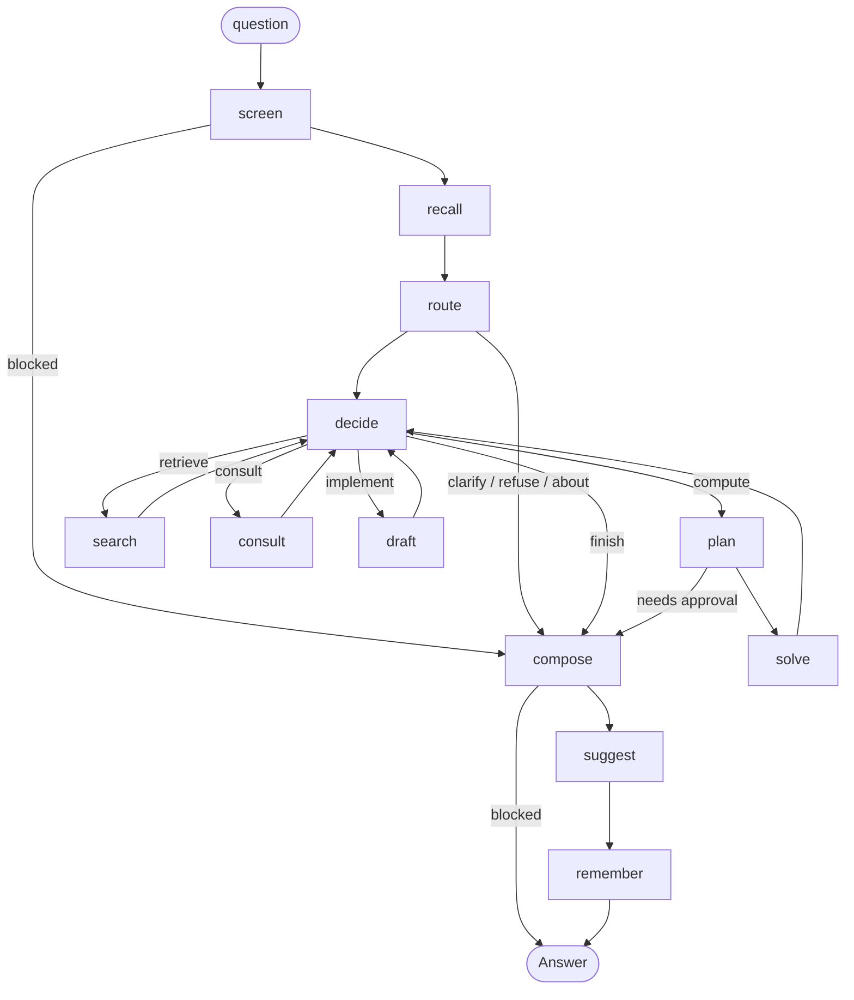
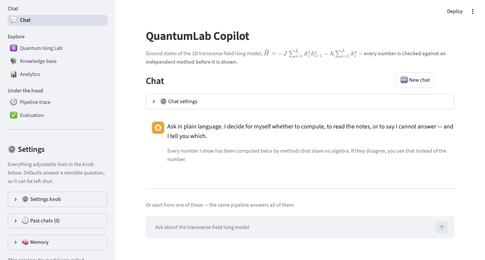

# ⚛️ QuantumLab Copilot — *the answer, and the proof that it is right*

[](https://github.com/BimlaDanu/AI-Engineering/actions/workflows/check-quantumlab-copilot.yml)

QuantumLab Copilot is a **domain-specialised AI agent** for the one-dimensional
transverse-field Ising model (TFIM). Instead of producing a plausible-looking number, it
**decides what work the question needs, runs that work in tested Python, computes every
number a second time by a method that shares no algebra with the first, and only then
writes prose around the result.** If the two methods disagree, you are shown that instead
of the number. If the question is outside what it can do, you get a refusal that names the
part it could not do.

> **Computed twice · Cited · Honest** — every number is corroborated by an independent
> method before it is shown, every claim taken from the notes carries its citation, and
> anything from outside this repository (arXiv, Wikipedia, the web) is labelled
> **unverified** wherever it appears. Off-topic questions and prompt-injection attempts are
> refused.

The fundamental physics model we consider is quantum Ising model given by Hamiltonian:
${\hat H} = - J \sum^L_{i=1} {\hat \sigma}^z_i  {\hat \sigma}^z_{i+1}  - h \sum^L_{i=1} {\hat \sigma}^x_i$

Read plainly: a row of $L$ tiny magnets in a line. $\hat{\sigma}_i^z$ and
$\hat{\sigma}_i^x$ are the Pauli matrices at site $i$ — the operators that measure which
way spin $i$ points, along $z$ and along $x$. The coupling $J$ says how strongly
neighbours want to agree with each other; the transverse field $h$ pushes every spin
sideways, in a direction they cannot all agree on. The competition between those two
terms is the entire subject.

The minus sign in front of the coupling makes the energy lowest when neighbours point the
*same* way, so $J > 0$ is the **ferromagnetic** case. Papers differ here — writing that term
with a plus sign flips the reading — so the app fixes one convention and accepts $J > 0$ only
(`TFIMSpec` rejects the rest). Every number it produces is for the ferromagnetic chain.

**Why this Hamiltonian matters to quantum computing.** It is not a toy chosen for
convenience. Written in qubits, $\hat\sigma^z$ and $\hat\sigma^x$ are the Pauli $Z$ and $X$
gates, so this is a two-local qubit Hamiltonian a real machine can hold: it is exactly what a
quantum annealer such as D-Wave's implements in hardware, and the same $ZZ$ + $X$ terms are
what a gate-based device Trotterises into $R_{zz}$ and $R_x$ rotations. That makes it the
standard proving ground for VQE, QAOA, adiabatic state preparation and digital simulation —
and the closing gap at $h = J$ is the thing that sets how slowly an annealer must run.

It earns that role because **the answer is already known**: Pfeuty solved it exactly in 1970.
So when a device, a simulator or a new algorithm returns a number, it can be checked rather
than believed. That is the same argument this project makes about a language model, one level
up — which is why the corpus has a whole shelf on the quantum-computing uses, and another on
where the model shows up outside physics (portfolio optimisation, routing, scheduling: any
NP-hard problem written as an Ising cost function).

Built with **Python 3.11+, Streamlit, LangChain 1.x, LangGraph, Chroma, NumPy and SciPy**.
Developed for the Turing College Sprint 4 programme, against the assignment brief in
[135.md](135.md).

<details>
<summary><b>New to the terms?</b> - A plain-English glossary of both halves, the AI and the physics (click to expand)</summary>

None of this is needed to use the app. It is here so the rest of the README reads the same
whichever half of the subject you arrived from.

**The AI side**

| Term | In simple terms |
|---|---|
| **Agent** | A program that *decides* what steps to take for your question, instead of running the same fixed steps every time. Here the decision is visible: every answer shows the path it took. |
| **LangGraph** | A library for writing that decision process as an explicit graph of steps you can draw, inspect and interrupt. |
| **Node** | One step in that graph — screen the question, search the notes, solve the physics, write the answer. |
| **RAG** (retrieval-augmented generation) | Before answering, the app looks up relevant passages in its own library and answers *from* them — grounded, not remembered. |
| **Knowledge base / corpus** | That library: 19 curated notes in `data/corpus/`, on three shelves. |
| **Chunk** | A note sliced into smaller passages — the unit that actually gets retrieved and cited. |
| **Embedding** | A piece of text turned into a list of numbers, so the app can measure which passages are closest *in meaning*. |
| **Vector store** (Chroma) | The database holding those number-lists, which finds the closest matches to a question. |
| **Hybrid search / BM25** | Meaning-based matching blended with plain keyword matching, so an exact term (an author, `h = J`) is not missed. |
| **Structured output** | The model is made to answer in a fixed, checkable shape (like a form), so the app never guess-parses free text. |
| **Tool / function calling** | Letting the model *ask* for a piece of work — a second chain length, a field sweep, an arXiv search — which Python then performs. The model never runs anything itself. |
| **MCP** (Model Context Protocol) | A standard way to borrow extra tools from a remote server. |
| **Prompt injection** | A message that tries to talk the model out of its rules. Screened here before anything else happens. |
| **LangSmith** | An observability service: traces of every call, and a place to file evaluation runs. Off unless you configure it. |
| **Checkpointer** | Storage that lets a graph pause and resume — needed because Streamlit re-runs its script on every click. |

**The physics side**

| Term | In simple terms |
|---|---|
| **Spin** | Spin is a built-in property of tiny particles. A particle is like a tiny object that comes with its own little arrow ($\|\uparrow\rangle$, $\|\downarrow\rangle$).  |
| **Fermions** | Two identical fermions don't like being in exactly the same quantum state. Fermions are like people who aren't allowed to share the exact same seat. |
| **Hamiltonian** | The Hamiltonian is the energy-and-dynamics rulebook of a quantum system: if you know the Hamiltonian, you know how the quantum system is going to evolve. |
| **Spin chain** | A row of quantum magnets, each with a spin that can point up or down along the z-axis — the operator that measures which is the Pauli matrix $\sigma^z$. |
| **Coupling `J`** | How strongly neighbours want to agree. Large `J`: they line up — a ferromagnet. |
| **Transverse field `h`** | A magnetic field pushing *sideways* (along x, measured by ${\sigma}^x$). Sideways is not a direction the spins can agree on, so it fights the coupling by making every spin uncertain about its own alignment. This competition is the whole story. |
| **Ground state** | The lowest-energy configuration — what the system settles into at absolute zero. |
| **Energy gap** | The distance from the ground state to the first excited state. When it closes, the system can be disturbed by an arbitrarily small nudge. |
| **Quantum phase transition** | At `h = J` exactly the competition ties: below it the chain is ordered, above it disordered, and *at* it the gap closes and correlations reach across the whole chain. Driven by quantum fluctuations, not temperature — it happens at zero temperature. |
| **Exact diagonalisation (ED)** | Write the Hamiltonian as a matrix and find its lowest eigenvalue numerically (Brute force numerical diagonalization). Truth for small chains, and the cost doubles with every spin added. |
| **Pfeuty / free fermions** | Pfeuty exactly  solved this model analytically in 1970 by mapping spins to non-interacting fermions (Jordan–Wigner + Bogoliubov). A closed formula — no matrix at all. |
| **Self-duality** | Swapping `J` and `h` leaves the energy unchanged. This is *why* the critical point sits exactly at `h = J`, and it is one of the identities the tests check. |
| **Why this model** | It is the simplest system with a genuine quantum phase transition **and** an exact solution — which makes it the standard benchmark. If a new algorithm, simulator or piece of hardware cannot get the TFIM right, it cannot get anything right. It is also the native language of quantum annealing: the Hamiltonian a D-Wave machine implements directly. |

`data/corpus/` has nineteen notes going deeper, and the 📚 Knowledge base page publishes all
of them.

</details>

---

## 🕐 Quick Overview of the Agentic AI Workflow in the Codebase
The codebase is quite large, so if you are running short on time, please focus on these eight files, as they contain the relevant components needed to implement the requirements specified in [135.md](135.md).

| # | File | What you are checking | 
|---|---|---|
| 1 | [`src/agent/graph.py`](src/agent/graph.py) — start at `build_graph()`, at the bottom | That the agent is a **graph with real branches**, not a prompt: twelve nodes, **five** genuine branch points, and four actions that all loop back into `decide` | 
| 2 | [`src/agent/deciding.py`](src/agent/deciding.py) | **Who chooses** the next action — the model, with a deterministic `policy_step` fallback and overrides that refuse an unsound choice | 
| 3 | [`src/verification/cross_check.py`](src/verification/cross_check.py) | **The one claim**: every number computed twice by methods sharing no algebra, and what happens when they disagree | 
| 4 | [`src/physics/ed.py`](src/physics/ed.py) + [`src/physics/exact.py`](src/physics/exact.py) | That the two methods really are independent — Lanczos on a sparse matrix, and Pfeuty's closed form | 
| 5 | [`src/agent/router.py`](src/agent/router.py) | Scope, routing and injection classification — and the two-layer trick: a narrow offline **gate**, a broad **steer** | 
| 6 | [`src/rag/retrieve.py`](src/rag/retrieve.py) | Advanced RAG: hybrid BM25 + vector **fusion**, a relevance **grader**, one **rewrite**, and an honest empty result | 
| 7 | [`src/security.py`](src/security.py) | The deterministic screen that runs before any model call | 
| 8 | [`src/evals/cases.py`](src/evals/cases.py) + [`reports/scorecard.md`](reports/scorecard.md) | The frozen suite and its **last live result** — the evidence for everything above | 


**Then run it**: `make check` (about 80s, 1718 tests) proves the physics and the graph;
`make run` shows the trajectory of each answer on screen.

**The three things worth your scepticism**, and where each is answered:

- *Does the model actually decide anything, or is the path hard-coded?* — `deciding.py`, and
  `make live-check`, which logs the chosen action and **who chose it** for each question.
- *Is retrieval doing work, or is the model answering from memory?* — `refusal_text()` in
  `src/agent/graph.py` refuses unless something grounded the answer; there is no fallback to
  memory.
- *Are the evals graded by a model marking its own homework?* — no. `evals/scoring.py`
  compares against arithmetic and recorded structure. No judge model is used anywhere.

---

## 📚 Contents

1. [Get started in 4 simple steps](#get-started-in-4-simple-steps)
2. [What makes QuantumLab Copilot different?](#what-makes-quantumlab-copilot-different)
   · [what you can actually do with it](#what-you-can-actually-do-with-it)
3. [How QuantumLab Copilot finds an answer](#how-quantumlab-copilot-finds-an-answer)
   · [what is hard-coded, deterministic, or agentic](#what-is-hard-coded-what-is-deterministic-and-what-the-agent-actually-decides)
4. [Verification — the one claim this project makes](#verification--the-one-claim-this-project-makes)
5. [Features at a glance](#features-at-a-glance)
   · [core requirements](#core-requirements--implemented)
   · [every sub-requirement with its location](#every-sub-requirement-with-its-exact-location)
   · [the RAG stack](#the-rag-stack-feature-by-feature)
   · [memory](#memory-and-what-it-learns)
   · [authentication](#authentication-and-personalisation)
6. [Explore the pages](#explore-the-pages)
   · [the sidebar, and which brief items it carries](#the-sidebar--shared-by-every-page-drawn-once)
   · [💬 Chat](#-chat--where-the-agent-actually-works)
   · [⚛️ Quantum Ising Lab](#-quantum-ising-lab--the-same-physics-with-no-model-at-all)
   · [📚 Knowledge base](#-knowledge-base--what-it-has-read-published)
   · [📊 Analytics](#-analytics--what-the-session-did-and-what-it-cost)
   · [🧭 Pipeline trace](#-pipeline-trace--how-the-last-answer-was-decided)
   · [✅ Evaluation](#-evaluation--the-published-scorecard)
   · [which pages involve a model at all](#which-parts-of-the-interface-involve-a-model-at-all)
7. [Project structure](#project-structure) — every `.py` file, plus a module reference
8. [Testing](#testing)
9. [Evaluation results](#evaluation-results)
10. [Technology stack](#technology-stack) — language, numerical, agent, and standard library
11. [Tasks checklist](#tasks-checklist)
12. [Technical decisions](#technical-decisions)
13. [When something goes wrong](#when-something-goes-wrong)
14. [Current limitations](#current-limitations)
15. [App preview](#app-preview)

---

## Get started in 4 simple steps

**Prerequisites:** Python 3.11+, the [`uv`](https://docs.astral.sh/uv/) package manager, and
an [OpenRouter API key](https://openrouter.ai/keys).

```bash
# 1 — create the single uv-managed virtual environment (.venv, from uv.lock)
make sync

# 2 — put your key in a .env file in the project root (git-ignored; never commit it)
#     OPENROUTER_API_KEY=sk-or-...        # the only required variable
#     LANGSMITH_API_KEY=...               # optional — tracing + evaluation runs
#     LANGSMITH_TRACING=true              # optional — off by default
#     APP_PASSPHRASE=...                  # optional — a gate for a deployment

# 3 — build the Chroma vector store from the 19 notes in data/corpus/ (three shelves)
make ingest

# 4 — launch the app on http://localhost:8501
make run
```

> **Step 3 is required before the agent can ground an answer** — it cannot search an empty
> index. Re-run `make ingest` after changing anything in `data/corpus/` **or** after
> changing the embedding model (a different embedder produces number-lists of a different
> size, so the old index no longer lines up; the model name is part of the collection name
> for exactly this reason).

> **Rendering the app calls no model and reads no credential.** That is a tested invariant,
> so `make run` works on a fresh checkout with no `.env` at all: the ⚛️ Quantum Ising Lab
> computes real physics, 📚 Knowledge base lists the corpus, and only 💬 Chat needs a key.
> A model is reached when you actually ask something — and even then the agent degrades to a
> plain, honest answer rather than crashing if there is no key to use.

| Command | Description |
|---|---|
| `make help` | List every target (the default) |
| `make sync` | Create/update `.venv` from `pyproject.toml` + `uv.lock` |
| `make lock` | Re-resolve dependencies and rewrite `uv.lock` |
| `make ingest` | Build the Chroma vector store from `data/corpus/` |
| `make run` | Launch the Streamlit app (`src/ui/app.py`) |
| `make format` | Auto-format and auto-fix with Ruff |
| `make lint` | Ruff check + format check, writing nothing |
| `make typecheck` | Static type check with mypy (98 source files) |
| `make test` | Run the pytest suite — **1718 tests**, about 80s; no chat model is ever called. With no credential two skip: the eval suite's retrieval embeds through the gateway, so its pass-count assertion needs a key |
| `make test-fast` | The same suite without what is marked `slow` — about 30s against 80s. The slow set is the eval cases that run the real graph and every UI test that renders the Quantum Ising Lab, because drawing that page diagonalises a chain and Streamlit's cache is per session. For a tight edit loop, never the gate |
| `make check` | **The gate** — lint + typecheck + test |
| `make check-fast` | The same gate minus the slow tests (~30s). For the edit loop; `check` is still the definition of done |
| `make coverage` | The suite under coverage, `src` only, failing below 90% — **96% measured**. Kept out of the gate because instrumentation roughly triples the run. HTML report in `htmlcov/` |
| `make sync-ci` | Install exactly what `uv.lock` pins (`--frozen`) — what CI installs before the gate |
| `make versions` | Print the interpreter, numpy, mypy, Ruff and pytest the gate is running on |
| `make evals` | Run the held-out 26-case suite, write `reports/scorecard.md`, file the run in LangSmith if configured. Exits non-zero on any failure, so it can gate a commit. Live, so mostly network wait — about seven model calls per case. Four cases run at once by default; `EVAL_WORKERS=1` runs them one at a time |
| `make observable-check` | Four live calls that ask whether the *model*, not the code, picks which observable to plot |
| `make live-check` | Ask the real agent a few questions and log each trajectory with per-node latency |
| `make clean` | Remove `.venv` and every tool cache. System packages untouched |

---

## What makes QuantumLab Copilot different?

Ask it *"what is the ground-state energy of an 8-site ring at h = J?"* and it does not
recall an answer — it picks a solver, runs it, runs a second solver that derives the same
quantity a completely different way, compares the two, and writes the prose last.

Three rules govern every reply:

- **A number** → computed in `src/physics/`, **corroborated by a second independent
  method**, and shown with the size of the disagreement. The model never supplies a digit.
- **In the knowledge base** → answered **from the retrieved passages**, with citations you
  can expand and read. Reachable from outside (arXiv, Wikipedia, web, MCP) only *after* the
  corpus has been tried, and then labelled **unverified** everywhere it appears.
- **Not answerable** → **refused, deterministically.** Out of scope, under-specified,
  too expensive, or a prompt injection: four distinct outcomes, each composed by code rather
  than written by a model, because a model asked to explain its own limits invents a fluent
  reason.

You steer *how* it explains, from the sidebar knob:

| Dial | Options |
|---|---|
| **Explain it for** | Beginner · Practitioner · Researcher |
| **Physics** | Sites `L` (2–12) · coupling `J` · field `h` · boundary (periodic/open) · sweep resolution, which governs the Lab plots *and* the curves the agent draws |
| **Chat model** | 7 slugs across Anthropic, OpenAI and Google via OpenRouter, plus free text for anything newer |
| **Sampling** | Temperature (default **0.6**) · reply cap (**4096** tokens) · call ceiling · retries · requests/second · timeout |
| **Retrieval** | Passages to use (top-k, default 4)· $\alpha$ vector/keyword blend (default 0.5) |
| **Tools** | One switch per tool, grouped by whether the result can be verified here |


**Who it is for**

| | Arrives wanting | Gets |
|---|---|---|
| **Curious reader** | To know what quantum criticality, quantum simulation, quantum computing  even means | Plain-language answers, worked plots, no jargon assumed |
| **Student** | To check homework and build intuition | Exact numbers with their verification shown, and the curves behind the statements |
| **Practitioner / researcher** | A fast, trustworthy sandbox for the canonical benchmark model | Two independent solvers, finite-size scaling against the exact thermodynamic limit, live arXiv lookup, and a full trace of how each answer was produced |

### What you can actually do with it

Six workflows the code supports today. Nothing here is aspirational — each names the page,
command or function that performs it.

| You want to | Do this | You need a key? |
|---|---|---|
| **Ask a physics question and check the answer** | 💬 Chat: *"ground-state energy of an 8-site ring at h = J?"* The number arrives with both solvers' results and their difference; expand the trace to see every step and who chose it | Yes |
| **Explore the model with no AI in the loop** | ⚛️ Quantum Ising Lab: drag `L`, `J`, `h`, watch the energy, the gap, the magnetisation curve and the finite-size scaling. Pure Python, no model call, no credential | No |
| **Read what the agent reads, or add to it** | 📚 Knowledge base publishes all 19 notes. Add a Markdown note under `data/corpus/<shelf>/` following the frontmatter contract in [`data/README.md`](data/README.md), run `make ingest`, and it is retrievable and citable from the next question | Only for `make ingest` |
| **Use it from your own Python** | `from src.agent.graph import ask` → `ask("…")` returns a structured `Answer` (text, spec, verification, citations, caveats, tool runs, trajectory), never a prose blob. `sweep_field()` and `cross_check()` are usable on their own too | Only for the model calls |
| **Run it as a regression gate** | `make evals` scores 26 held-out cases and exits non-zero on any failure. The scorecard is written as Markdown *and* JSON for a CI step to read | Yes |
| **Extend it** | `SKILL.md` walks through adding a solver — register it, and method selection, cross-checking and the UI pick it up with no further edits. A new tool is a schema in `tools/calling.py` plus a module beside it | No |


---

## How QuantumLab Copilot finds an answer

Every question is screened first, then classified, then **the agent decides for itself what
work it needs** — and each act returns to that decision until it has enough. Here is the
whole journey:

```
User question
     │
     ▼
1. Injection + scope screening (regex/deterministic, then a classifier that may only ADD)
     │                                                        ← always first; alone can block
     ├── blocked ─────────────────────────────────► deterministic refusal (no model saw the text)
     ▼
2. Recall — the last 4 turns of this conversation, fenced and labelled as a record
     │
     ▼
3. Route (structured output + confidence): compute · explain · about · clarify · refuse
     │
     ├── clarify / refuse / about ───────────────► composed by code, never model-written
     ▼
4. DECIDE ◄──────────────────────────────────────────┐   the loop, bounded at MAX_STEPS = 4
     │                                               │
     ├── compute   → plan (survey + rank methods) → solve (run both, cross-check) ──┤
     ├── retrieve  → search (corpus, graded, may widen or re-query for a gap) ──────┤
     ├── consult   → tools offered WITH the verified numbers already in view ───────┤
     ├── implement → draft (runnable code, never executed here) ────────────────────┤
     └── finish    → compose
                       │
                       ▼
5. Compose (prose around a structured result) → suggest (screened follow-ups) → remember
                       │
                       ▼
       Answer: text · spec · verification · citations · caveats · tool runs · code · trajectory
```

A few things to know:

- **Safety comes first, and only it can block.** `security.screen` runs before any model
  call; the LLM classifier that follows may only *add* a refusal, never lift one. Blocked
  text never reaches a model and **is never stored**.
- **Which nodes run is decided per question.** That is what makes this an agent rather than
  a pipeline — and the 📊 Analytics page counts how often each node actually ran, so the
  claim is checkable rather than asserted.
- **The decision reads state, not vocabulary.** `Progress` carries *what has been
  established* — were numbers computed, were passages kept, did a tool run — and the policy
  reads only that. A rule keyed on the words in a question is a patch for that question; a
  rule keyed on "nothing has been established yet" generalises to questions nobody
  anticipated.
- **Some choices the model is not allowed to make.** It may not answer from nothing, may not
  reach outside before the corpus has been searched, and may not finish while a number — or
  the code the question asked for — is still owed. Each override is recorded in the
  trajectory with the action it replaced.
- **The wait is not hidden.** The graph is *streamed*, so each node is named on screen as it
  finishes and you watch the trajectory happen.

### What is hard-coded, what is deterministic, and what the agent actually decides

The most useful thing to know about this project is **where the model's judgement is used and
where it is deliberately not.** Three columns, and the boundary between them.

| Layer | Kind | What is in it |
|---|---|---|
| **Hard-coded constants** | Fixed in source, testable, never model-chosen | `MAX_SITES_STATEVECTOR = 12` (the honest ceiling) · `MAX_STEPS = 4` · `MAX_SEARCHES = 2` · `MAX_ROUNDS = 2` · `MAX_TOOL_CALLS = 3` · `MAX_COMPARISON_SITES = 9`, one below the approval threshold of 10 · `MAX_CODE_CHARACTERS = 6000` · `AGREEMENT_TOLERANCE` · chunk 1200/150 · relevance thresholds, *measured* against this corpus rather than guessed · the arXiv/Wikipedia/web **hosts**, because a model that could name a URL could be talked into naming one you would not like |
| **Deterministic code** | Same input → same output, no model involved | All of `physics/` (energies, gap, spectrum, $\langle \sigma^x\rangle$, scaling) · `verification/cross_check` · `security.screen` and `neutralise` · BM25 · every **refusal text** · the **self-description** ("what can you do?", composed from the registry and the live tool schemas) · the **learning rule** (`memory.learn` counts ratings, ±1 each, two agreeing signals to move) · `policy_step`, the offline decider · cost accounting · the deterministic follow-ups used when no model is available · every figure |
| **Agentic — the model's judgement** | Structured output, recorded, and overridable | **Routing** (which kind of question this is, with confidence) · **the injection second opinion** (may only *add* a refusal) · **the next action** (`compute · retrieve · consult · implement · finish`) · **which shelf** to read · **whether what was retrieved is enough** · **what the gap is**, for a second search · **which tools** to ask for, and with what arguments · **which observable** to plot · **the drafted code** · **the prose** · **the follow-up questions** |

Two rules make that boundary hold in practice:

- **No model output is ever a number on screen.** The model may choose *what to compute*; it
  never supplies the result. Numbers are read off the verification record, and structured
  output means nothing is regex-extracted from prose.
- **A model decision can be overridden, and the override is shown.** `deciding.instead_of`
  records "the model asked to finish; it was made to search instead", and the trajectory on
  screen names both the action and who chose it (`model` or `policy`). An agent whose
  decisions cannot be read is indistinguishable from a pipeline.


<details>
<summary><b>Want the technical details?</b> — the graph itself, node by node (click to expand)</summary>

Twelve nodes and five branch points. `decide` is the loop; every act returns to it.



| Node | What it does |
|---|---|
| **screen** | Injection and scope screening. Runs first, and it alone blocks. |
| **recall** | Reads the last four turns, so *why?* and *now try an open chain* mean something. The recap is fenced and labelled as a record — never as instructions, never as evidence for a number. |
| **route** | Classifies the question: `compute`, `explain`, `about`, `clarify`, `refuse`. It sees the recap, which is how a bare follow-up is routed as the question it continues rather than refused as off-topic. |
| **decide** | Chooses the next action — compute, retrieve, consult, implement, finish — from what has been established. Every step carries its reason and whether the *model* or the offline policy chose it. A forced decision costs no model call, but only where consulting could not change the outcome. |
| **plan** | Surveys which solvers apply at this size and boundary, ranks them by accuracy then cost, and raises the human-approval gate if the run would be expensive. |
| **solve** | Runs the chosen method **and its corroborator**, then cross-checks them. |
| **search** | Retrieves from the corpus, from whichever shelf the router chose. The shelf holds for one round; if it comes back empty the search widens to the whole library and the trace says so. A second search may target a named gap (`MAX_SEARCHES = 2`). |
| **consult** | Offers the model its tools **with the verified numbers already in front of it** — so it chooses what *else* would help, not what it guesses might. One round, at most `MAX_TOOL_CALLS = 3` calls. |
| **draft** | Writes runnable code when the question asked for something to run — after the search, so it follows the ansatz and gate decomposition the notes describe. **Never executed here**, capped at 6000 characters, and asked to end with a check against the closed form. |
| **compose** | Writes prose around a structured result. Numbers are read off the verification record, never off the prose. |
| **suggest** | Proposes what to ask next from what this run established. Model-written, code-constrained: **each suggestion is screened as if you had typed it**, because a suggestion is a button and a button is a question that will be asked. |
| **remember** | Stores the turn. **A blocked question is never stored** — enforced in this node *and* in the edge that skips it. |

The `Answer` returned is a structured object — text, spec, verification, citations,
caveats, tool runs, drafted code, trajectory — **never a prose blob**. Everything on screen
is a field of it (`ask()` in `src/agent/graph.py`), which is also why the numbers on screen
are guaranteed to be the numbers computed: nothing regex-extracts them from a paragraph.

</details>

---

## Verification — the one claim this project makes

Two solvers, sharing no algebra:

| Method | How it works | Cost | Applies to | Code |
|---|---|---|---|---|
| **`pfeuty_exact (exact analytical solution)`** | Jordan–Wigner to free fermions, Bogoliubov rotation, closed form | O(L) | Uniform rings of even length | `ground_state_energy()` in `src/physics/exact.py` |
| **`exact_diagonalisation (brute force numerical diagonalization)`** | Sparse Hamiltonian in CSR form, lowest eigenpair by Lanczos | O(2^L) | Small chains, including open boundaries and odd `L` | `solve()` in `src/physics/ed.py` |

Where both apply, both run, and the answer carries their difference (`cross_check()` in `src/verification/cross_check.py`). Where only one applies, the answer **says so** - that is a caveat you are shown, not one you have to infer. Measured in this repository, the two agree to **2.5 × 10⁻¹⁴** on the ground-state energy and **1.9 × 10⁻¹⁵** across a
41-point field sweep: margins that make a genuine disagreement unmistakable.

Beyond the pairwise check, the tests prefer **identities to golden numbers**, because an
identity cannot be fitted to a bug:

- `h = 0` ⇒ `E₀ = −J · n_bonds` exactly (a classical ferromagnet).
- `E₀(J, h) = E₀(h, J)` — the Kramers–Wannier self-duality, which is *why* the critical
  point sits at `h = J`.
- A variational energy can never fall below the ground state.
- On a finite chain `⟨σᶻᵢ⟩ = 0` identically. Any code claiming otherwise is broken, however
  physical the number looks.

---

## Features at a glance

[135.md](135.md) lists five core requirements plus optional Easy, Medium and Hard tasks.
This is what is implemented and where it lives.

### Core requirements — implemented

| Requirement | How the app supports it | Code |
|---|---|---|
| **1· Agent purpose, usefulness, target users** | A research assistant for the canonical benchmark model of quantum many-body physics, aimed at three audiences served by one pipeline and one slider. The purpose is the guarantee: *no number is shown until two independent methods agree on it.* | this README, `src/physics/`, `src/verification/` |
| **2· Core functionality and user interaction** | A twelve-node LangGraph agent with a real decision loop; two independent solvers; six function tools; graded agentic retrieval; conversation memory with a rating feedback loop; a human-approval gate for expensive runs; deterministic refusals. | `src/agent/graph.py`, `src/agent/deciding.py`, `src/tools/`, `src/rag/` |
| **3· User-friendly interface for all functionality** | Six Streamlit pages, one sidebar, two settings surfaces with a stated precedence, three-layer answers (prose → evidence → machinery). **No blocking call hangs silently:** the graph is streamed and each node is named as it finishes; every long operation shows progress. | `src/ui/app.py`, `src/ui/panels.py`, `src/ui/pages/` |
| **4· Appropriate tools, error handling, real-world usage** | LangChain 1.x + LangGraph, Chroma, OpenRouter over the OpenAI protocol; retries on transient failures **only**; a rate limiter; refusals as first-class results; graceful degradation to a deterministic answer with no credential at all. | `src/agent/llm.py`, `src/settings.py`, `src/tools/http.py` |
| **5· Documentation, examples, technical decisions** | This README, `SKILL.md` (how to add a solver), `data/README.md` (the corpus contract), and a docstring on every public function explaining *why*, not just what. | `README.md`, `SKILL.md`, `data/README.md` |

### Every sub-requirement, with its exact location

<details>
<summary>The full checklist, grouped by requirement (click to expand)</summary>

**Agent purpose and scope**
- [x] Clear purpose — verified answers about the 1D TFIM, ${\hat H} = - J \sum_i {\hat \sigma}^z_i  {\hat \sigma}^z_{i+1}  - h \sum_i {\hat \sigma}^x_i$ (`src/physics/model.py`)
- [x] Why it is useful — a model asked for a physics problem solutions and numbers; here every number is corroborated first (`cross_check()` in `src/verification/cross_check.py`)
- [x] Target users — three registers, one pipeline; the slider changes prose only (`src/agent/setting.py`, `src/settings.py` `Audience`)

**Core functionality**
- [x] Agent loop — `plan → act → observe → decide again`, `MAX_STEPS = 4` (`src/agent/deciding.py`), enforced in the node *and* in the edge
- [x] Twelve nodes, five branch points — registered in `build_graph()`, `src/agent/graph.py`
- [x] Two independent solvers — `src/physics/exact.py` (Pfeuty closed form), `src/physics/ed.py` (Lanczos tri-diagonalisation)
- [x] Low-lying energy spectrum for the gap — `low_levels()` in `src/physics/ed.py`, `excitation_energies()` and `gap()` in `src/physics/exact.py`
- [x] Method registry: what exists, when it applies, what it costs — `src/physics/registry.py`
- [x] Human approval for expensive runs — `plan` raises the gate; `L ≥ 10` needs a click, and a tool call that would cross it is **declined inside the call** rather than started
- [x] Deterministic refusals in four flavours — blocked · out of scope · needs clarification · needs approval (`src/agent/graph.py`, composed, never model-written)
- [x] Self-description built from the installed registry — "what can you do?" cannot claim a capability that is not installed

**RAG implementation**
- [x] Domain knowledge base — `data/corpus/{physics-notes,quantum-computing,applications}/`, 19 front-matter-tagged notes, contract in `data/README.md`, held by `tests/test_corpus.py`
- [x] Chunking strategy — Markdown-header split first, then a 1200/150-character backstop (`CHUNK_CHARACTERS`, `CHUNK_OVERLAP` and `chunk()` in `src/rag/ingest.py`)
- [x] Embeddings + similarity search — Chroma with **cosine** set explicitly (`open_index()` in `src/rag/ingest.py`); the embedding model is part of the collection name because changing it invalidates the index
- [x] Hybrid retrieval — dense vectors blended with a hand-written BM25 scorer, `α` on a slider (`src/rag/lexical.py`, `search()` in `src/rag/retrieve.py`)
- [x] Retrieval **is a decision** — `decide` chooses to search; an empty retrieval becomes a refusal, not model memory (`retrieve()` in `src/rag/retrieve.py`)
- [x] LLM relevance grading of what came back — `src/agent/grading.py`
- [x] Query rewriting for a corrective second round — `src/agent/rewriting.py`, `MAX_ROUNDS = 2`
- [x] A second search for a *named gap* — `MAX_SEARCHES = 2`, driven by `Progress.covered` (titles + headings, not a count)
- [x] Untrusted document text reaches a prompt only through `Passage.of` + `Retrieval.context()` — never string-concatenated

**Tool calling**
- [x] `CompareChain(n_sites)` — the same physics at another length, cross-checked like any other number (`src/tools/calling.py`, `src/tools/chains.py`)
- [x] `SweepField(points, observable)` — the whole field range, every point computed twice; the *model* picks the observable, while `points` defaults to the resolution the user set and is clipped to it — asking for a finer curve than the knob allows is the one thing it cannot do (`src/tools/calling.py`, `src/tools/sweeps.py`)
- [x] `FindPapers(query, author, title, limit)` — live arXiv; author queries try `surname, given`, `given surname`, surname alone (`src/tools/calling.py`, `src/tools/papers.py`)
- [x] `LookUpWikipedia(query, depth)` — opening definition or full article + section list (`src/tools/calling.py`, `src/tools/wiki.py`)
- [x] `SearchWeb(query)` — a configured endpoint only; withheld entirely when unconfigured (`src/tools/calling.py`, `src/tools/websearch.py`)
- [x] `CallMcpTool(tool, argument)` — JSON-RPC 2.0 over streamable HTTP, **no SDK installed**; a name is validated against the server's own `tools/list` before any call (`src/tools/calling.py`, `src/tools/mcp.py`)
- [x] One round, at most 3 calls, run *after* the physics — `MAX_TOOL_CALLS = 3`
- [x] A UI switch per tool, and switching one off **removes it from the schema list** — a disabled tool is not described, so no question can talk the agent into wanting it
- [x] **No tool ever takes a URL** — the host is a constant, the model only names a term (`src/tools/http.py`, the single egress point)
- [x] Three failures that refuse rather than crash — an invented tool name, arguments of the wrong shape, a dead network — each recorded in the trace

**Domain specialisation and security**
- [x] Deterministic injection screen, first and alone able to block — `screen()` in `src/security.py`
- [x] Neutralisation of any text that re-enters a prompt — `neutralise()` in `src/security.py`
- [x] An LLM classifier as a **second opinion that may only add** a refusal — `src/agent/router.py`
- [x] Input validation — length and emptiness, before anything else
- [x] Blocked text never reaches a model **and is never stored** — checked in `remember` and in the edge to it
- [x] Refusal is a valid answer, and **a cap is never widened to avoid one** — `L ≤ 12` is arithmetic (`2³⁰` amplitudes is 8 GB), not caution
- [x] Optional passphrase gate in front of the whole app — `gate()` in `src/ui/identity.py`, compared with `hmac.compare_digest`, never logged

**Technical implementation**
- [x] LangChain + OpenRouter (OpenAI-compatible) — `build_chat_model()` in `src/agent/llm.py` (`ChatOpenAI`, `base_url=openrouter_base_url`)
- [x] Retry with backoff on **transient** failures only — retrying a bug is not resilience (`is_transient()` in `src/agent/llm.py`)
- [x] Client-side rate limiting so the limit is not tripped in the first place — one retry layer, not two multiplying
- [x] Structured configuration read once from the environment — `src/settings.py` (pydantic-settings; 22 fields, every one env-overridable)
- [x] Structured logging configured at start-up, `print()` banned — `src/logging_setup.py`
- [x] Type hints and Google-style docstrings enforced by Ruff `D` + `ANN` and mypy `disallow_untyped_defs`
- [x] Layering enforced by test: `ui → agent → {tools, rag, evals, verification} → physics`, `security` a leaf, and `rag`/`tools` must not import `agent`

**User interface (Streamlit)**
- [x] Six pages, one sidebar — `src/ui/app.py`
- [x] Answers in three layers: prose → evidence → machinery — `render_answer()` in `src/ui/panels.py`
- [x] The verification verdict, shown not claimed — `render_verdict()` in `src/ui/panels.py`
- [x] The trajectory: every step, its reason, and who chose it — `render_trajectory()` in `src/ui/panels.py`
- [x] Progress while waiting: the graph is streamed and each node named as it finishes — `ask_agent()` in `src/ui/panels.py`
- [x] Citations with expandable sources; drafted code in its own block, marked *not run here*
- [x] Token usage and cost under every answer, and per pipeline step on 📊 Analytics — `PRICES` and `metered()` in `src/agent/usage.py`
- [x] Session-wide settings knob whose every dial opens where the process actually runs — `read_settings_knob()` in `src/ui/panels.py`

</details>

### The RAG stack, feature by feature

Everything a retrieval-augmented assistant is expected to have, and what each one is here:

| Feature | How it works here | Where |
|---|---|---|
| **Knowledge base** | 19 curated Markdown notes with YAML front matter (title, citation, topics, shelf), on **three shelves**. The contract is written down in `data/README.md` and enforced by `tests/test_corpus.py` — a malformed note fails at ingest, loudly, rather than at question time, silently | `data/corpus/` |
| **Chunking** | Structure first: `MarkdownHeaderTextSplitter` so a chunk is a *section*, with a 1200-character / 150-overlap `RecursiveCharacterTextSplitter` as a backstop that almost never fires. A claim split across two chunks embeds as two half-claims, which is the failure this avoids | `_sections()` in `rag/ingest.py` |
| **Embeddings** | An API embedding model, named in the collection so that **changing it invalidates the index** rather than silently mixing vector spaces | `build_embeddings()` in `rag/ingest.py` |
| **Vector search** | Chroma, local and persistent, with **cosine explicitly set** (`hnsw:space: cosine`) — the default is L2, which quietly changes what "relevance" means | `open_index()` in `rag/ingest.py` |
| **Keyword search** | BM25, hand-written in ~240 lines and rebuilt from `data/corpus/` at question time, so it is never stale. No extra dependency | `rag/lexical.py` |
| **Hybrid ranking** | The two halves fused by **reciprocal-rank fusion** with an `α` dial on the slider (default 0.5). A passage both halves rank outranks one that only one half loves. Both ends of the dial are labelled with what they give up | `rag/retrieve.py` |
| **Metadata / topic boost** | Front-matter topics contribute a bounded bonus, so an exact subject match ("Trotter error") is not outranked by a vaguely similar paragraph | `rag/retrieve.py` |
| **Shelf filtering** | The router chooses which of the three shelves to read — the physics of the chain, its uses in quantum computing, or its applications outside physics. The filter holds for one round; if that round is empty the search **widens to all of them** and the trace says so | `agent/router.py`, `rag/retrieve.py` |
| **Relevance grading** | An LLM grader scores what came back and says why — and then the *loop* decides whether that is enough. "Found something" is not "found enough", and that judgement is the one thing nothing else here can make | `agent/grading.py` |
| **Query rewriting** | A model-backed reformulation for a corrective second round inside one search (`MAX_ROUNDS = 2`) | `agent/rewriting.py` |
| **Corrective / agentic second search** | Different from the rewrite: the *loop* chooses to search again with a new focus, named from the gap it can see (`Progress.covered` — titles and headings, because a count cannot express coverage), and the result **adds** rather than replaces (`MAX_SEARCHES = 2`) | `agent/deciding.py`, `agent/graph.py` |
| **Follow-up understanding** | The recap goes to the router, so *"why is that?"* is answered as the question it continues instead of refused as off-topic | `agent/memory.py`, `agent/router.py` |
| **Citations** | Every claim from the notes carries `[n]`, expandable to the passage, its note, its shelf and its citation. Retrieved text reaches a prompt **only** through `Passage.of` + `Retrieval.context()` — never string-concatenated, so untrusted document text cannot be smuggled into a prompt by accident | `rag/retrieve.py`, `render_sources()` in `ui/panels.py` |
| **Empty retrieval is a result** | `nothing_relevant` becomes a **refusal**, not a fall-back on training data. This is the feature most RAG assistants are missing, and it is why a refusal here is information. An index that would not open is a separate outcome, `store_unavailable`, so "the notes do not cover this" is never said by a run that never read them | `rag/retrieve.py` |
| **External fallback (CRAG-style)** | Only *after* the corpus was tried: arXiv, Wikipedia, open web, MCP. Everything from outside is labelled **unverified** wherever it appears, and can never be evidence for a number | `tools/` |
| **The index, published** | 📚 Knowledge base shows every note, shelf, topic, citation and chunk count, plus which collection and embedding model are in use — so "the notes do not cover that" is checkable | `ui/pages/knowledge.py` |
| **The retrieval trace** | 🧭 Pipeline trace shows every query, every round, what was kept, what was dropped and why, and the relevance scores behind it | `render_query_trace()` in `ui/panels.py` |
| **Never write a number into the corpus** | Once a number is retrievable it is indistinguishable from a verified one. The corpus holds physics; the verification record holds numbers. Held by a test | `tests/test_corpus.py` |

### Memory, and what it learns

One append-only JSONL file, read three ways. Plain text on purpose: everything the agent
remembers can be read with `cat`.

- **Short-term** — the last four turns of this conversation, to resolve references. Kept
  deliberately short: a recap long enough to be interesting is long enough to push the
  verified numbers out of the model's attention.
- **Long-term** — every rating this user ever gave, reduced to one preference
  (`learn()` in `src/agent/memory.py`). Rate two answers up at the same register and the
  reading level changes — visibly, on a slider you can drag back, with the count that moved
  it printed under 🧠 **Memory**. **The rule is arithmetic, not a model:** each rating scores
  its register ±1 and it takes two agreeing signals to move anything. An agent that asked a
  model to update its own preferences could arrive at any preference at all, and neither you
  nor anyone else could say why.
- **The conversation list** — the same log grouped by chat (`conversations()` in `src/agent/memory.py`), which is what 🕘 **Past chats** renders, and which any of them can be deleted from (`forget_threads()` on the store).

Three rules hold it together: **a blocked question is never stored**; **a remembered turn is
untrusted text** (neutralised again on the way back in, inside a fence labelled as a
record); and **memory never carries a number forward** — the next question recomputes.

**Ending a conversation is not deleting it.** A thread key is `<user>/<chat>`, so 🆕 **New
chat** moves the second half and nothing else. The turns stay where they were and 🕘 **Past
chats** lists them — each earlier chat, its date, and the questions asked in it. **Reopen**
sets the key back and the agent recalls that conversation again. What does not come back is
the page: an `Answer` holds solver functions, passages and a verification record, none of it
serialisable, so a reopened chat starts empty and the recap carries the context. Storing the
prose instead would put an unverified number back in circulation. Only **Forget this
conversation** deletes, and it says how many records went.

### Authentication and personalisation

**Personalisation is always on and needs no account.** The sidebar knob (register, physics,
model, sampling, retrieval, tools) lives in session state, so every visitor gets an
independent setup. The settings shown beside an answer are the ones that *produced* it, not
whatever the sliders say now.

**Authentication is optional, and there are three ways in.** `APP_PASSPHRASE` puts a shared
passphrase in front of the whole app (`gate()` in `src/ui/identity.py`); where the platform
supplies an OIDC login, `platform_user()` uses that identity instead; and **Use a key** in the
top bar takes a visitor's own OpenRouter credential, so the answers are billed to them rather
than to whoever deployed. Unset and unconfigured, there is no gate at all, which is what a
laptop wants.

**A pasted key is checked before it is stored, and that check earns its place here
specifically.** Every number in an answer is computed and cross-checked *before* a model is
consulted, so a key that fails every call still produces a correct answer written by the
offline fallback — nothing errors, nothing is missing, the prose is just quietly worse. So
`src/agent/credential_check.py` asks OpenRouter's free `GET /api/v1/key` first, and keeps
*refused* apart from *could not be checked*: a laptop offline is not a bad credential, and
refusing there would lock somebody out with a key that works. The key itself lives in session
state alone — never on disk, never in a log, never in a URL — and `panels.session_settings()`
is the only reader.

Three rules it keeps: there is **no name box** — only a real login counts as an identity, and
everyone else gets a per-session token and `panels.SessionMemory`, so nothing reaches disk
under a key that will not exist tomorrow. A passphrase is **never logged** and is compared in
constant time. And the gate **fails closed**: the app is `st.stop()`ped rather than drawn
behind it.

## Explore the pages

Six pages, because there are six questions a visitor arrives with. Grouped in the sidebar by
what you came for, not by how the code is organised.

| Area | Page | Intended use |
|---|---|---|
| **Chat** | 💬 Chat | *What is the answer?* A real thread — replayed history, each answer in three layers (prose → verification → machinery), a 👍/👎 on anything remembered, follow-up buttons, 🆕 New chat in the top bar, and the wait shown step by step |
| **Explore** | ⚛️ Quantum Ising Lab | *Is it right?* The chain in the sidebar, computed with **no model involved at all**, in seven tabs: what makes it quantum (the two terms that refuse to commute, the phase diagram, the ground state drawn as spins) · magnetisation and energy across the field range · the low-lying energy spectrum `Eₙ − E₀` with the free-fermion dispersion behind it · the energy density and its first and second derivatives · energy density against `1/L` beside the exact infinite-chain value · the method survey · the cross-check report |
| | 📚 Knowledge base | *What does it know?* The corpus published — every note, its shelf, topics, citation and chunk count. A refusal about something outside it stops looking like a failure once you can see the shelves |
| | 📊 Analytics | *What did that cost?* Tokens and estimated spend for the session, broken down by pipeline step, plus the two charts that make the agentic claim measurable: which routes the questions took, and which nodes actually ran. **Unequal bars are the point** — a fixed pipeline would draw them all the same height |
| **Under the hood** | 🧭 Pipeline trace | *How did it decide?* LangGraph draws its own graph with the last question's path lit up, plus every tool call and whether its result was verified |
| | ✅ Evaluation | *How well does it do?* The held-out scorecard: pass rate per family, the path each case took, every failure spelled out. Written by `make evals`; opening the page never re-runs anything |

### The top bar — one row, every page

`src/ui/app.py` draws it once, after the title, and `panels.TOP_BAR_CSS` lifts it onto
Streamlit's own header strip on a window wide enough to share one. Below 900px the rule is
dropped and the row falls back into the page, against the right edge of the content column.

| Control | What it does |
|---|---|
| 🆕 **New chat** | Clears the page and the conversation half of the memory key. Only on the chat page, because that is the only page whose thread it acts on. Nothing is deleted — the chat stays listed under **Past chats** |
| **Log in** · **Sign up for free** | The platform's OIDC login. Both start the same flow, because with an identity provider there is no separate sign-up. With no provider configured they are drawn **disabled with the reason in the tooltip** rather than hidden — hidden, a deployment looks like one that has no accounts, which is indistinguishable from broken to anybody who was told to sign in |
| **Use a key** | Paste your own OpenRouter key and have the answers written on your account. Checked before it is accepted, held in session state only, and revocable from the same menu |

Signed in, or running on a pasted key, those three collapse into one button carrying the name
— the account menu, with **Sign out** and **Forget my key** behind it.

**One account surface, and that is the point.** The sidebar carried a *Sign in* button before
this, which made two places for one fact and therefore two places for it to disagree; it was
also hidden entirely without a provider, so a local checkout looked like an application with
no accounts rather than one whose deployment has not been given a provider.

### The sidebar — shared by every page, drawn once

`src/ui/app.py` draws it before the navigation, so it is identical everywhere and each page
just *reads* the result (`panels.current_setting`).

| Panel | What it holds |
|---|---|
| ⚙️ **Settings knob** | Four tabs: **Physics** (what is true) · **Language model** (how it is said) · **Knowledge search** (what is cited) · **Tool playground** (what it may reach for). Collapsed by default, and its label carries an *N changed* marker so a dial left somewhere odd cannot hide behind a shut expander |
| 🕘 **Past chats** | Every earlier conversation of yours: its number, its date, the questions asked in it, **Reopen**, a 🗑 per row, and **Delete all past chats** at the foot. Both deletes ask once more before they act, and neither touches the conversation on screen — **Forget this conversation** under 🧠 Memory is that one's control |
| 🧠 **Memory** | What the ratings have taught the agent, in one sentence, with the count behind it — plus **Forget this conversation**, which says how many records went |
| 💰 **Session cost** | Tokens and estimated spend so far, for the whole session |

**The sidebar and the top bar carry eight of the brief's items between them.** It is worth naming which, because
several optional tasks *are* sidebar features:

| Sidebar feature | [135.md](135.md) item it satisfies |
|---|---|
| **Who is asking** — the top bar's account controls, plus the passphrase gate and the session token behind them | **Medium 4** — user authentication and personalisation |
| ⚙️ knob → **Language model** tab: the model picker (7 slugs + free text) | **Easy 3** — choose from a list of LLMs · **Medium 7** — multi-model support (Anthropic, OpenAI, Google) |
| ⚙️ knob → **Language model** tab: temperature, reply cap, call ceiling, retries, requests/second, timeout | **Easy 4** — the main model settings as sliders/fields |
| ⚙️ knob → **Explain it for** (Beginner · Practitioner · Researcher) | **Easy 2** — a personality: register, formality and depth, with the numbers unchanged |
| ⚙️ knob → **Tool playground** tab: one switch per tool | **Medium 6** — a UI to enable or disable each function tool, and the plugin surface (MCP) that adds more |
| ⚙️ knob → **Knowledge search** tab: passages, `α` vector/keyword blend | **Hard 1** — agentic RAG, with its retrieval dials exposed rather than hidden |
| ⚙️ knob as a whole — developer dials behind one collapsed expander, away from the reader | **Medium 8** — *"keep the developer settings separate from the user experience"* |
| 🧠 **Memory** — what the ratings taught it, the count behind it, and **Forget** | **Medium 2** — long/short-term memory · **Medium 5** — a rating feedback loop · **Hard 4** — an agent that adjusts from feedback, by counting |
| 🕘 **Past chats** — list, date, questions, **Reopen**, 🗑 per chat, **Delete all past chats** | **Medium 2** — the conversation half of memory, made visible, reversible and *removable* |
| 💰 **Session cost** — tokens and estimated spend | **Medium 1** — calculate and display token usage and costs |

What the sidebar deliberately does **not** carry: anything that changes a *number* without
saying so. The physics dials are in their own tab, labelled *"These change the computed
number"*, and the register slider is labelled as changing only the wording — because a control
that silently altered a result would defeat the entire verification story.

### 💬 Chat — where the agent actually works

The thread: `st.chat_input` at the bottom, replayed history above it, six starter buttons
below. Nothing is re-answered when a widget moves — a rerun replays what was already computed,
because an agent that answered again on every slider drag would bill you for a slider drag.

**Each answer is three layers**, which is only possible because `Answer` arrives as fields
rather than as prose (a paragraph cannot be folded):

1. **The reply** — the prose, its status badge (Answered · Declined · Needs clarification ·
   Needs approval), the spec it was answered for, and any caveats, split out so a limitation
   is never buried mid-sentence.
2. **The evidence** — both methods numbers and the size of their disagreement; the cited
   passages, expandable; any figure the tools produced; and drafted code in its own block,
   marked **not run here**.
3. **The machinery**, behind an expander — the route and why, the full trajectory (every step,
   its reason, and whether the *model* or the offline policy chose it), every tool call and
   whether its result was verified, what retrieval did, and what the answer cost.

Also on the page: 👍/👎 on anything that was remembered (two agreeing ratings move the
register), follow-up buttons proposed from what *this* run established, ⚙️ **Chat settings**
for the two or three dials worth reaching for mid-conversation, and the approval button when
a run would be expensive. 🆕 **New chat** is no longer here — it moved into the top bar, beside
the account controls, so the row a visitor reads for *"whose session is this?"* is the same row
that offers to end it. While you wait, the status box names each node
as it finishes — *Screening the question · Searching the notes · Solving and cross-checking ·
Writing the answer* — so a 20-second answer reads as progress rather than as a hang.

### ⚛️ Quantum Ising Lab — the same physics with no model at all

Seven tabs, all driven by the sidebar's physics dials, none of them touching a model or a
credential. This is the page that makes the rest of the app checkable.

| Tab | What it shows |
|---|---|
| **What makes it quantum** | The claim behind the name, in three steps: the two terms of the Hamiltonian **failing to commute** (computed, with the commutator's norm), the phase diagram with your `(J, h)` marked on it, and the ground state drawn as spins — a classical arrow where the state is definite, a superposition where it is not |
| **Magnetisation and energy** | ⟨σˣ⟩ and the energy density across the whole field range, with your `h` marked. The contrast is the point: energy is smooth and featureless while ⟨σˣ⟩ rises steeply through `g = h/J = 1` |
| **Excitation spectrum** | The low-lying levels `Eₙ − E₀`, beside the free-fermion dispersion `ε(k)` they are built from — so the gap is not an assertion but a picture |
| **Energy and its derivatives** | The energy density with its first and second derivatives in `h`, which is where a transition actually shows up in a finite chain |
| **Finite-size scaling** | Energy density against `1/L` for `L = 4, 6, 8, 10, 12`, with the **exact infinite-chain value** plotted beside it — the honest way to say something about the thermodynamic limit without a big simulation |
| **Methods** | The survey: which solvers apply at this size and boundary, which was ranked first, and what each costs |
| **Report** | The cross-check in full: both numbers, their difference, the tolerance, and the verdict — including *unverified* with the reason, for an odd or open chain where only one method applies |

Every point on every curve is computed twice, and each caption states the worst disagreement
found across it.

### 📚 Knowledge base — what it has read, published

All three shelves, and for each note its title, shelf, topics, citation and chunk count, with the
text readable in place. Also the index's own status: which collection, which embedding model,
how many chunks. The reason this page exists is that **a refusal you cannot audit looks like a
failure** — once the shelves are visible, "the notes do not cover that" becomes a statement you
can check rather than an excuse.

### 📊 Analytics — what the session did, and what it cost

Cost first (total tokens and estimated spend, then a per-step breakdown, then a table
question by question), because that is the question a reader has. Then the two charts that
make the agentic claim measurable: **which routes the questions took** and **which nodes
actually ran**. Unequal bars are the whole point — a fixed pipeline would draw them all the
same height. Prices are estimates and say so; an unpriced model yields *no* cost rather than a
zero one.

### 🧭 Pipeline trace — how the last answer was decided

LangGraph draws its own graph — not a hand-drawn picture that could drift from the code —
with the nodes your last question actually visited lit up, a legend that is generated from the
same fills, then the trajectory, the tool calls with their verification status, the retrieval
trace (every query, every round, what was kept and what was dropped) and the call trace.

### Which parts of the interface involve a model at all

The same three-way split as the pipeline, applied to what you can see. **Five of the six pages
never call a model**, which is why `make run` works with no `.env` at all.

| Surface | Hard-coded | Deterministic (no model) | Agentic (a model decides) |
|---|---|---|---|
| **Sidebar — sign-in** | `APP_PASSPHRASE` variable name; thread digest length | The whole gate: constant-time comparison, session token, which store you get | — |
| **Sidebar — ⚙️ knob** | Every bound and step (`L` 2–12, `α` 0–1, temperature 0–2, points 5–121) — all in `agent/setting.py`, none in the widget | Reading the dials into a validated `Setting`; the *N changed* marker; the search-weighting caption computed from the slider | — (the *learned register* moves the widget's **default**, and you can drag it back) |
| **Sidebar — 🕘 Past chats** | `MAX_LISTED_CHATS = 8`, `MAX_LISTED_TURNS = 4` | Grouping the log by chat, filtering to your own base, reopening a thread, deleting one or all of them | Deleting is two presses, and **Delete all past chats** reaches the ones past the display cap as well — a button that quietly spared what it had not drawn would leave you believing you had cleared a history you had not |
| **Sidebar — 🧠 Memory** | `MIN_SIGNALS_TO_LEARN = 2` | The whole learning rule — counting ratings, explaining itself in a sentence, and forgetting on request | — (deliberately: a model updating its own preferences could arrive at any preference at all) |
| **Sidebar — 💰 Session cost** | The price table, which is an estimate and says so | Adding up what was already counted per call | — |
| **💬 Chat** | Starter questions; status labels; `MAX_STEPS` and the tool budget | Everything drawn: the verdict, the trajectory, the citations, the cost, the caveat split, the maths rendering | The **answer itself** — routing, actions, tool choices, prose, and the follow-up buttons (each one screened as if you had typed it) |
| **⚛️ Quantum Ising Lab** | `SCALING_SITES = (4, 6, 8, 10, 12)`; the spectrum's 121-point sampling; `MAX_SITES` for the algebra tab | **All seven tabs.** Every number and every figure comes from `physics/` and `verification/` | **Nothing at all** — that is the point of the page |
| **📚 Knowledge base** | The corpus contract in `data/README.md` | Reading the notes and the index; chunk counts; shelf descriptions | — (the notes are written by hand and committed) |
| **📊 Analytics** | The price table | Every chart and metric — counted from the session's own answers | — |
| **🧭 Pipeline trace** | The node names | The diagram (LangGraph draws itself), the legend generated from the same fills, the retrieval and call traces | — (it *displays* the decisions a model made; it makes none) |
| **✅ Evaluation** | `TOLERANCE`, the 26 cases | Rendering the scorecard, and the grading behind it — **no judge model, ever** | — (the cases exercise a model when you run `make evals`, but the page never does) |

### ✅ Evaluation — the published scorecard

The result of `make evals`, rendered: pass rate overall and per family, the path each case
took, and every failure spelled out. **Opening the page never runs the suite** — a page that
re-scored the agent on every visit would report a different number each time and bill whoever
opened it. If no scorecard exists yet, it says `Run make evals` instead of showing zeros.

---

## Project structure

A **deterministic physics core with an agent above it and a Streamlit UI on top.** Everything
under `src/physics`, `src/verification`, `src/rag`, `src/tools`, `src/evals` and `src/agent`
runs without Streamlit and is unit-tested; `src/ui` is the only place Streamlit is
imported. Layering is enforced by a test, not by convention:
`ui → agent → {tools, rag, evals, verification} → physics`, with `security` as a leaf.


<details>
<summary><b>The full tree</b> — every module with a one-line note (click to expand)</summary>

```
src/                          # all application code
├── __init__.py               # the package docstring — one sentence on what this project is
├── settings.py               # runtime configuration, read once from the environment
│                             #   (pydantic-settings; 22 fields, every one env-overridable)
├── security.py               # prompt-injection screening — the deterministic half of the
│                             #   defence. A leaf: imported by everything, imports nothing
├── logging_setup.py          # structured logging configured once at start-up (print() is banned)
│
├── physics/                  # the deterministic core — zero LLM, zero network
│   ├── __init__.py           #   marks the layer everything else is allowed to depend on
│   ├── model.py              #   TFIMSpec: the problem specification every method consumes
│   ├── exact.py              #   Pfeuty free-fermion closed form: energy, gap, spectrum, ⟨σˣ⟩
│   ├── ed.py                 #   sparse exact diagonalisation (CSR + Lanczos), and low_levels
│   ├── registry.py           #   what methods exist, when each applies, and what each costs
│   └── quantumness.py        #   the operator algebra behind the word "quantum", checked
│                             #     rather than asserted (non-commutation, superposition)
│
├── verification/             # the project's central claim, in one module
│   ├── __init__.py           #   "independent corroboration of numerical claims"
│   └── cross_check.py        #   run every applicable method and compare — one verdict
│
├── agent/                    # the decision layer — LangGraph, prompts, policy
│   ├── __init__.py           #   what the state schema is and which node owns which field
│   ├── graph.py              #   the StateGraph: twelve nodes, five branch points, and the
│   │                         #     structured Answer that every page reads fields off
│   ├── deciding.py           #   the loop's decider: Progress, the action policy, MAX_STEPS,
│   │                         #     and the overrides the model is not allowed past
│   ├── router.py             #   query routing + the injection classifier (typed, confidence)
│   ├── selection.py          #   which method to run — policy; the registry holds the facts
│   ├── grading.py            #   the model-backed relevance grader for retrieved passages
│   ├── rewriting.py          #   the model-backed query rewriter for a corrective round
│   ├── drafting.py           #   writing runnable code for the chain — never executing it
│   ├── followups.py          #   what to ask next, each suggestion screened like a typed one
│   ├── memory.py             #   recall, the arithmetic learning rule, and the chat listing
│   ├── setting.py            #   the settings knob: every dial a user may turn, validated
│   ├── llm.py                #   the chat model plus every policy wrapped around a call
│   │                         #     (retry on transient only, rate limit, timeout, usage)
│   ├── credential_check.py   #   is a pasted key any good? refused and unverifiable kept apart
│   ├── usage.py              #   what one answer cost, counted while it was being produced
│   ├── mathmarkup.py         #   make an answer's mathematics render instead of showing source
│   ├── tracing.py            #   switching LangSmith tracing on, or deliberately off
│   └── checkpointing.py      #   a SQLite checkpointer, built and tested — and used by
│                             #     nothing, deliberately (read its docstring before wiring)
│
├── rag/                      # retrieval: notes in, ranked citable passages out
│   ├── __init__.py           #   why retrieval here is agentic rather than a fixed step
│   ├── ingest.py             #   build the Chroma store: header-aware chunking (1200/150
│   │                         #     backstop), cosine space, the model in the collection name
│   ├── retrieve.py           #   graded, bounded retrieval that is allowed to return nothing
│   └── lexical.py            #   BM25 keyword search, hand-written — no new dependency
│
├── tools/                    # work the model may ask for but never performs itself
│   ├── __init__.py           #   the inward/outward split, and why it decides trust
│   ├── calling.py            #   the six typed tool schemas, the one-round loop, and the
│   │                         #     refusals: bad name, wrong shape, dead network
│   ├── chains.py             #   solve a second chain, so a question about size is answerable
│   ├── sweeps.py             #   sweep the field; the model picks which observable
│   ├── papers.py             #   arXiv lookup — the live literature, labelled unverified
│   ├── wiki.py               #   Wikipedia, for background the corpus does not carry
│   ├── websearch.py          #   open web search when configured, absent when it is not
│   ├── mcp.py                #   an MCP client written to JSON-RPC 2.0, no SDK installed
│   └── http.py               #   the single egress point — one place to reason about it
│
├── evals/                    # the held-out suite and the scorecard it writes
│   ├── __init__.py           #   why the suite is graded by comparison, not by a model
│   ├── cases.py              #   26 frozen cases: what is asked, and what must happen
│   ├── scoring.py            #   grading one run against one case; the scorecard that adds up
│   ├── run.py                #   run the suite, write reports/, exit non-zero on a failure
│   └── tracking.py           #   file the run in LangSmith; never raises if it cannot
│
└── ui/                       # the Streamlit layer — the only place Streamlit is imported
    ├── __init__.py           #   what lives in session state, and what each key means
    ├── app.py                #   entry point: page config, the gate, the top bar, the sidebar,
    │                         #     navigation
    ├── panels.py             #   everything that draws — answers, verdicts, trajectories,
    │                         #     every figure, the settings knob, memory and past chats
    ├── identity.py           #   who is using this: passphrase gate, OIDC user, session token,
    │                         #     the top bar, and a key the visitor brought themselves
    ├── starters.py           #   the six opening questions, importable and therefore testable
    └── pages/
        ├── __init__.py       #   how Streamlit discovers these, and why each is a few lines
        ├── ask.py            # 💬 Chat — the thread, and each answer in three layers
        ├── chain.py          # ⚛️ Quantum Ising Lab — the chain computed twice, seven tabs
        ├── knowledge.py      # 📚 Knowledge base — the corpus, published
        ├── analytics.py      # 📊 Analytics — what this session did, and what it cost
        ├── pipeline.py       # 🧭 Pipeline trace — how the last answer was produced
        └── evaluation.py     # ✅ Evaluation — the published scorecard, never a live run

scripts/                      # things a person runs deliberately, not part of the library
├── __init__.py               #   keeps them importable as a module, so `python -m` works
├── live_check.py             #   ask the real agent a few questions, log every trajectory
│                             #     with per-node latency (make live-check)
└── observable_check.py       #   does the *model* pick the observable, or does the code?
                              #     Four live calls, two deliberate near-misses
data/
├── README.md                 # the corpus contract, held by tests/test_corpus.py
└── corpus/                   # the committed knowledge base — 19 notes, three shelves
    ├── physics-notes/        #   5 notes: the Pfeuty exact solution · quantum criticality at
    │                         #     h = J · the transfer matrix and the quantum-to-classical
    │                         #     mapping · exact-diagonalisation practice and its limits ·
    │                         #     why this model is the benchmark
    ├── quantum-computing/    #   7 notes: the variational quantum eigensolver · QAOA and
    │                         #     preparing the critical ground state · quantum annealing and
    │                         #     the minimum gap · digital simulation and Trotter error ·
    │                         #     circuits that implement the chain · hardware realisations ·
    │                         #     verifying a quantum computer with a solvable model
    └── applications/         #   7 notes: how a business problem becomes an Ising model ·
                              #     portfolio optimisation and finance · routing, the travelling
                              #     salesman and scheduling · Ising machines in industry ·
                              #     machine learning and the Ising model, both directions ·
                              #     which quantum speedups are real, and what that means for
                              #     AI/ML · what industrial R&D actually uses a solvable chain for

reports/                      # scorecard.md + scorecard.json, written by make evals and
                              #   committed, because the scorecard is the evidence

tests/                        # 1718 tests. L ≤ 8 here, no exceptions
```

</details>

<details>
<summary><b>Module reference</b> — the same files again, with the names each one actually exports (click to expand)</summary>

Useful when you are about to change something and want to know where a concept lives. Every
name below is public API within the project; anything prefixed `_` is private and omitted.

**Deterministic core**

| Module | Key names | In one line |
|---|---|---|
| `physics/model.py` | `TFIMSpec`, `MAX_SITES_STATEVECTOR`, `HAMILTONIAN_LATEX/INLINE/DISPLAY` | The frozen spec (`n_sites`, `coupling`, `field`, `boundary`) that every method takes, and the one place the Hamiltonian is written for display |
| `physics/exact.py` | `ground_state_energy()`, `energy_density()`, `transverse_magnetisation()`, `excitation_energies()`, `gap()`, `dispersion()`, `positive_momenta()`, `gap_thermodynamic()`, `energy_density_curvature()`, `magnetisation_slope()`, `magnetisation_curvature()`, `energy_density_thermodynamic()`, `energy_density_thermodynamic_quadrature()`, `unsupported_reason()` | Pfeuty's closed form, including the field derivatives of both the energy density and the magnetisation — analytic, never finite differences. Note the two independent thermodynamic-limit routes, elliptic integral *and* quadrature, so even the reference value is corroborated |
| `physics/ed.py` | `hamiltonian()`, `solve()`, `low_levels()`, `ground_state_energy()`, `transverse_magnetisation()`, `spin_table()`, `bonds()`, `estimate_memory_bytes()`, `EDResult` | Sparse ED. `estimate_memory_bytes` is what the approval gate reads, so "this is expensive" is arithmetic rather than a guess |
| `physics/registry.py` | `all_methods()`, `method_names()`, `get_method()`, `survey()`, `Method`, `MethodInfo`, `Rejection`, `MethodSurvey` | The facts: what exists, when it applies, what it costs. Policy lives in `agent/selection.py`, never here |
| `physics/quantumness.py` | `site_operator()`, `terms()`, `commutator()`, `anticommutator()`, `norm()`, `superposition()`, `Configuration`, `Superposition`, `parity()` | The algebra behind the word "quantum": the two terms are built and their commutator *measured*, so the Lab's first tab shows a number, not a claim |
| `verification/cross_check.py` | `cross_check()`, `CrossCheck`, `MethodResult`, `AGREEMENT_TOLERANCE` | Run every applicable method, compare, return one verdict with the difference in it |

**Agent**

| Module | Key names | In one line |
|---|---|---|
| `agent/graph.py` | `build_graph()`, `ask()`, `Answer`, `State`, `caveats_for()`, `compose_material()`, `build_answer()`, `refusal_text()`, `capabilities()`, `split_caveat()`, `executed_nodes()`, `pipeline_mermaid()` | The graph and the structured `Answer`. `ask(progress=…)` is what streams the run so each node can be named on screen |
| `agent/deciding.py` | `decide()`, `policy_step()`, `is_forced()`, `instead_of()`, `Progress`, `Step`, `MAX_STEPS`, `MAX_SEARCHES` | The loop. `policy_step` is the offline decider every test exercises; `instead_of` is the record of a model choice that was overridden |
| `agent/router.py` | `route()`, `guard()`, `heuristic_route()`, `Routing`, `Guard`, `RouteChoice`, `InjectionVerdict`, `asks_for_a_number()`, `asks_for_code()`, `SHELF_MENU` | Typed routing plus the classifier second opinion. `SHELF_MENU` is generated from the corpus, never hand-written |
| `agent/selection.py` | `select()`, `select_from()`, `rank()`, `approval_for()`, `caveat_for()`, `Plan`, `Approval`, `APPROVAL_SITES` | Which method to run, and when a human has to say yes |
| `agent/grading.py` | `grade()`, `build_grader()`, `Relevance`, `as_material()` | Is what we retrieved actually about the question? |
| `agent/rewriting.py` | `rewrite_query()`, `build_rewriter()`, `Reformulation` | The corrective second query |
| `agent/drafting.py` | `draft()`, `extract()`, `Draft`, `FENCE`, `MAX_CODE_CHARACTERS` | Code for the chain. `extract` splits prose from fenced code; an over-long draft is dropped whole rather than truncated into something that will not run |
| `agent/followups.py` | `propose()`, `deterministic_followups()`, `capability_brief()`, `Followups`, `Suggestion` | What to ask next — and a model-free fallback, so the buttons exist without a credential |
| `agent/memory.py` | `recall()`, `learn()`, `conversations()`, `rate()`, `build_turn()`, `should_remember()`, `forget` / `forget_threads` (on the store), `Turn`, `Rating`, `Preference`, `Recall`, `Conversation`, `FileMemory`, `NullMemory`, `Memory` | Three windows on one append-only log: the recap, the learned preference, the chat listing. Deleting is the one operation that rewrites the file, and it does so once for any number of threads, via an atomic swap |
| `agent/setting.py` | `Setting`, `PhysicsSetting`, `ModelSetting`, `RetrievalSetting`, `ToolSetting`, `MODEL_CHOICES`, every `DEFAULT_*`/`MAX_*` bound | The knob. Every user-adjustable bound lives here so it can be tested away from Streamlit |
| `agent/llm.py` | `build_chat_model()`, `chat_model_or_none()`, `ask_structured()`, `ask_prose()`, `is_transient()`, `build_rate_limiter()`, `build_middleware()`, `LoggingMiddleware` | One place where a model call happens, and every policy wrapped around it. `chat_model_or_none` is what makes "no credential" a mode rather than a crash |
| `agent/usage.py` | `metered()`, `Meter`, `Usage`, `Call`, `price_for()`, `PRICES`, `PurposeTotal` | Tokens and cost, counted per call and attributable to a pipeline step |
| `agent/mathmarkup.py` | `to_dollar_math()`, `balance_display()` | Whatever notation a model emits, the reader sees rendered maths — never raw source |
| `agent/tracing.py` | `configure_tracing()`, `TRACING_VARIABLE` | LangSmith on, or deliberately off |
| `agent/checkpointing.py` | `build_checkpointer()`, `open_sqlite_checkpointer()`, `thread_config()` | Built, tested, wired to nothing — read the docstring first |

**Retrieval**

| Module | Key names | In one line |
|---|---|---|
| `rag/ingest.py` | `ingest()`, `open_index()`, `load_corpus()`, `chunk_corpus()`, `build_embeddings()`, `stale_ids()`, `get_shelf()`, `shelf_names()`, `SHELVES`, `Note`, `CorpusError`, `CHUNK_CHARACTERS`, `CHUNK_OVERLAP`, `REQUIRED_KEYS` | Corpus → chunks → Chroma, deterministically and re-runnably. `CorpusError` is how a malformed note fails loudly at ingest instead of quietly at question time |
| `rag/retrieve.py` | `retrieve()`, `search()`, `Passage`, `Retrieval`, `Attempt`, `DEFAULT_TOP_K`, `DEFAULT_VECTOR_SHARE`, `MIN_RELEVANCE`, `MAX_ROUNDS`, `RRF_K` | Hybrid ranking (reciprocal-rank fusion), graded, bounded, and allowed to return nothing |
| `rag/lexical.py` | `Bm25`, `build_index()`, `default_index()`, `tokenise()`, `K1`, `B` | BM25 in ~240 lines, rebuilt from `data/corpus/` at question time so it is never stale |

**Tools**

| Module | Key names | In one line |
|---|---|---|
| `tools/calling.py` | `consult()`, `requested_calls()`, `context_for()`, `Toolbox`, `ToolRun`, the six schemas, `MAX_TOOL_CALLS` | The one-round tool loop, and the typed schemas that are the only thing the model may ask for |
| `tools/chains.py` | `compare_chain()`, `ChainRun`, `MIN/MAX_COMPARISON_SITES` | Another length, cross-checked like anything else |
| `tools/sweeps.py` | `sweep_field()`, `methods_for()`, `FieldSweep`, `SweepPoint`, `Observable`, `MAX_POINTS`, `MAX_COSTLY_SITES` | The whole field range, every point computed twice; the model names the observable |
| `tools/papers.py` | `find_papers()`, `build_query()`, `author_clause()`, `paper_of()`, `arxiv_results()`, `Paper`, `PaperSearch`, `CATEGORY_FILTER` | arXiv, restricted to the relevant categories, with three author-name orderings tried |
| `tools/wiki.py` | `look_up()`, `WikiArticle`, `WikiLookup`, `MAX_EXTRACT_CHARACTERS` | Background, at two depths |
| `tools/websearch.py` | `search_web()`, `live_search()`, `is_configured()`, `configuration()`, `WebResult` | Off unless configured — and then withheld from the schema rather than failing |
| `tools/mcp.py` | `McpServer`, `RemoteTool`, `McpCall`, `endpoint()`, `is_configured()`, `PROTOCOL_VERSION` | JSON-RPC 2.0 by hand: `tools/list` before `tools/call`, always |
| `tools/http.py` | `get_json()`, `post_json()`, `encode()`, `parse_body()`, `MAX_RESPONSE_BYTES`, `USER_AGENT` | The only egress. Size-capped, timeout-bounded, and it takes a host from code and a term from the model |

**Evaluation, configuration, UI**

| Module | Key names | In one line |
|---|---|---|
| `evals/cases.py` | `CASES`, `Case`, `ROUTING`, `REFUSAL`, `VERIFICATION`, `EXACT_LIMITS`, `MEMORY`, `KNOWLEDGE`, `TOLERANCE` | 26 frozen behavioural expectations, in six families |
| `evals/scoring.py` | `grade()`, `Check`, `CaseResult`, `FamilyScore`, `Scorecard` | Comparison-based grading, and the report object |
| `evals/run.py` | `main()`, `run_suite()`, `run_case()`, `score()`, `write_report()`, `REPORT_PATH`, `SUMMARY_PATH` | The runnable entry point; configures logging itself, exits non-zero on failure |
| `evals/tracking.py` | `is_configured()`, `begin()`, `publish()`, `DATASET_NAME`, `PROJECT_SUFFIX` | LangSmith filing that cannot break a scoring run |
| `agent/credential_check.py` | `check_key()`, `KeyStatus`, `CHECK_TIMEOUT_S`, `MIN_KEY_CHARACTERS` | Ask the gateway before storing somebody's key. Standard library only, and *unreachable* is not *rejected* |
| `settings.py` | `Settings`, `get_settings()`, `DEFAULT_TEMPERATURE`, `DEFAULT_MAX_OUTPUT_TOKENS`, `DEFAULT_CHAT_MODEL` | The environment, once, validated, cached |
| `security.py` | `screen()`, `neutralise()`, `normalise()`, `Screening`, `Signal`, `Rule`, `INVISIBLE`, `MAX_QUESTION_CHARACTERS` | The deterministic screen. `normalise` folds the invisible-character tricks before any rule runs |
| `logging_setup.py` | `configure_logging()`, `get_logger()`, `log_llm_call()`, `observing_calls()`, `JsonFormatter`, `REDACTED` | Structured JSON logs with secret redaction built in, so a log line cannot leak a key |
| `ui/identity.py` | `gate()`, `account_bar()`, `current_identity()`, `own_key()`, `platform_user()`, `login_configured()`, `session_thread()`, `configured_passphrase()`, `matches()`, `Identity`, `TOP_BAR_NAME`, `OWN_KEY_STATE` | Who is asking, whose budget pays, the thread key that follows from the first — and the one row that draws all of it |
| `ui/panels.py` | `render_answer()`, `render_verdict()`, `render_trajectory()`, `render_past_chats()`, `render_memory()`, `ask_panel()`, `ask_agent()`, `read_settings_knob()`, `render_analytics()`, `render_chain()`, `render_knowledge()`, `render_pipeline()`, `render_evaluation()`, every `render_*` figure | Everything that draws. Deliberately thin: no physics and no agent logic, because logic inside a Streamlit script cannot be unit-tested |
| `ui/starters.py` | `STARTERS` | The six opening questions, as data — which is why a test can assert each one still routes as intended |
| `ui/app.py`, `ui/pages/*.py` | *(no exports — they are scripts)* | A few lines each: read the shared knob, call panels. That they export nothing is the point |

</details>


---

## Testing

**`make test` → 1718 tests, and no chat model is ever called.** The model, the vector store,
the tools and the memory are all injectable, so every route is exercised deterministically. A
test that passes no store cannot reach `chroma_db/`; it is stubbed autouse, so "no store
injected" means "no index" rather than "whatever is on this developer's disk".

**`make check` is green with no credential** — everything passes and **two skip** on a checkout with
no `.env`, which is what the CI workflow proves on every push by deliberately providing no
key. With a key configured, all **1718** run.

What the two skips are, precisely, because the distinction is the honest part. Every chat
model in the suite is stubbed, so no answer is ever bought. But the `slow` tests that run
the real eval suite reach retrieval, and retrieval **embeds its queries through the
gateway** — that is the one call a key still buys. Without it the store is unreachable, the
two knowledge cases find nothing and refuse honestly, and the suite scores 24 of 26. That
is the agent behaving correctly, so `test_the_agent_passes_its_own_suite` skips rather than
asserting 26: a regression test that quietly accepted 24 would have stopped being one.
Everything else — the whole graph and all of the physics included — needs nothing.

**22 of the 1718 are marked `slow`, and they are two thirds of the wall clock.** The eval
cases that run the real graph, and every UI test that renders the Quantum Ising Lab:
drawing that page diagonalises a chain, and Streamlit's cache is per session, so each such
test pays the full solve on its own rather than sharing one. `make test-fast` and
`make check-fast` defer them — 30s against 80s — and the gate never does.

**`make check` is the gate** — `lint` → `typecheck` (mypy over 100 files,
`disallow_untyped_defs`) → `test`, about 80 seconds. `make test-fast` skips the 22 `slow`
and takes under a minute: a shortcut while editing, never the gate.

- **Ruff** line length 100, rules `E W F I B UP N D ANN RUF`. **mypy** strict on our own code;
  untyped third-party imports are excused rather than allowed to block it.
- **`L ≤ 8` in tests, no exceptions** — `2^L` is materialised, and a slow suite stops being run.
- **Identities over golden numbers**, because an identity cannot be fitted to a bug. See
  [Verification](#verification--the-one-claim-this-project-makes).
- **`pythonpath = ["."]`** is what makes `from src…` resolve — no editable install, no
  `PYTHONPATH`, no `conftest.py` needed for imports.

**And CI runs that same gate** on every push and pull request:
`uv python install` (the pinned interpreter), `make sync-ci`, `make check`. One string, so
what CI runs and what this page tells you to run cannot drift apart. The badge at the top of
this page is the last [`check`](https://github.com/BimlaDanu/AI-Engineering/blob/main/.github/workflows/check-quantumlab-copilot.yml) run on `main`; click
it for the run history and the logs.

The steps live in [`.github/actions/check/action.yml`](.github/actions/check/action.yml), a
composite action inside this project, because GitHub starts workflows only from
`.github/workflows` at the *repository* root and a `.github` directory below that is just an
ordinary folder to it. There are two entry points:

| Entry point | Lives at | What it does |
|---|---|---|
| [`check-quantumlab-copilot.yml`](https://github.com/BimlaDanu/AI-Engineering/blob/main/.github/workflows/check-quantumlab-copilot.yml) | monorepo root | The run the badge reports. Adds a `paths` filter and a `working-directory` pointing back here, and still spells its steps out in full |
| [`.github/workflows/check.yml`](.github/workflows/check.yml) | here | A stub: calls `./.github/actions/check`, with `working-directory` defaulting to `.`. What runs when this project is pushed as a repository of its own |

The project stub carries only the workflow-level keys a composite action cannot hold: the
trigger, `permissions` and the concurrency group. Its path names no parent directory, so it
resolves unchanged wherever the project sits. Every project in the monorepo has its own root
stub and its own badge, scoped by `paths`, so no project triggers or cancels another's run.

Two things about it are deliberate:

- **No `OPENROUTER_API_KEY` is provided to the workflow**, and that omission is itself the
  test. A gate with the key in scope cannot check this: code that quietly reads an ambient
  credential works on the machine that has one and fails on a fresh checkout. Three did, and
  the first CI run is what found them — a test in `tests/test_evals.py` that left a required
  field to the environment, `ingest()` reading configuration it never used when the caller
  supplied both the store and the corpus, and `load_corpus()` needing a credential to list
  committed Markdown, which had quietly emptied the Knowledge page. All three are fixed; the
  two remaining skips are named above and are a real network dependency, not an accident.
- **The interpreter is pinned in [`.python-version`](.python-version)**, and the pin is
  load-bearing rather than tidiness. `uv.lock` resolves **numpy 2.4.6 below Python 3.12 and
  2.5.2 at or above it**, and 2.5.2's type stubs are written in 3.12 syntax that mypy —
  targeting `python_version = "3.11"` — cannot parse. Unpinned, `make typecheck` passed or
  failed according to which interpreter `uv` happened to find on the machine. The pin and the
  mypy target are one decision recorded in two files, and `make versions` prints both so a
  green run says what it was green on.

<details>
<summary><b>Where the tests are</b> — count by area, and what each file defends (click to expand)</summary>

| Area | Tests | Files |
|---|---|---|
| **Physics** | 390 | `test_ed.py` (179) · `test_exact.py` (110) · `test_registry.py` (46) · `test_cross_check.py` (23) · `test_quantumness.py` (20) · `test_model.py` (12) |
| **Agent + graph** | 507 | `test_router.py` (147, routing *and* injection) · `test_graph.py` (115) · `test_setting.py` (50) · `test_llm.py` (40) · `test_deciding.py` (39) · `test_selection.py` (21) · `test_grading.py` (18) · `test_rewriting.py` (17) · `test_drafting.py` (17) · `test_followups.py` (17) · `test_mathmarkup.py` (14) · `test_checkpointing.py` (8) · `test_tracing.py` (4) |
| **Retrieval + corpus** | 255 | `test_corpus.py` (104) · `test_rag_retrieve.py` (78) · `test_rag_ingest.py` (54) · `test_rag_lexical.py` (19) |
| **Tools** | 135 | `test_tools_sweeps.py` (36) · `test_tools_calling.py` (32) · `test_tools_mcp.py` (17) · `test_tools_papers.py` (14) · `test_tools_wiki.py` (14) · `test_tools_websearch.py` (12) · `test_tools_chains.py` (10) |
| **Memory + identity** | 88 | `test_memory.py` (53) · `test_identity.py` (25) · `test_credential_check.py` (10) |
| **Security + config + logging** | 148 | `test_security.py` (77) · `test_settings.py` (30) · `test_logging_setup.py` (24) · `test_usage.py` (17) |
| **UI** | 104 | `test_ui_app.py` (97, via Streamlit's own `AppTest`) · `test_ui_starters.py` (7) |
| **Docstring examples** | 50 | `test_doctests.py` — every `>>>` in the codebase is run |
| **Evaluation harness** | 24 | `test_evals.py` |

</details>

---

## Evaluation results

`make evals` runs a frozen suite of **26 behavioural cases** and writes `reports/scorecard.md`
and `.json`. The ✅ Evaluation page renders that file — opening it re-runs nothing.

Cases fix *behaviour*, not wording. Wording moves with the model; "this must be refused" and
"this number must be corroborated" do not.

**Latest run: 26 of 26 passed.** Model `openai/gpt-5-mini`, 175 calls across the suite; the
corpus answered 17 of the retrieval cases.

| Family | What a failure would mean | Passed |
|---|---|---|
| **routing** | The question reached the wrong kind of work — a search where a calculation was needed, or a diagonalisation for a question about the literature | 5/5 |
| **refusal** | Something that must not be answered was — an injection, another subject. Or the false positives that matter: *why did you refuse?* read as an attack, *"what is your agentic workflow?"* read as prompt extraction | 5/5 |
| **verification** | A number came back uncorroborated **and did not say so** | 3/3 |
| **exact limits** | Two limits with closed-form energies (`h = 0` → −JL, `J = 0` → −hL) disagreed with arithmetic | 2/2 |
| **memory** | A bare follow-up was not understood, or a blocked turn was recalled | 3/3 |
| **knowledge** | A question the corpus covers was refused, or answered without reading it — including a business question, which carries no physics vocabulary | 8/8 |

```bash
make evals                 # four cases at once by default — live, so several minutes
EVAL_WORKERS=1 make evals   # one at a time, when a trajectory is easier to read in order
```

Being live is the point of a held-out suite, but it costs tokens, so this is the
refresh-the-evidence step rather than a per-commit gate — `make check` is the gate. It exits
non-zero on any failure, so CI can use it as one.

**Nothing is graded by a model.** Every check is a comparison: a status, the path through the
graph, a number against arithmetic. The same commit scores the same way on any machine, with
or without a credential. The scorecard names whatever actually answered — a key whose gateway
is unreachable still produces a complete run on the deterministic path, and the report says so
rather than naming a model it never reached.

Not graded: wording, length, tone. Those move with the model and the register slider, so
freezing them would fail runs that are not regressions.

The scorecard prints **the path each case took**, which is where the agentic claim is
checkable. `energy asks the solver` runs
`screen → recall → route → decide → plan → solve → search → compose → suggest → remember`;
`a direct injection` runs `screen → compose` and never reaches a model.

<details>
<summary><b>What a case can specify</b> — the fields, if you want to add one</summary>

A case is data, not a script: a question, the settings to ask it under, and expectations about
behaviour (`src/evals/cases.py`).

| Field | Meaning |
|---|---|
| `name` | What it defends, in words — `"an odd chain says it is unverified"` |
| `family` | One of the six above |
| `question` | Exactly what a user would type |
| `why` | Why the case exists — so a later reader can tell a real regression from a stale expectation |
| `setting` | The knob it is asked under, so a case pins the physics too |
| `expect_status` | `answered` · `refused` · `clarification_needed` · `approval_needed` |
| `expect_nodes` / `forbid_nodes` | Nodes the run must, or must not, have visited — this is how routing is graded |
| `expect_route` | The route itself, stated separately because the shelf decision rides on it |
| `expect_shelves` | Which knowledge bases the router had to pick, **and only those**. `("",)` means none — the "search everything" decision. Order is not part of the claim |
| `require_shelves` / `forbid_shelves` | The looser halves: which shelf must be *among* those picked, and which must not. A run that also read a second relevant shelf did better than an equality case would allow |
| `expect_verified` | Whether the number had to be corroborated |
| `expect_unverified_notice` | An unverified number is acceptable; **one that does not say so is not** |
| `expect_energy` | For the exact-limit cases: the known energy, compared against arithmetic within `TOLERANCE` |
| `expect_followups` / `forbid_followups` | Whether follow-ups had to be offered, or none — how "a blocked question is not handed three ways to continue" becomes testable |
| `follow_up`, `follow_up_expect_status`, `forbid_follow_up_route` | The memory cases: a second question in the same thread, and the rule that a bare follow-up is not refused as off-topic |

</details>

With `LANGSMITH_API_KEY` set, the same run is filed in LangSmith as an experiment under a
`-evals` project. The scores filed there are the same `grade()` verdicts, not a second
opinion — two graders would eventually disagree, and then "did this commit regress?" would
have two answers. If LangSmith is unreachable, the scorecard says so and the local result
stands.

---

## Technology stack

Python 3.11+, Streamlit, LangChain 1.x, LangGraph, Chroma, NumPy and SciPy, managed by
`uv` and checked by Ruff, mypy and pytest.

<details>
<summary><b>Every library, and what it is doing here</b> (click to expand)</summary>

**Language and toolchain**

| Library / tool | Purpose here |
|---|---|
| **Python 3.11+** | The whole project. 3.11 is the floor because `Self`, `StrEnum`-era typing and the faster interpreter are all assumed |
| **`uv`** | The only environment manager. One `.venv`, resolved from `pyproject.toml` and pinned in the committed `uv.lock` — the modern frozen `requirements.txt` |
| **Ruff** | Lint + format in one tool. Line length 100, rules `E W F I B UP N D ANN RUF`, Google docstring convention |
| **mypy** | Static types over `src` and `tests`, `disallow_untyped_defs` — 100 files clean |
| **pytest** (+ **pytest-cov**) | 1718 tests; `make coverage` reports 96% over `src` and fails below 90% |
| **Claude Code** | AI-assisted implementation, refactoring and documentation

**Numerical and scientific libraries — where every number actually comes from**

| Library | Used for | Where |
|---|---|---|
| **NumPy** | The array type everything speaks. Dense `complex128` operators, `np.kron` to build many-body operators from single-site Pauli matrices, `np.linalg.eigh` / `eigvalsh` for small dense spectra, `np.linalg.norm` to measure how far two operators fail to commute | `physics/ed.py`, `physics/quantumness.py` |
| **SciPy — `scipy.sparse`** | `coo_matrix` → `csr_matrix`: the Hamiltonian as a sparse matrix, which is what makes `L = 12` (4096 × 4096) cheap instead of impossible | `physics/ed.py` |
| **SciPy — `scipy.sparse.linalg.eigsh`** | **Lanczos**: the lowest eigenpair without forming a dense matrix, and the `k` lowest for the excitation spectrum. One of the two independent solvers | `_ground_state()` and `low_levels()` in `physics/ed.py` |
| **SciPy — `scipy.special.ellipe`** | The complete elliptic integral **E**, which is the closed form of the infinite-chain ground-state energy density — the exact value the finite-size scaling tab plots against | `energy_density_thermodynamic()` in `physics/exact.py` |
| **SciPy — `scipy.integrate.quad`** | Numerical quadrature as a *second* route to that same thermodynamic-limit integral, so the elliptic-integral form is checked rather than trusted | `energy_density_thermodynamic_quadrature()` in `physics/exact.py` |
| **Matplotlib** (`Agg` backend) | Every figure — the field sweep, the spectrum, the derivatives, the scaling plot, the spin cartoons. `Agg` because a server process must never try to open a window | `ui/panels.py` |

**No quantum SDK is installed, and that is deliberate.** There is no Qiskit, no Cirq, no
PennyLane. The physics of the transverse-field Ising chain is *plain linear algebra* — Pauli
matrices, Kronecker products, one sparse eigensolver, one closed-form formula — so pulling in a
circuit framework would add a large dependency and a second source of truth without computing
anything this repository cannot compute itself. The quantum-computing half of the corpus
describes VQE, QAOA, annealing and Trotterisation, and the agent will *draft* circuit code for
you (`agent/drafting.py`), but nothing here executes a circuit. A real device or simulator
backend would be the point at which a quantum SDK earns its place.

**Agent, LLM and retrieval libraries**

| Library | Purpose here |
|---|---|
| **LangGraph** | The agent itself: a `StateGraph` of twelve nodes with conditional edges, streamed so each node can be named as it finishes, and able to draw its own diagram for the 🧭 Pipeline trace page |
| **`langgraph-checkpoint-sqlite`** | The resumable-conversation checkpointer (built and tested; see `agent/checkpointing.py` on why it is not wired in) |
| **LangChain 1.x** (`langchain`, `langchain-core`) | Prompts, message types, **structured output** (every model decision arrives as a validated object, never as prose to parse), and the middleware stack for retry and throttling |
| **`langchain-openai`** | `ChatOpenAI` pointed at OpenRouter, which speaks the OpenAI protocol — one client for Anthropic, OpenAI and Google models |
| **LangSmith** | Observability: traces of every call, and evaluation runs filed as experiments under a separate `-evals` project. Off unless configured, and it never raises |
| **`langchain-chroma` + `chromadb`** | The local, persistent vector store. Cosine space set explicitly, and the embedding model in the collection name |
| **`langchain-text-splitters`** | `MarkdownHeaderTextSplitter` first (chunks that respect a note's structure), `RecursiveCharacterTextSplitter` as the 1200/150 backstop |
| **`arxiv`** | The live literature lookup — the one external API with a real client library |
| **`pydantic`** | Every typed contract: tool schemas, router decisions, grader verdicts. Validation is what lets the app trust a model's *shape* while trusting none of its numbers |
| **`pydantic-settings`** | Configuration read once from the environment into `src/settings.py`, with bounds on every field |
| **`tenacity`** | Retry with exponential backoff — on transient failures only, because retrying a bug is not resilience |
| **Streamlit** | The six-page interface, `st.navigation`, `st.chat_input`, `st.status` for streamed progress, and `AppTest` — which is how the pages themselves are unit-tested |

**Standard library**

| Module | Purpose here |
|---|---|
| `dataclasses` | `@dataclass(frozen=True, slots=True)` value objects — `Answer`, `TFIMSpec`, `CrossCheck`, `Turn`, `Draft`, `Passage`. Immutable, so nothing downstream can edit a verified result |
| `typing` + `__future__.annotations` | Type hints everywhere, with postponed evaluation so modules need not import each other just to annotate |
| `collections.abc` | `Callable`, `Sequence`, `Iterable` in signatures — the abstract forms, so a caller may pass whatever satisfies them |
| `pathlib.Path` | Every filesystem path, platform-independent |
| `json` | The JSONL memory, the scorecard, and MCP's JSON-RPC payloads |
| `urllib` | The single egress point (`tools/http.py`) — Wikipedia, web search and MCP all speak their protocols over it, with no SDK |
| `re` | The deterministic injection patterns, the code-fence parser, and the maths-markup rewriter |
| `hashlib` / `hmac` | Thread identifiers as digests (a digest of a name is not the name), and constant-time passphrase comparison |
| `sqlite3` | The checkpointer's connection, opened `check_same_thread=False` because Streamlit serves reruns from a worker pool |
| `datetime` (UTC) | Timestamps on stored turns, at seconds resolution — nobody reading "when did I ask that" needs microseconds |
| `contextvars` | The usage meter, so tokens are counted where the call happens rather than threaded through every function |
| `logging` | Structured logs, configured exactly once; `print()` is banned project-wide |
| `os` | Environment access, and the atomic `os.replace` that makes "forget this conversation" leave either the old history or the new one, never half of each |
| `math` | `math.isclose` where two floats are compared for display, and the BM25 logarithms |
| `functools` | `lru_cache` / `cache` on the settings read and the BM25 index build — the things that must not be recomputed on every Streamlit rerun |
| `typing.Literal` (not `enum`) | Statuses, routes and actions are `Literal` string unions rather than enums, so a structured-output schema can carry them straight to a provider and back without a converter |

</details>

---

## Tasks checklist

Against [135.md](135.md). Everything below is implemented; the detail behind each line is
earlier in this README.

### Core requirements

| # | Requirement | Status | Where |
|---|---|---|---|
| 1 | **Agent purpose** — purpose, usefulness, target users | ✅ | [What makes it different](#what-makes-quantumlab-copilot-different) |
| 2 | **Core functionality** — main features, user interaction | ✅ | Twelve-node loop, two solvers, six tools, agentic RAG, memory, approval gate |
| 3 | **User interface** — intuitive, covers everything | ✅ | Six pages, one sidebar, three-layer answers, streamed progress |
| 4 | **Technical implementation** — libraries, error handling, real usage | ✅ | LangGraph + LangChain 1.x + Chroma; refusals as results; transient-only retries; 1718 tests |
| 5 | **Documentation** — usage, examples, decisions | ✅ | This README, `SKILL.md`, `data/README.md`, docstrings that say *why* |

### Easy

| # | Task | Status | Where |
|---|---|---|---|
| 1 | Critique the solution (usability, security, prompts) | ✅ | Done throughout, and kept as tests — injection layering, the `is_forced` overrides, the widget-default trap |
| 2 | Personality / formality and concision | ✅ | **Explain it for** changes register only; a test pins the energy bit-identical across all three |
| 3 | Choose from a list of LLMs | ✅ | Seven slugs across Anthropic, OpenAI and Google (`MODEL_CHOICES`), plus free text |
| 4 | Model settings as sliders/fields | ✅ | Temperature, reply cap, call ceiling, retries, requests/second, timeout |
| 5 | Interactive help or guide | ✅ | The `about` route answers from the installed registry and tool schemas, so it cannot overclaim |

### Medium

| # | Task | Status | Where |
|---|---|---|---|
| 1 | Token usage and cost | ✅ | `agent/usage.py`, per call and per pipeline step. Unpriced model → *no* cost, not a zero |
| 2 | Long-term or short-term memory | ✅ | Both: `recall` (last 4 turns) plus a learned preference, with 🕘 Past chats, per-chat and bulk delete, and a `forget` that reports its count |
| 3 | A tool calling an external API | ✅ | `FindPapers` against the live arXiv API |
| 4 | Authentication and personalisation | ✅ | Optional `APP_PASSPHRASE` gate, platform OIDC identity, conversation keyed to whichever applies |
| 5 | A feedback loop that improves the agent | ✅ | 👍/👎 on any remembered answer; two agreeing ratings move the register, and the count is shown |
| 6 | 5+ tools, each switchable in the UI | ✅ | **Six**; switching one off removes it from the model's schema list. MCP is the plugin surface |
| 7 | Multi-model support | ✅ | Three families through one OpenAI-protocol gateway |
| 8 | A security guard, developer settings kept aside | ✅ | Deterministic screen blocks alone; the classifier may only add. Sidebar/chat split keeps tuning away from the reader |

### Hard

| # | Task | Status | Where |
|---|---|---|---|
| 1 | **Agentic RAG** | ✅ | Retrieval is a decision: relevance grading, corrective rewrite, a second search for a named gap, a shelf choice that can widen, and an empty retrieval that becomes a refusal |
| 2 | **LLM observability** | ✅ | LangSmith, env-driven, off by default; evaluation runs filed under a separate `-evals` project |
| 3 | **An AI evaluation report** | ✅ | `reports/scorecard.md` from a frozen 26-case suite, graded by comparison rather than by a judge model |
| 4 | **An agent that learns from feedback** | ✅ | The register is learned by counting ratings, needs two agreeing signals, and moves the *widget default* so you can drag it back |
| 5 | **External data sources** | ✅ | arXiv, Wikipedia, web search and MCP — each reachable only after the corpus was tried, each labelled **unverified** |

<details>
<summary><b>Extras not required by the brief</b> — why each one is here (click to expand)</summary>

| Extra | Why it is here |
|---|---|
| **Two independent solvers and a cross-check on every number** | The whole reason the project exists. The brief asks for a useful agent; it does not ask for corroboration, and this is the feature everything else is arranged around |
| **⚛️ Quantum Ising Lab** — seven tabs, zero model calls | An agent you cannot check is an agent you have to trust. This page recomputes the same physics with no model in the loop, so the chat's numbers can be audited by hand |
| **The operator algebra, computed** (`physics/quantumness.py`) | The word "quantum" is usually an adjective in a README. Here the two terms are built as matrices and their commutator is *measured*, so the claim is a number |
| **Finite-size scaling against the exact thermodynamic limit** | The honest way to say something about an infinite chain from `L ≤ 12` — including a second, independent route to that limit (elliptic integral *and* quadrature) |
| **Code drafting** (`agent/drafting.py`) | Asked for code, the agent writes it *after* the search so it follows the notes rather than inventing an ansatz — and it is **never executed here**, capped, and asked to end with a check against the closed form |
| **A deterministic self-description** | "What can you do?" is composed from the installed registry and the live tool schemas, so it cannot claim a capability that is not there — a test proves a model cannot get *"I can run circuits on quantum hardware"* onto the page |
| **Streamed execution with named steps** | A 20-second answer reads as progress rather than as a hang, and what you are watching is the trajectory itself |
| **🕘 Past chats** | "New chat" that deletes nothing: the log is grouped by conversation and any of them can be reopened — or deleted, one at a time or all at once, which is the only thing here that does erase anything |
| **`make live-check` / `make observable-check`** | Two scripts for what unit tests cannot show: which actions the loop chose and who chose them, and whether the *model* or the code picks the observable |
| **Measured latency, published** | `make live-check` prints per-node timings for a real run, so "it can be slow" is a number you can reproduce rather than a claim |

</details>

---

## Technical decisions

**LangGraph.** The work a question needs depends on the question. A conceptual
one needs retrieval and no solver; a numerical one the opposite; an expensive one needs to
stop and ask a human. Conditional edges express that directly, and the graph can be
interrupted and resumed — which is what an approval gate actually requires. A linear chain
would run every step and discard most of them.

**A loop, not a pipeline, and the decision reads state.** `decide` is re-entered after every
act. `Progress` carries what was established and nothing keyed on the question's words, so
the policy generalises. `MAX_STEPS = 4` is enforced in the node *and* in the edge, because a
loop is the one place a wrong decision costs without bound.

**Two solvers rather than one good one.** A single exact method is still one implementation,
and implementations have bugs. Free fermions and sparse diagonalisation share no algebra, so
they cannot fail the same way. The cost is running both; the benefit is that a discrepancy is
detectable rather than theoretical.

**Refusals and self-description are code, not prompts.** Both are cases where a model's
fluency *is* the failure mode. Asked why it cannot do something, or what it can do, it
produces something plausible. Both are composed from what is actually installed — and a test
proves that a model claiming *"I can run circuits on quantum hardware"* cannot get that
string onto the page.

**Function calling in one round.** A tool-calling loop is where cost, latency and injection
surface all compound. One round, at most three calls, executed **after** the physics is done.
The model gets to ask for what would help; it does not get to iterate unattended.

**The `consult` node runs last, not first.** Choosing tools before the work happens means
choosing from the question alone. Afterwards, the model chooses with the verified numbers in
front of it, which is a materially better decision.

**Retrieval is a decision, and an empty one is a refusal.** `nothing_relevant` produces a
refusal rather than a fall-back on training data. It is kept distinct from
`store_unavailable`, which is what an unbuilt or unreachable index returns: the two read
identically downstream and mean opposite things, so an agent handed the first when the second
is true reasons on from a false premise — and stops re-searching an index that is not there. Retrieved text reaches a prompt only through
`Passage.of` + `Retrieval.context()`, so untrusted document text can never be concatenated
into a prompt by accident.

**Structured output everywhere.** `Answer` is a frozen dataclass with a verification field.
The UI reads fields, never parses prose — which is also why a number on screen is guaranteed
to be the number computed.

**Cosine similarity, explicitly.** Chroma defaults to L2, which silently changes what
"relevance" means. The collection sets `hnsw:space: cosine`, and the relevance thresholds were
*measured* against this corpus rather than guessed. The embedding model is part of the
collection name, because changing it invalidates the index.

**SQLite checkpointer, not the in-memory one.** Streamlit re-runs its script on every
interaction; without persistence the agent would meet each message as its first, and a restart
would erase the conversation. (It is built and tested but wired to nothing — read
`agent/checkpointing.py`'s docstring before adopting it: the graph's state holds solver
*functions*, so it cannot be serialised as-is.)

**One egress point.** Every outbound request goes through `tools/http.py`, and **no tool ever
takes a URL** — the host is a constant and the model only names a term. A model that could
name a URL could be talked into naming `http://169.254.169.254/`.

**Layering, enforced by test.** `ui → agent → {tools, rag, evals, verification} → physics`,
with `security` a leaf. `rag` and `tools` must not import `agent`: the LLM grader is injected,
and the approval-gate relationship (`MAX_COMPARISON_SITES = 9`, one below the threshold of 10)
is pinned by a test rather than by an import.

---

## When something goes wrong

The failure modes worth knowing, and where each one shows itself.

| Symptom | Most likely cause | What to do |
|---|---|---|
| Answers cite nothing, or the agent refuses questions the notes clearly cover | The Chroma index is empty or stale — the commonest failure here. An index that will not open now says so, in the caveat and on the Pipeline trace page; one that opens but is *stale* is still quiet, because keyword search keeps working and the answer looks merely thin | `make ingest`. Re-run it after **any** change under `data/corpus/` and after changing `embedding_model` |
| Citations say "unknown shelf" | The index predates the shelves | `make ingest` again |
| `make ingest` fails with a 404 on `/embeddings` | The gateway does not serve embeddings on that route | Point `EMBEDDING_BASE_URL` (and `EMBEDDING_API_KEY` if it needs a different credential) at a provider that does |
| The app starts but chat answers are plain and carry no citations | No usable credential, so no model was built at all and every step took its deterministic fallback. A supported mode, not a crash | Check `OPENROUTER_API_KEY` in `.env` |
| Answers are plain *despite* a working key | The calls are being made and coming back unusable — a rejected schema, a timeout, an empty reply | Each one logs `structured_call_unusable` with `purpose` and `reason`, beside the `llm_call` record that carries the error type and the latency |
| An answer takes ~20 s | Normal. An answer is about seven sequential model calls; the graph is streamed so you can watch which node is running | Nothing is wrong. `make live-check` prints the per-call latency if you want the breakdown |
| `make evals` seems to hang | It does not — it is minutes of network wait. Every case logs when it starts and finishes | Watch the `eval_case_start` / `eval_case_finished` lines. Raise `REQUESTS_PER_SECOND` (and `EVAL_WORKERS` with it) to shorten the run, as far as your gateway tier allows |
| A tool is missing from the model's options | An unconfigured tool is withheld from the schema rather than offered and failed | Configure it (web search and MCP need endpoints) or switch it on in the sidebar |
| A number looks wrong | It cannot be a model's invention — every number is computed and cross-checked. Either both solvers agree and it is right, or the answer already says they did not | Read the verification panel; ⚛️ Quantum Ising Lab recomputes the same physics with no model involved |

Everything the application does is logged as structured JSON with secrets redacted
(`src/logging_setup.py`). When an answer surprises you, the log line for that step names the
operation, its inputs and how long it took.

---

## Current limitations

Stated plainly, because an assistant that hides its edges is the problem this project exists
to fix.

- **One model, one dimension.** The 1D transverse-field Ising chain with uniform couplings.
  No 2D, no disorder, no long-range interactions, no other Hamiltonians.
- **`L ≤ 12`.** Exact diagonalisation only — no DMRG, no Monte Carlo. Thermodynamic-limit
  statements come from the closed form or from finite-size scaling, never from a big
  simulation. Above the line the honest answer is no, and the cap is never widened to avoid a
  refusal.
- **Ground state and low-lying levels energy only.** No dynamics and no finite temperature. The gap
  and the low spectrum are computed (`ed.low_levels`, `exact.excitation_energies`); real-time
  evolution and thermal states are not.
- **Nineteen corpus notes.** Retrieval is honest about its coverage, which means it refuses
  fairly often. The arXiv, Wikipedia and web tools exist precisely to cover that gap, and what
  they return is unverified.
- **Anything from outside is unchecked.** Titles, authors and abstracts come back as the API
  reports them. Nothing in this repository can validate them, and they are labelled
  accordingly — never as evidence for a number.
- **An answer takes ~20–30 seconds**, and almost all of it is sequential gateway calls. The remaining reductions each
  cost a capability, so they are offered as choices rather than taken silently.
- **Answers arrive complete, not streamed token-by-token.** The *graph* is streamed (each node
  named as it finishes) but the prose is not: it passes through the caveat split and the maths
  renderer before display, and streaming raw tokens would bypass both.
- **Prompt-injection defence is layered, not absolute.** A deterministic screen, a classifier
  second opinion, neutralisation of anything re-entering a prompt, and a store that never
  keeps blocked text — together they reduce the risk; they do not eliminate it.
- **Drafted code is never executed here**, so nothing has checked it. It is asked to end with
  a comparison against the closed form, and running that check is what tells you whether it
  works.
- **English only**, and prose quality depends on the chosen model — though the numbers do not.
- **Evaluation is live.** `make evals` makes ~7 model calls per case across 26 cases, so it is
  the "refresh the evidence" step, not a per-commit gate. `make check` is the gate.

---


## App preview



---


