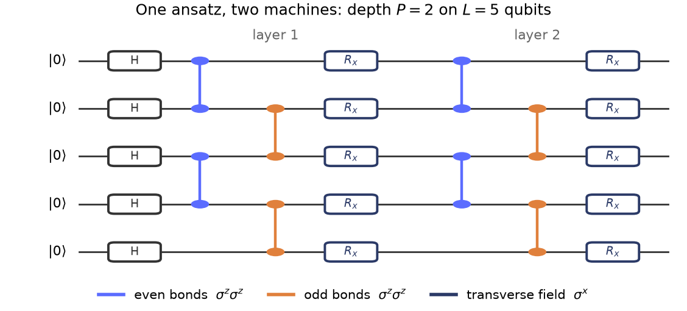
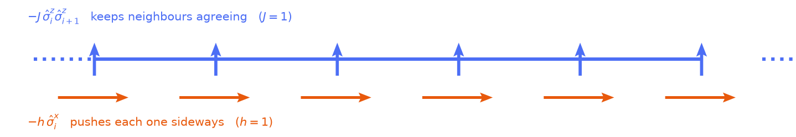
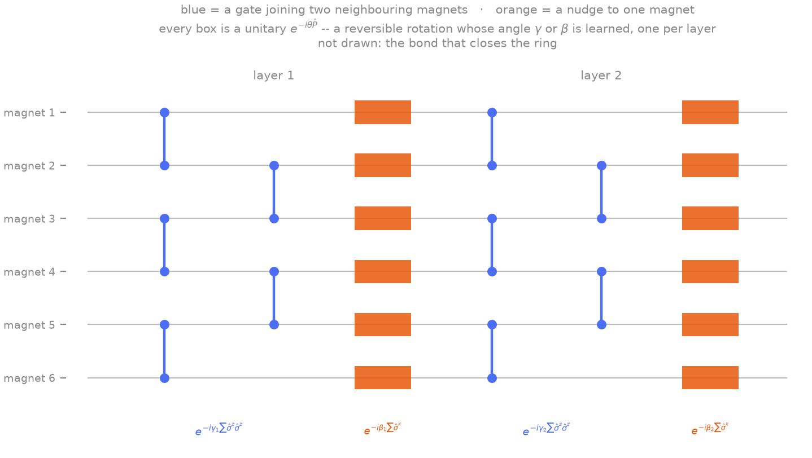
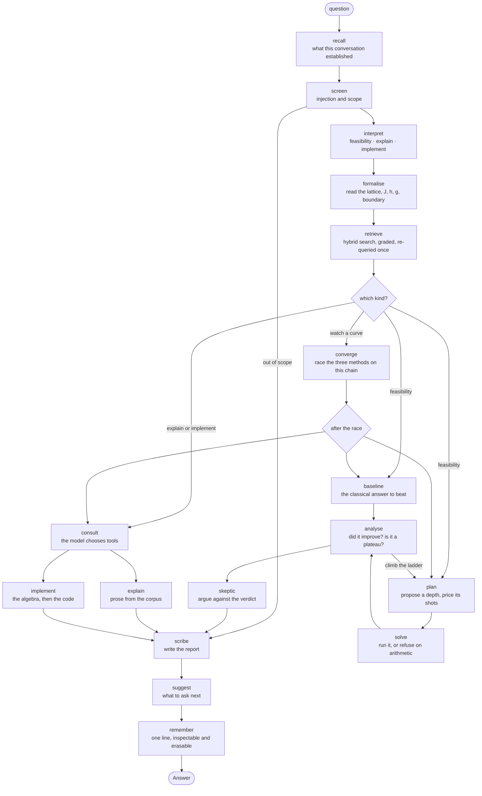
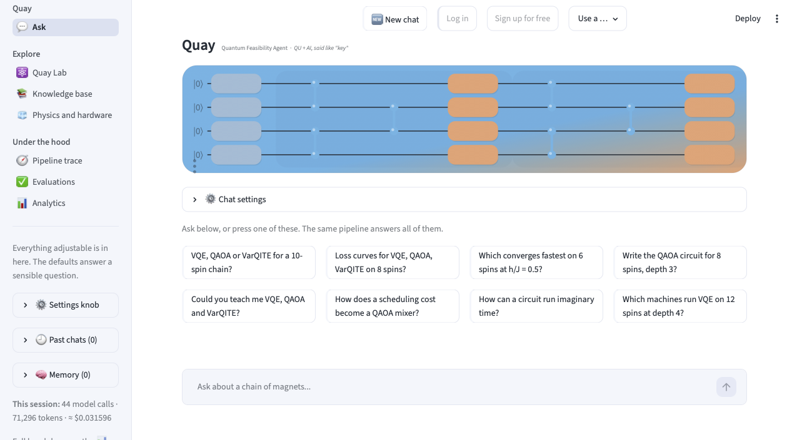

# ⚛️ Quay — a feasibility agent for quantum simulation

[](https://github.com/BimlaDanu/AI-Engineering/actions/workflows/check-quay-agent.yml)

[](https://www.python.org/downloads/)
[](https://docs.streamlit.io/)
[](https://langchain-ai.github.io/langgraph/)
[](https://python.langchain.com/docs/introduction/)
[](https://docs.trychroma.com/)
[](https://openrouter.ai/docs/quickstart)
[](https://docs.pydantic.dev/)

[](https://quantum.cloud.ibm.com/docs)
[](https://numpy.org/doc/stable/)
[](https://docs.scipy.org/doc/scipy/)
[](https://info.arxiv.org/help/api/index.html)

[](https://docs.astral.sh/uv/)
[](https://docs.astral.sh/ruff/)
[](https://mypy.readthedocs.io/)
[](https://docs.pytest.org/)


<p align="center">
   and passes through a Hadamard, then two repeated layers of blue even-bond and orange odd-bond two-qubit gates followed by single-qubit R_x rotations" width="760">
</p>

<p align="center">
  <sub><b>The whole subject, as a program.</b> Five magnets, two layers, six learned angles. <b>H</b> is a Hadamard gate: it turns the single definite arrangement <code>|00000⟩</code> into an equal mix of all thirty-two, which is the exact answer when the sideways push wins outright so the search starts somewhere known. Then blue couples neighbours along <code>σᶻ</code>, orange pushes each one sideways along <code>σˣ</code>, and the learned angles rotate that starting point toward the reality.</sub>
</p>

## Quay — Quantum Feasibility Agent · **QU** + **AI**

**Quay is a working environment for the transverse-field Ising model — the standard test problem of near-term quantum computing.** Magnetic spins on a line, a square grid or a triangular grid. Ask in ordinary language and the agent decides what the question needs: an explanation of an algorithm, a derivation, a curve, the cost of a circuit on a named machine, or a full feasibility verdict. On that last path it reads the problem out of the sentence, designs a circuit, prices it against a real device's wiring and coherence time, spends a measurement budget, runs the classical method the answer would have to beat, and writes the report. If the budget cannot buy the accuracy asked for, the answer is a refusal that shows the arithmetic.

**No number in any answer comes from a language model.** Deterministic, tested Python computes every quantity; the model reads the question and writes the prose. A separate exact solver, which the agent cannot import, marks the result afterwards. Most language-model applications have no way to check their own output; this one is built on a model whose answer can be computed independently, which turns each of the agent's claims into something measurable.

Built with **Python 3.11+, Streamlit, LangChain, LangGraph, Chroma, NumPy and SciPy**, over OpenRouter. Each badge at the top links to that tool's documentation.

<details>
<summary><b>New to the terms?</b> — a plain-English glossary of both halves, the software and the physics</summary>

None of this is needed to use the application. It is here so the rest of this document reads the same whichever side of the subject you arrive from.

| Term | In plain words |
| --- | --- |
| **Spin** | A small magnet that can point one of two ways. The same thing as a qubit, seen from the physics side. |
| **Transverse-field Ising model (TFIM)** | Spins on a lattice. Each prefers to point the same way as its neighbours; a sideways push stops them settling. The competition between those two is the whole problem. |
| **Lattice** | Which spins are neighbours of which. A line, a square grid, or a triangular grid. |
| **Ground state** | The lowest-energy arrangement. Finding it is the task. |
| **Critical point** | The setting where the two forces balance. The hardest place to compute anything, and the interesting one. |
| **Ansatz** | A circuit shape with adjustable dials. You turn the dials until the energy stops falling. |
| **Variational bound** | Any answer this kind of circuit gives is *at or above* the true energy, never below. A number below the bound is a bug, not a better answer. |
| **Shot** | One measurement of a quantum computer. Noise falls as one over the square root of the shot count, so accuracy is bought by the million. |
| **Transpilation** | Rewriting a circuit for a machine that cannot connect every qubit to every other. It adds gates, and the added gates cost time the machine does not have. |
| **Coherence time** | How long a real device stays quantum. A circuit longer than this returns noise. |
| **Frustration** | When no arrangement of spins can satisfy every neighbour at once. Needs a triangular lattice and a coupling that makes neighbours disagree. |
| **RAG** | Retrieval-augmented generation: search a set of documents first, answer from what came back, and cite it. |
| **Agent** | A program that decides *which* work to do, does it with tools, looks at the result, and decides again — rather than following a fixed sequence. |
| **Eval** | A held-out set of questions with known answers, run on a schedule and scored. It is the reason to believe any of the above. |

</details>

---

## 🕐 A quick overview

The codebase is large. These eight files carry the main parts:

| # | File | What it shows |
|---|---|---|
| 1 | [`src/agent/graph.py`](src/agent/graph.py) — start at `build_graph()` | That the agent is a **graph with real branches**: 17 nodes, a `plan → solve → analyse → plan` loop with four termination conditions, and parallel fan-out |
| 2 | [`src/physics/model.py`](src/physics/model.py) | The problem statement as one frozen, validated object. Everything downstream reads the shape off it |
| 3 | [`src/physics/registry.py`](src/physics/registry.py) + [`tests/test_architecture.py`](tests/test_architecture.py) | **The one structural claim**: the agent cannot import a reference solution, proved by walking the import graph |
| 4 | [`src/physics/reference/free_fermions.py`](src/physics/reference/free_fermions.py) + [`exact_diagonalisation.py`](src/physics/reference/exact_diagonalisation.py) | Two reference routes that share no algebra — an analytical exact solution, and a sparse eigenproblem with a different bit convention |
| 5 | [`src/agent/tools.py`](src/agent/tools.py) | Eight tools, each returning a structured dictionary. Read a description: it is written to be understood without physics |
| 6 | [`src/rag/retrieve.py`](src/rag/retrieve.py) | Hybrid BM25 + vector search fused by reciprocal rank, graded, re-queried once, with an empty result treated as an answer |
| 7 | [`src/security.py`](src/security.py) | The deterministic screen that runs before any model call, in both directions |
| 8 | [`src/evals/`](src/evals/) + [`reports/scorecard.md`](reports/scorecard.md) | Three held-out suites, scored by arithmetic rather than by a model, and the last run |

**Then run it.** `make check` runs lint, types and the whole test suite. `make run` opens the interface and shows the route each answer took.

**Three things worth questioning, and where each is answered:**

- *Does the model decide anything, or is the path fixed?* — `src/agent/intent.py` and `make routes`, which prints the nodes that ran for one question of each shape.
- *Is retrieval doing work, or is the model answering from memory?* — on the explaining branch an empty search is a refusal. There is no fallback to training data.
- *Are the evals a model marking its own homework?* — no. `src/evals/metrics.py` compares against arithmetic and recorded structure. No judge model is used anywhere.

---

## 📚 Contents

1. [The problem it solves](#the-problem-it-solves)
2. [Classical and quantum computers, and where this model sits](#classical-and-quantum-computers-and-where-this-model-sits)
3. [The model](#the-model) · [the one-dimensional case](#the-one-dimensional-case-and-why-it-is-special) · [two dimensions](#two-dimensions-square-and-triangular) · [the longitudinal field](#the-longitudinal-field-g)
4. [Get started](#get-started)
5. [What you can ask it](#what-you-can-ask-it)
6. [How it reaches an answer](#how-it-reaches-an-answer)
7. [The import wall](#the-import-wall)
8. [Features](#features)
9. [The pages](#the-pages)
10. [Evaluation results](#evaluation-results)
11. [Project structure](#project-structure)
12. [Technology stack](#technology-stack)
13. [Testing](#testing)
14. [When something goes wrong](#when-something-goes-wrong)
15. [Limitations](#limitations)
16. [Future directions](#future-directions)
17. [Ethics](#ethics)
18. [References](#references)

---

## The problem it solves

Stated as situation, complication, resolution.

**Situation.** If you want to learn near-term quantum computing, you end up at the transverse-field Ising model whichever door you come in by. On an annealer it is not a model of the machine, it is the machine: the couplings are physical couplers and the field is what gets ramped down. Gate-based devices are benchmarked on it because every term touches at most two qubits, so the hardware can hold it without approximation. QAOA was written for it. It is the standard textbook example of a quantum phase transition. And written as a QUBO, it is what scheduling and portfolio problems get turned into before anyone hands them to an Ising machine.

Those are five different subjects: the physics, the algorithms, the circuit, the device, the classical competition. The model only makes sense when you can see all five at once.

**Complication.** Textbooks give you one of the five at a time. Papers assume you already have all of them. The obvious way to close that gap now is to ask a language model. What comes back is fluent, well organised, and full of numbers — an energy, a gate count, a shot budget, a fidelity. Anyone still learning the subject is the person least equipped to tell a computed number from an invented one. The failure lands where it will not be noticed.

**Resolution.** Quay is a place to work on that model where the language model is not allowed to produce a number. It reads your question and writes the prose. Tested Python does the arithmetic. An exact solver the agent cannot import marks the answer afterwards.

Ask what a method is and you get a lesson. Ask what a circuit costs on a named machine and you get the routing and the coherence arithmetic. Ask whether the quantum route is worth it and you get a verdict with the classical baseline next to it — and the planner has no way to skip that baseline, because it sits on a branch of the graph that nothing downstream controls. If the notes turned up nothing and nothing was computed, the agent says so instead of filling the gap from memory.

Only one model, and that was the point. It is the one with an exact analytical solution, so there is always a right answer the agent could not see.

### What you actually do with it

Six things, and they take different routes through the agent: learn an algorithm, follow a derivation, plot a curve, price a circuit on a named device, reach a feasibility verdict, or get runnable code. [What you can ask it](#what-you-can-ask-it) lists the questions that exercise each one.

Six reading levels, from *no background at all* to *wants the derivation*, change the prose and none of the numbers.

<details>
<summary><b>Why this model reaches outside physics</b> — the QUBO connection, and its limit</summary>

Write the same equation as a quadratic cost over variables that take the values $\pm 1$ and you have a **QUBO**. That is the form portfolio selection, vehicle routing and job scheduling get rewritten into before anyone hands them to an Ising machine, quantum or classical. It is not an analogy — it is the same Hamiltonian with different names on the coefficients.

That is why one of the four shelves of the corpus is about applications. It holds what is known about that route: which operational problems map cleanly onto an Ising cost function, what commercial Ising machines exist, and which claimed speedups have actually been demonstrated. Ask about it and you get an explanation with citations.

What you do not get is an assessment of your scheduling problem. The app does one model. Where a question drifts outside it, the answer says so.

</details>

### What "it works" means, measurably

The success criteria were fixed in advance, so the project can fail against them. Three properties do the work, and they are worth separating because they fail differently.

| | What it means | Where |
| --- | --- | --- |
| **A number is never generated** | Every energy, gap, depth, shot count and refusal is arithmetic in tested Python. The model reads the question and writes the prose. Set the temperature to 2.0 and every digit comes back identical — the interface says so beside the dial, so it can be checked rather than taken on trust | `src/physics/`, `src/agent/graph.py` |
| **A number is computed twice** | `hamiltonians.py` is held against `exact_diagonalisation.py` (a different bit convention), against `free_fermions.py` (no matrix at all), and against a Kronecker assembly written inside the test. Worst disagreement across sixteen ring configurations: $1.4 \times 10^{-14}$ | `src/verification/cross_check.py` |
| **The agent cannot read the answer** | Nothing under `src/agent/`, `src/physics/quantum/`, `src/physics/classical/` or `src/hardware/` may import `src/physics/reference/`, directly or transitively, and a test walks the import graph to check | `src/physics/registry.py`, `tests/test_architecture.py` |

<details>
<summary><b>Every step from question to verdict, and the check on it</b></summary>

None of these checks was written by the agent.

| Step | What checks it |
| --- | --- |
| question → Hamiltonian | the assumptions are recorded; exact diagonalisation on a small chain |
| Hamiltonian → circuit | $E \ge E_0$ — a lower value is a bug, never a better answer |
| circuit → native circuit | statevector equivalence against the un-compiled version |
| native → device circuit | coupling-map legality, and a fidelity model checked against noisy simulation |
| imaginary-time flow → classical ODE | energy monotone in $\tau$; the condition number as an expressivity diagnostic |
| model → reference answer | a closed form on a line · sparse exact diagonalisation on any lattice · the two free limits |

</details>

---

## Classical and quantum computers, and where this model sits

**A classical computer stores a definite state:** $L$ bits hold one of $2^L$ possible values at a time, and a program moves between them one step at a time. To describe a quantum system of $L$ spins, a classical computer has to track all $2^L$ arrangements at once, together with how much of each is present in the mixture. Sixteen spins is 65,536 states, which is nothing. Fifty spins is more states than there are atoms in a building. That exponential growth is the whole difficulty, and it is why simulating quantum matter is one of the few problems where a quantum computer has a clear theoretical case.

**A quantum computer stores a superposition:** Its $L$ qubits hold a combination of all $2^L$ arrangements natively, because they are themselves a quantum system. It does not read that state out: a measurement returns one arrangement, at random, with a probability the state decides. So a quantum algorithm arranges interference so that the arrangements you want become likely, and an answer is an average over many measurements.

**Quantum advantage:**  Quantum advantage means a specific problem, at a specific size, solved faster or more accurately than the best known classical method. A quantum advantage claim also has to survive the machine: circuits have to be rewritten for hardware that cannot connect every qubit to every other, and every added gate costs time against a coherence limit measured in microseconds.

**Why quantum Ising Hamiltonian in particular:** Written in the language of qubits, $\hat\sigma^z$ and $\hat\sigma^x$ are exactly the operators the Pauli-$Z$ and Pauli-$X$ gates apply, and every term touches at most two spins. That makes the transverse-field Ising model *two-local*: something a real machine can hold directly rather than approximately.

| On real hardware | What this model becomes |
| --- | --- |
| **A quantum annealer** | Hardware implementation: The neighbour couplings are the physical couplers between qubits, and the sideways field is the transverse field the machine ramps down. Annealing is this equation |
| **A gate-based device** | Trotterised into a repeating pattern of two-qubit $R_{zz}$ rotations and one-qubit $R_x$ rotations the circuit shape `src/physics/quantum/ansatz.py` builds and `src/hardware/transpile.py` places on a real wiring diagram |
| **A variational algorithm** | The standard optimisation approach. QAOA's cost-and-mixer structure is this model split in two, and the Hamiltonian Variational Ansatz is the same split turned into circuit layers |

The physics feeds back into the engineering. The energy gap closes at the critical point. The gap sets how slowly an annealer must run to stay in the ground state, so it decides whether a schedule is feasible. The same closing gap is why variational circuits need the most layers there, and run out of coherence time there first.


**The four methods, and what separates them.** The left of each pair searches for its own settings; the right lets the physics fix them. Quay implements one from each column — VQE and imaginary time — because those are the two that return an *energy*, which is the quantity an exact answer can mark.

Outside physics, the same equation is a **QUBO**, a quadratic cost function over ${\sigma}^z =\pm 1$ variables, which is the form portfolio optimisation, routing and scheduling problems are rewritten into before being handed to any Ising machine. That is why the corpus carries a shelf on applications: *which business problems map onto this model* is a question about this exact Hamiltonian.

---

## The model

One family of models, taken all the way through. The Hamiltonian is

$$
\hat H = -J \sum_{\langle ij \rangle} \hat\sigma^z_i \hat\sigma^z_j - h \sum_i \hat\sigma^x_i
$$

where $\langle ij \rangle$ runs over each pair of neighbouring sites once, so the same equation covers every lattice the project supports.

Read plainly: **small magnets on a lattice, pulling their neighbours into line while something pushes them sideways.**



That picture is the whole subject. Blue keeps neighbours pointing the same way, orange tries to knock each one sideways, and **no arrangement of magnets satisfies both** — that disagreement is the only reason any of this is quantum, and everything further down is an attempt to settle it.

Term by term:

| Symbol | What it is | In plain words |
| --- | --- | --- |
| $\hat H$ | the Hamiltonian | the rule that assigns an energy to every arrangement. The task is to find the arrangement with the lowest energy — the ground state |
| $L$ | the number of sites | how many magnets. Everything is written and tested at **12**; **16** is the ceiling both circuit simulation and sparse diagonalisation stop at, and it is there because a $4\times4$ square is exactly 16 sites. A question naming more is clamped with the assumption printed, never answered quietly about a smaller problem |
| $\langle ij \rangle$ | the neighbour pairs | which magnets pull on which. This is the lattice, and it is the only thing that differs between the three shapes |
| $\hat\sigma^z_i$, $\hat\sigma^x_i$ | Pauli operators at site $i$ | the measurements "which way is magnet $i$ pointing?", asked along two different axes. |
| $J$ | the coupling | how strongly each magnet wants to point the same way as its neighbours. The minus sign makes agreement cheap, so $J > 0$ is the ferromagnetic case, which is the one this project uses throughout |
| $h$ | the transverse field | a push sideways, in a direction the magnets cannot all agree on at once. This is the term that makes the problem quantum |

**The subject is a competition between the two terms.** $J$ wants every magnet lined up; $h$ wants each one pointing sideways. They cannot both win, and at a particular ratio the system changes character, from an ordered ferromagnet to a disordered paramagnet. That is where every approximate method has its hardest time.


**Why that ratio is the whole difficulty**, on the right. The gap — the energy cost of the cheapest excitation — closes to zero at $h/J = 1$ on an infinite chain. A closing gap is what makes a problem hard for *every* method at once: it sets how slowly an annealer must ramp, how many layers a variational circuit needs, and how long imaginary time takes to settle. On a finite chain it dips to a small non-zero minimum instead, which is why a six-site answer is not simply a shorter version of the real one.

Why sideways makes it quantum: measuring along $z$ and measuring along $x$ are incompatible questions, so a magnet cannot have a definite answer to both at once. The lowest-energy arrangement is therefore a superposition of classical arrangements rather than one of them, and that is why a classical computer has to track all $2^L$ states.

### The one-dimensional case, and why it is special

On a line each site has one forward neighbour, so the neighbour sum can be written out:

$$
\hat H = -J \sum_{i=1}^{L} \hat\sigma^z_i \hat\sigma^z_{i+1} - h \sum_{i=1}^{L} \hat\sigma^x_i
$$

This is a limiting case of the equation above rather than a second model, and it is worth its own equation for two reasons.

**It is the only shape with an exact analytical solution:** A change of variables called the Jordan–Wigner transformation turns a chain of interacting spins into a gas of non-interacting particles, and non-interacting problems can be solved analytically. **Pfeuty published the closed-form solution in 1970**. The transformation straightens out a chain and does nothing for any other higher dimensional lattice graph.


**A great deal of well-understood physics lives in this case and can be worked through by hand:** The gap closing linearly at $h = J$; the critical point pinned exactly there by Kramers–Wannier self-duality; the logarithmic divergence of the susceptibility; the mapping of the quantum chain onto a two-dimensional classical Ising model, which is what the classical baseline samples. Somebody who follows the one-dimensional case has the vocabulary for the two-dimensional ones, where no exact solution exists.


### Two dimensions: square and triangular

Two more lattices, and they are where the physics stops being solvable in closed form.

| Lattice | Neighbours per site | Bipartite | What it adds |
| --- | --- | --- | --- |
| **chain** | 2 | yes | the reference case, and the only one with a closed form |
| **square** | 4 | yes | genuine two-dimensional criticality, no exact solution at any size. Ferromagnet and antiferromagnet have identical spectra here, which is a free cross-check |
| **triangular** | 6 | **no** | frustration becomes possible: its triangles cannot be two-coloured, so with a coupling that makes neighbours disagree, the three bonds of a triangle cannot all be satisfied at once |

**Why this is more than a second lattice.** Every verdict on a one dimensional model is honestly negative, because a chain is where classical methods are strongest. Moving off the chain changes three things at once:

- **The circuit gets more expensive per layer.** A line puts two two-qubit gates on each spin per layer; a square lattice four, a triangular one six. Each of those is a full gate duration against a fixed coherence time, before the machine's wiring adds any shuffling. `assess_device_fit` prices this: a $4\times4$ square at depth 3 on a heavy-hex device needs 216 added SWAP gates, reaches two-qubit depth 366, and takes 167.8 µs against a 90 µs coherence time — refused, with the arithmetic shown.
- **The classical competition weakens.** Frustration produces many nearly-equal arrangements separated by barriers a single spin flip cannot cross, so a sampler's measurements stay correlated and its error bar is smaller than the real one. Not a sign problem — this model is stoquastic on any lattice, and `tests/test_classical_regime.py` checks that from an assembled matrix.
- **The reference answer costs exponentially.** With no exact analytical solution, the only exact route on a lattice is brute force matrix diagonalisation.

`src/physics/lattice.py` holds the geometry: a shape in, an edge list out. Bipartiteness is computed by two-colouring the edge list rather than read off the lattice's name, so the ferromagnet-antiferromagnet cross-check tests the graph that was actually built.

<details>
<summary><b>One calibration anchor worth knowing about</b></summary>

A $2\times2$ open square has bonds A–B, B–D, D–C, C–A: a four-cycle. A four-site ring is also a four-cycle. The two are **isomorphic but not identical** — under row-major numbering the square's cycle runs 0-1-3-2-0 while the ring's runs 0-1-2-3-0, so the labelled edge sets differ and only the graph is the same. An energy does not depend on labelling, so the two-dimensional code path at its smallest size must reproduce the one-dimensional closed form exactly. At $J = h = 1$ both give $-5.226251860$.

It is the only such identity available: a two-dimensional lattice needs at least two rows and two columns, so the smallest triangular one has four sites and is not a ring.


</details>

### The longitudinal field $g$

A third field can be switched on:

$$
\hat H = -J \sum_{\langle ij \rangle} \hat\sigma^z_i \hat\sigma^z_j - g \sum_i \hat\sigma^z_i - h \sum_i \hat\sigma^x_i
$$

It is written second, not last: $-J\sum\hat\sigma^z\hat\sigma^z$ and $-g\sum\hat\sigma^z$ are both diagonal, and the code splits the Hamiltonian on exactly that line into $\hat H_\text{diag}$ and $\hat H_\text{field}$.

$g$ is a nudge along the axis the magnets already argue about. It defaults to zero and is reachable from an advanced control, so a reader who never touches it is not shown a symbol that does nothing.


**At $g = 0$ on a line, the model is integrable** — the exact analytical solution applies, the exact answer costs $O(L)$ arithmetic, and the honest verdict is that no quantum computer could beat an ordinary one at it. **At any $g \ne 0$, that shortcut is gone.** The field along $z$ breaks the transformation, the spins interact, and nothing cheaper than an exponential method remains. Same two-local Hamiltonian, same circuit depth, same shot budget, a different competitive landscape.

That asymmetry is the point:

- **It costs no two-qubit depth.** $g$ adds one-qubit rotations, which are close to free on real hardware. Turning it on does not change what a device can run, only what an ordinary computer can do about it.
- **It is one of the two places a positive answer could live**, the other being frustration on a triangular lattice.
- **$g = 0$ is the calibration setting**, where a reference answer exists and every method can be checked against it. The project calibrates there and asks the interesting question next door.

When $g$ is non-zero, three things follow and each is checkable: `list_methods` withholds the closed form with the reason attached; the reference solver declines to score, and the verdict therefore rests on the classical baseline and the variational runs alone, with the report stating what it could not check.

### The model as a program

**One convention, fixed everywhere.** Pauli operators with eigenvalues $\pm 1$; spin operators $\hat S = \hat\sigma/2$ appear nowhere. Mixing the two is the commonest factor-of-two error in this subject. And `TFIMSpec` carries the lattice, so every method that describes, prices, solves or scores a problem reads the shape off the same object — before that, geometry was an optional argument defaulting to a line, and a $4\times4$ square came back with a variational energy *below* the number reported as exact.

A quantum computer is not given instructions. It is wired up as a diagram and then run. This is the diagram for the Hamiltonian above:



Each blue connector applies the coupling term $e^{-i\gamma_p \sum \hat\sigma^z_i \hat\sigma^z_j}$ to two neighbouring magnets. Each orange box applies $e^{-i\beta_p \sum_i \hat\sigma^x_i}$ to one magnet on its own — the field term. One layer is a column of blue followed by a column of orange, and the angles $\gamma_p, \beta_p$ are the two numbers per layer that get learned.

**Notice the blue columns.** The connectors in one column share no wire, so they happen at the same moment. A chain needs **two columns per layer however long it is**, because its bonds split into evens and odds. Doing them one after another would make the program grow with the chain: at fourteen magnets that is a depth of 26 against 4, for a bit-identical circuit. That saving comes from noticing a commutation structure, not from better hardware, and it is the difference between a circuit a real machine can hold and one it cannot.

**Every number this project reports is a statement about this picture** — how deep it is on a given machine after routing, how much signal survives it, how many measurements it takes to read an energy off it, and whether an ordinary computer would have been faster.

And this is what is *done* with it:


**The algorithm is a loop with a classical optimiser inside it**, which is the part that makes it runnable on hardware that cannot stay coherent for long: each pass through the quantum half is short, and the thinking happens on an ordinary computer between passes. The inequality under the arrow is what makes the whole project checkable — the loop can only ever report a number *at or above* the true ground-state energy, so a result below it is a bug and never a discovery, and `tests/` asserts exactly that.

Drawn by `src/ui/figures.py`, the same function the **Quay Lab** page calls, and regenerated by `make figures`. The vector original is `reports/figures/lab-ansatz-circuit.pdf`.

---

## Get started

**Prerequisites:** [Python 3.11+](https://www.python.org/downloads/) and [uv](https://docs.astral.sh/uv/getting-started/installation/). An [OpenRouter key](https://openrouter.ai/keys) is needed to *ask the agent anything* and to reproduce the scores below; the pages render, and the whole test gate passes, without one.


```bash
# 1 — install exactly what the lockfile pins
make sync

# 2 — put a key where the application can find it
#     OPENROUTER_API_KEY=sk-or-v1-...   # needed to ask a question or run the evals
#     LANGSMITH_API_KEY=...             # optional, for traces
cp .env.example .env && $EDITOR .env

# 3 — fetch the corpus, then build the search index from it
make corpus && make ingest

# 4 — run it
make run
```

> **Step 3 is two commands.** `make corpus` fetches abstracts from arXiv and writes Markdown; `make ingest` embeds them into Chroma. Changing the embedding model means re-running `make ingest` alone.


> **Rendering a page calls no model and reads no credential.** `make run` works on a fresh checkout with no `.env`, and CI runs the whole gate with no key in scope.

| Command | What it does |
| --- | --- |
| `make sync` | Install from `uv.lock`, with no re-resolution |
| `make run` | Launch the Streamlit application |
| `make check` | **The gate** — lint, format check, typecheck, tests, doctests. Exactly what CI runs |
| `make test` | The test suite alone, offline and deterministic |
| `make test-serial` | The same suite in one process, for when a failure needs a readable traceback |
| `make format` · `make lint` · `make typecheck` | Ruff format · Ruff check · mypy |
| `make corpus` | Refetch the arXiv corpus into `data/corpus/` (network) |
| `make ingest` | Rebuild the Chroma index from the corpus (network, credential) |
| `make evals` | **Live, needs a key.** Run the held-out suites and write `reports/scorecard.md` |
| `make evals-offline` | The same harness with no model: physics, planner, budget, verdict rules and keyword retrieval. Scores no writing, writes no scorecard |
| `make figures` | Redraw every figure into `reports/figures/` as PDF, each with a PNG beside it for this page and for slides |
| `make live-check` | **Live, needs a key.** Ask the agent real questions and print each route |
| `make starter-check` | Press every starter button offline and report the route each takes, and how much of the 17-node graph the eight cover between them |
| `make curve-check` | Ask the six curve questions offline and check each fetched a curve |
| `make routes` | Print the route each shape of question takes through the graph |
| `make timing` | Time one question and report where the wait went |
| `make verify-models` | Resolve every catalogued model against the live index |
| `make campaign` | Run one feasibility campaign end to end (live; costs tokens) |
| `make mcp` | Serve the agent's tools over the Model Context Protocol |

> **Which of these need `OPENROUTER_API_KEY`.** Four do, and they are the four that
> talk to a model or an embedding endpoint: `make ingest`, `make evals`,
> `make live-check` and `make campaign` (`make verify-models` needs the network but
> no key). Everything else — including `make run`, `make check` and every figure —
> works on a fresh checkout with no `.env` at all. The scores quoted further down
> come from `make evals`, so **reproducing them needs a key**; checking that the
> software works does not.

---

## What you can ask it

### Feasibility: the longest route through the agent

| Ask | What happens |
| --- | --- |
| *"VQE, QAOA or imaginary time for a 10-spin critical chain?"* | The full campaign. The classical baseline runs in parallel with the planner, circuits climb a depth ladder until the shot budget or the coherence time stops them, and a dated verdict states the crossover condition |
| *"Is quantum hardware worth it for a 4×4 square lattice at criticality?"* | The same campaign on a lattice, where the closed form does not exist. `list_methods` withholds it by name, the sampled classical baseline declines as well, and the verdict rests on what could actually be run |
| *"Is a quantum computer worth using for a chain of 200 magnets?"* | A refusal naming the number asked for and the limit it exceeds. Nothing is quietly answered about a smaller problem |
| *"How deep should the circuit be before noise wins?"* | The depth ladder, climbed rung by rung until something stops it, with the refusal shown and its arithmetic: which depth was rejected, and whether the shot budget, the fidelity floor or the coherence time was the binding constraint. **No verdict** — the question named no chain, so the runs are reported under the chain the assumptions state and no yes-or-no is offered |
| *"And if we double the circuit depth?"* | Answered from what the previous question established. This is the memory layer in one click — the question names no size, no field and no method |

### Retrieval and literature

| Ask | What happens |
| --- | --- |
| *"Why does the energy gap close at h = J?"* | An explanation from the corpus with citations, and no invented numbers: the explaining branch is forbidden to state a quantity it did not compute |
| *"Can you provide some recent arXiv papers on QAOA approximation for quantum Ising lattices?"* | Hybrid retrieval over 127 notes, plus a live arXiv search — every fetched abstract screened and labelled unverified |
| *"How does a scheduling cost become a QAOA cost and mixer?"* | The applications shelf. This is the question that connects the model to problems outside physics |
| *"What is the best pizza in Vilnius?"* | Declined before a search is made or a problem is invented |

### Teaching and derivation

| Ask | What happens |
| --- | --- |
| *"Could you teach me about VQE, QAOA and VarQITE applied to this model?"* | A lesson rather than a measurement: a section per algorithm covering what it is for, the mathematics, what it does here, and what it costs |
| *"Detail the mathematics of the quantum-to-classical mapping."* | The derivation line by line, including the check that the mapping puts the critical point at $h = J$ for every slice thickness |
| *"How can a circuit run imaginary time, which is not unitary?"* | The McLachlan variational principle, the Fubini–Study metric, and why the cost is $O(P^2/\Delta)$ |

### Curves and figures

| Ask | What happens |
| --- | --- |
| *"Can you plot the exact energy levels as the field is turned up?"* | A field sweep by the closed form, corroborated point by point by diagonalisation, with the figure drawn from the recorded call rather than from anything the model wrote |
| *"Plot the ground-state energy and its first two derivatives against h/J."* | Every derivative analytic — the first is minus the magnetisation exactly, by Hellmann–Feynman. A finite difference would make the plotted physics depend on the point spacing |
| *"Plot the energy of a 3×4 square lattice as the field is turned up."* | The same curve on a lattice, diagonalised at every point and assembled a second way as a Kronecker product. Higher derivatives are declined by name — a lattice has no dispersion to differentiate |
| *"Learning curve for VQE, QAOA and VarQITE: 8 spins at criticality?"* | A curve *and* a verdict. The question names a size, so it takes the feasibility branch as well as the race |

### Hardware and cost

![Three panels for a twelve-magnet chain on three machines. Left, what the wiring costs: depth on the machine divided by depth in principle, flat at one for a segment and at eight for a ring. Centre, what the noise leaves: the fraction of the result that is signal, starting near 0.65 and falling past half by three layers on both real machines while the ideal one stays at one. Right, what that costs in shots: measurements relative to a perfect machine, rising to several hundredfold by twelve layers on a log scale.](reports/figures/device-limits.png)

**This is the feasibility question, in three panels.** A circuit does not cost what it looks like it costs. Wiring the chain onto a machine that was not built for it multiplies the depth (left); every added layer loses signal to noise (centre); and recovering the lost accuracy costs measurements, which scale as the *inverse square* of the error, so a curve that looks like a gentle decline in the middle panel is a hundredfold bill in the right one. The agent computes all three before it commits to a run, and refuses when the budget cannot buy the accuracy asked for. Regenerated by `make figures`; the vector original is `reports/figures/device-limits.pdf`.

| Ask | What happens |
| --- | --- |
| *"Which real quantum computers could run these methods?"* | The circuit placed and routed on three real wiring diagrams, with the added SWAP gates and the resulting depth priced against each machine's published coherence time |
| *"What would a hundred questions of this kind cost?"* | A follow-up — "of this kind" refers to the answer above it, so it is asked second or pressed as a suggestion. |

### Code

| Ask | What happens |
| --- | --- |
| *"Can you write the QAOA circuit for 8 spins at depth 3?"* | The algebra first — the state written out layer by layer, the energy, the shot estimator and the variational bound, composed from the same specification that priced the circuit — and then the program, labelled as unrun text. |

---

## How it reaches an answer

Seventeen nodes exist and a given question runs some of them. The route is a decision, and the *Pipeline trace* page draws the route the last question actually took.


**The same graph as a picture.** Navy is the fixed front every question runs, blue the feasibility branch with its `plan → solve → analyse` loop, orange the prose branch and the curve race, green the closing sequence. The loop is the only cycle in it. Drawn by `scripts/draw_agent_graph.py` straight from `build_graph()`, and a test fails the build if a node exists that this picture does not draw — so the diagram cannot drift from the code. The vector original is `reports/figures/agent-graph.pdf`.



<details>
<summary><b>Node by node</b> — what each one contributes</summary>

| Node | What it does |
|---|---|
| **recall** | Reads the recent turns, so *why?* and *now try an open boundary* mean something. The recap is fenced and labelled as a record — never as instructions, never as evidence for a number |
| **screen** | Injection and scope screening. Runs early, and it alone blocks |
| **interpret** | Decides what kind of question this is. Word scores usually settle it; a curve or comparison question that names a size in its own sentence goes down the feasibility branch, because it wants both the curve and the verdict |
| **formalise** | Reads the lattice, the size, $J$, $h$, $g$ and the boundary, and records every assumption it had to make. Reads a *ratio* too — *"the neighbour pull is twice the sideways field"* names no number and fixes the physics completely, which is how somebody who is not a physicist states this |
| **retrieve** | Hybrid search, graded, re-queried once if a round keeps nothing. Reaches arXiv when the question asks for literature, not only when the corpus is silent — a fixed corpus cannot answer "what is recent" |
| **baseline** | The classical method the quantum arm has to beat. Issued in parallel with the planner, and not a step the planner may skip |
| **plan** | Surveys which solvers apply at this size, shape and boundary, ranks them by accuracy then cost, and prices the shots the next depth would need |
| **solve** | Runs the chosen configuration, or refuses it on arithmetic before spending anything |
| **analyse** | Did the energy improve? Is this a barren plateau? Loops back to `plan` to climb the depth ladder, and stops at the first refusal, because every reason for one grows with depth |
| **skeptic** | Argues against the verdict that is about to be written, and withholds it entirely when the question named no chain — the runs are still reported, under the chain the assumptions name |
| **converge** | Races the three near-term methods on *this campaign's* chain — not a stock one — and keeps the curves. Reached only when the question asked to watch something converge rather than be told where it ended. Every energy is an exact expectation value from a simulated state vector, so the curves compare methods on a perfect device and say nothing about noise, which the node records as a belief in those words |
| **consult** | Offers the model the whole tool registry with the verified numbers already in front of it, so it chooses what *else* would help rather than guessing. At most three rounds; every round logged and billed separately, every call recorded with its arguments and result |
| **explain** | Prose from the corpus. Forbidden to state a quantity nothing computed |
| **implement** | The algebra a program is a transcription of, composed from integers, and then the program — labelled as unrun text |
| **scribe** | Writes the report. Numbers are read off the structured result, never off the prose |
| **suggest** | Proposes what to ask next from what this run established. Each suggestion is screened as if it had been typed |
| **remember** | Stores one line. A blocked question is never stored — enforced in this node and in the edge that skips it |

</details>

<details>
<summary><b>Edges, branches and loops</b> — how the route is decided</summary>

Four of the edges are conditional. Everything else is a straight line.

| Edge | Decides | Outcomes |
| --- | --- | --- |
| after **formalise** | is there a problem to work on? | `retrieve`, or straight to the verdict if the question was refused or named no chain |
| after **retrieve** | which branch answers this? | `[baseline, plan]` for feasibility — **both, at once** — or `consult` for prose, or `converge` when a curve was asked for |
| | and when no chain was named? | the loop still runs if the question asks for something only the loop measures — *how deep before noise wins?* — and the verdict is withheld instead. Otherwise `consult` |
| after **plan** | can this configuration run? | `solve` if it fits the budget · back to `plan` for something cheaper · stop if nothing is left to try |
| after **analyse** | is another depth worth it? | back to `plan`, or stop |
| after **consult** | which kind of prose? | `explain` or `implement` |

**The fan-out is the structural commitment.** A feasibility question starts the classical baseline and the planning loop in the same step. The baseline is not downstream of anything the planner controls, so there is no route that skips it — and the verdict rules return "no" when it is missing.

**The fan-in is deferred.** The two branches are very different lengths: the baseline is one node, the planning loop can go round several times. `skeptic` is declared `defer=True` so it waits for both. Without that it would fire the moment the shorter branch finished, on a campaign whose circuit runs had not happened yet.

**The loop stops on four conditions**, and the trace names which one: the accuracy target was met, the shot budget ran out, the planning round limit was reached, or the last run reported something no further attempt can fix.

**A verdict needs a named problem; a measurement does not.** A feasibility call is a statement about one specific chain, so a question that named none gets no verdict — at $g = 0$ every unnamed chain would get the same "no, this has a closed-form solution". What the runs measured is still reported, under the chain the assumptions name.

**The shelf choice orders rather than filters.** The router's guess raises one literature to the top and the rest of the library fills the slots left over, so a wrong guess costs the first few places rather than the answer.

</details>

Three algorithm families with opposite resource profiles:

| Family | Depth | Shots | Optimiser risk |
| --- | --- | --- | --- |
| VQE (hardware-efficient or Hamiltonian-variational) | grows with layers, so coherence-limited | $O(P)$ per gradient | plateaus, local minima |
| QAOA | grows with $p$, plus SWAP routing | $O(P)$ per gradient | plateaus at large $p$ |
| VarQITE | **fixed — independent of $\tau$** | **$O(P^2)$ per step** | none; a deterministic flow |


### What is fixed, what is computed, and what the agent decides

| Surface | Fixed in code | Computed deterministically | The agent's decision |
| --- | --- | --- | --- |
| **Refusing a question** | the injection patterns | the scope gate's vocabulary | none. A model may add a block, never remove one |
| **Which kind of question** | — | word scores, which usually settle it | the tie-break, when scores are level |
| **Reading the problem** | the bounds | patterns for numbers that are written down, and for ratios between them — *"twice as strong as the sideways field"* fixes $h/J$ and names no number | whatever is left: a description with neither a number nor a comparison in it |
| **Which knowledge shelf** | four shelves | word scores per shelf | the tie-break only |
| **The search query** | — | the query as typed | expansion into paraphrases, and reordering what came back |
| **The circuit depth** | the ladder's rungs and its ceiling | the shot arithmetic that refuses a depth | which depth to propose next, within what the arithmetic allows |
| **Every number** | — | **all of it** | **none of it** |
| **The verdict** | — | the comparison against the baseline and the bound | — |
| **The prose** | the audience registers | the fallback wording, when there is no model | the wording |

**The agent cannot widen its own limits.** Every ceiling is enforced in code outside the model's reach: problem size, model calls per run, shot budget, circuit depth against coherence. A dial that could raise the call ceiling would let a runaway loop become a bill; one that could raise the size cap would turn a principled refusal into an out-of-memory crash.

---

## The import wall

Everything else here is ordinary engineering. This is the part worth checking.

`tests/test_architecture.py` walks the import graph from every module in `src/agent/`, `src/physics/quantum/`, `src/physics/classical/`, `src/hardware/` and `src/mcp_server/`, follows imports transitively, and fails if any of them can reach `src/physics/reference/`. It bans the **prefix** rather than a list of names, so a solver added to `reference/` later is shut out by default.

The split that makes it work:

- **`physics/method_catalogue.py`** holds the *facts* about every method — name, cost class, accuracy class, applicability, and the callables for the methods the agent may run. It imports nothing from `reference/`.
- **`physics/registry.py`** is the only module that binds a catalogue entry to a reference solver.

So a reference method reaches the agent with `ground_state_energy=None` and `availability="grader_only"`. The agent can *state that an exact answer exists* — which an honest feasibility report has to do — while holding no way to evaluate one. Calling one from the agent's side raises `PermissionError`, and mypy rejects it at the type level.

`physics/model.py` is readable by everyone: it is the problem statement, not the solution.

One tool is an exception, and it is worth being precise about how. A question asking for a curve needs one exact solve per point, so `registry.field_sweep_bench()` lends the reference solver to a single tool as a plain-data callable, and `src/agent/tools.field_sweep_tool(bench)` builds the tool around it. Nothing under `src/agent/` imports `reference/`, so the architecture test stays green for the right reason. The tool is offered only at `consult`, which is not on the feasibility branch — so the campaign that gets scored against an exact answer structurally cannot call it — and every call is recorded on the run's state and shown on the page.

---

## Features

| Capability | How it works here | Where |
| --- | --- | --- |
| **Agentic workflow** | A LangGraph state machine of 17 nodes with conditional edges and a real loop — plan → solve → analyse → plan — bounded by a shot budget, a coherence budget and a call ceiling. The depth ladder terminates on four different conditions and the trace names which one | `src/agent/graph.py` |
| **Tool use** | 8 tools in a bounded loop. Five describe the problem, three act on it. Every one returns a structured dictionary; the loop records each call with its arguments and result, and turns any failure into a recorded failed call rather than a lost turn | `src/agent/tools.py`, `src/agent/llm.py` |
| **RAG** | Hybrid retrieval — Chroma vector search fused with BM25 by reciprocal rank — over 127 notes on four shelves (120 arXiv abstracts, fetched and screened, plus 7 written here), graded, re-queried once when a round keeps nothing, de-duplicated and reordered for reading | `src/rag/` |
| **Memory** | One line per turn on disk, keyed by user and thread, so *"and at twice the field?"* is a complete question. Inspectable and erasable from the sidebar | `src/agent/memory.py` |
| **Structured output** | Every classifier call is a Pydantic schema with `include_raw=True`, so a parse failure arrives as a field rather than an exception — and each of the four ways it can fail logs which one it was | `src/agent/llm.py` |
| **Model routing** | Three tiers by strength and a task-to-tier map. The cheap tier serves everything somebody is waiting on — including the one call inside the depth loop, which runs once per rung; the strong tier serves the written prose and nothing else | `src/agent/model_selection.py` |
| **Prompt-injection defence** | Layered: the question on arrival, every retrieved passage when stored, and assembled prompts again — because text built from clean parts can carry a pattern neither part did. Untrusted material is wrapped as data at every boundary | `src/security.py` |
| **Observability** | JSON logs with the credential masked at the formatter, a per-call ledger with token counts and cost, a route trace and a session cost line. LangSmith when a key is present | `src/logging_setup.py`, `src/agent/usage.py` |
| **Evals** | Three suites, three scores, graded by arithmetic and never by a model | `src/evals/` |
| **MCP server** | The same 8 tools over JSON-RPC on stdio, so another agent can use these instruments. The lent field-sweep tool is correctly absent from both `tools/list` and `tools/call` | `src/mcp_server/` |
| **Accounts** | Operator, guest, signed-in and own-key, differing in exactly one thing: which models they may spend | `src/ui/access.py` |

<details>
<summary><b>The RAG stack, feature by feature</b> — and why each choice is that way</summary>

| Feature | How it works here | Why |
| --- | --- | --- |
| **Chunking** | Structure first: split on Markdown headings so a chunk is a section, then by length only if a section is too long | A claim split across two chunks embeds as two half-claims |
| **Vector search** | Chroma, local and persistent, with cosine distance set explicitly | The default is L2, which quietly changes what "relevance" means |
| **Keyword search** | BM25 over the body, title, section and citation line | A question naming an author or an arXiv identifier shares no words with the body — that text lives in the frontmatter and was never embedded |
| **Fusion** | Reciprocal-rank fusion of the two rankings | A cosine sits in $[0, 1]$ and a BM25 score is unbounded; averaging them would let one half decide every ranking |
| **Grading** | Each candidate is graded for relevance before it is kept, by heuristic or by a model | Retrieval that returns its four nearest neighbours regardless is a search that always succeeds and therefore never informs |
| **Re-querying** | A round that keeps nothing is rewritten once from the grader's own verdict and tried again | The commonest retrieval failure is vocabulary, not coverage |
| **Shelf routing** | Four shelves; the router's choice orders the results rather than filtering them, and the rest of the library fills the slots left over | The router picks the right shelf about a third of the time. As a filter a wrong guess cost the whole result; as an ordering it costs the first few places |
| **An empty result is a result** | On the explaining branch, nothing relevant becomes a refusal rather than a fall-back on training data | *"I could not find much, but generally…"* is the same unsupported paragraph with an apology in front of it |
| **External sources** | arXiv fetched live, labelled unverified everywhere it appears, promoted into the corpus only after screening | A citation from outside this repository has not been through the checks the corpus went through, and the reader should be told which is which |
| **Batching, and its one trap** | `search_arxiv` takes several subjects at once and interleaves the results | Everything downstream of a tool clips a *prefix*. Three subjects laid end to end put subjects two and three past the cut: a question about three algorithms came back with twelve papers of which the four the answer could see were all about the first. Interleaved, a prefix of any length is a fair sample of every subject |

**The numbers, for a quick reminder.** Every one is a named constant, not a literal buried in a call.

| Setting | Value | Where |
| --- | --- | --- |
| Chunk size | 1200 characters | `CHUNK_CHARACTERS` |
| Chunk overlap | 150 characters | `CHUNK_OVERLAP` |
| Corpus | 127 notes → 433 chunks, mean 89 tokens each | `data/corpus/`, four shelves. **Notes**: 67 quantum-computing, 39 physics-notes, 13 applications, 8 method-comparison. **Chunks**: 182 · 125 · 46 · 80 — the hand-written notes are the long ones |
| Passages returned | 4 | `DEFAULT_TOP_K` — the same four the interface shows and the four `precision@4` scores |
| Overfetch before ranking | ×3, and ×4 again when a shelf is preferred | `OVERFETCH`, `SHELF_OVERFETCH` |
| Vector / keyword weight | 0.6 / 0.4 | `setting.DEFAULT_VECTOR_SHARE`, and the retrieval suite scores at the same 0.6 so the number describes the shipped app. Calling `retrieve()` with no setting falls back to an even 0.5 |
| Fusion constant | $k = 10$ | `RRF_K` — reciprocal-rank fusion scores a passage $\sum_r 1/(k + \text{rank}_r)$ |
| BM25 | $k_1 = 1.5$, $b = 0.75$ | `K1`, `B` — the standard values |
| Diversity | $\lambda = 0.5$ | `MMR_LAMBDA` — half relevance, half novelty |
| Query expansion | 3 phrasings, searched in parallel | `MAX_EXPANSIONS` |
| Grading rounds | 2 | `MAX_ROUNDS` — one search, one rewrite if the first kept nothing |
| Relevance floor | 0.2 cosine | `MIN_RELEVANCE` — below it a vector hit is not offered to the grader |
| Passages per note | at most 3 of the 4 | `MAX_PER_DOCUMENT_SLACK` — one note cannot take every slot |

</details>

<details>
<summary><b>The eight tools</b></summary>

| Tool | What it does | Runs a solver? |
| --- | --- | --- |
| `describe_problem` | Arithmetic on the problem's structure: neighbours per site, bond count, state-vector size, measurement groups, whether the lattice is bipartite or frustrated, and whether a shortcut solution exists | no |
| `list_methods` | The menu of applicable methods with each one's cost growth and accuracy class, and the reason every declined one declined | no |
| `estimate_measurement_cost` | Shots needed for a target precision, and what that costs in wall time | no |
| `assess_device_fit` | Places and routes the circuit on a named machine; reports added SWAPs, depth, duration against coherence, and surviving signal | no |
| `run_classical_baseline` | **The only solver the agent may call.** Variational imaginary time on the dual classical model | yes |
| `search_arxiv` | Live literature search over several subjects at once, screened, labelled unverified | no |
| `estimate_token_cost` | What a run of this shape costs in money | no |
| `solve_symbolic_maths` | SymPy, behind an allowlist parser rather than `eval` | no |

**The symbolic tool had a real defect.** `sympy.sympify` calls `eval`, and its argument is written by a model that reads fetched arXiv abstracts. Three screens now: dunders refused, `__builtins__` emptied, and the result required to be a `sympy.Basic` — an allowlist of names, not a denylist of escapes.

</details>

<details>
<summary><b>Memory and accounts</b></summary>

**Memory holds two things, and both are visible.** A one-line summary of each turn, so a follow-up naming only a boundary is answered about the problem under discussion. And a reading level learned from thumbs — shown on the control it moved, never applied invisibly, and draggable back in one gesture.

**Ending a conversation is not deleting it.** *New chat* stops the old thread being recalled; the sidebar's delete control erases it. Those are different requests, and they were once served by the same button.

Plain text on purpose: everything the agent remembers can be read with `cat`.

**Accounts exist for a hosting reason, not a security one.** On a hosted deployment every model call is billed to whoever deployed it. An open Ask button hands a stranger the host's budget; removing it leaves a demo that demonstrates nothing.

| Visitor | Models | How they got there |
| --- | --- | --- |
| **operator** | the full ladder, on the host's key | no identity provider configured — a local `make run` |
| **guest** | the cheapest available (~$0.002 a question) | opened the link on a deployment that has one |
| **signed in** | the full ladder, on the host's key | *Continue with Google* |
| **own key** | the full ladder, on theirs | pasted an OpenRouter key, checked before it is accepted |

**Nothing else is gated, and that is the design.** A guest reaches every page, every figure, the whole corpus, the cross-checks and the device arithmetic, because none of that calls a model. What a guest gives up is some quality of prose and none of the arithmetic. Most applications cannot offer a free tier without gutting the product; this one can, and the reason it can is the property the whole project is built to demonstrate.

**The account controls are in the top corner of every page**, beside Streamlit's own toolbar on a window wide enough to share it. Signing out, or swapping to your own key, is one click from wherever you are rather than only from Ask.

To enable sign-in: `uv add authlib`, then `cp .streamlit/secrets.toml.example .streamlit/secrets.toml` and fill in a Google OAuth client. Without it the buttons are drawn disabled with the reason in the tooltip: hidden would look like a deployment with no accounts, and live would raise.

</details>

---

## The pages

Seven pages in three groups, and the grouping is one distinction repeated: *Explore* is evidence about **the problem**, *Under the hood* is evidence about **the agent**.

| Page | The question it answers | What is on it |
| --- | --- | --- |
| 💬 **Ask** | *What is the answer?* | The product. Ask, watch the route run node by node, read the verdict with its assumptions and citations, press a follow-up |
| ⚛️ **Quay Lab** | *How does it get there?* | The circuit, the search for its angles, the imaginary-time evolution it is chasing, and a race between three methods — with no agent involved |
| 📚 **Knowledge base** | *What has it read?* | The whole corpus, published, so a refusal stops looking like a failure |
| 🧊 **Physics and hardware** | *Could anything actually run it? Is the model underneath it right?* | Three real wiring diagrams, with the circuit placed and routed on each and priced against its coherence time. The same physics recomputed three ways, and the margins between them. No agent, no model, no network |
| 🧭 **Pipeline trace** | *How did it decide?* | The route the last question took, node by node, with what each one contributed |
| ✅ **Evaluations** | *How well does it do on questions it was not tuned against?* | The published scorecard, a check that can be run live, what is measured, and the ethics statement |
| 📊 **Analytics** | *What did it cost?* | This session's spend by call and by model, a head-to-head bake-off, a cost surface, and a developer tab |

**Which parts involve a model at all:** Ask does. Every other page draws its figures from `src/physics/` and calls nothing.

**The sidebar is the same on every page.** Three things, all collapsed by default.

- **The settings knob**, split into three tabs. *Physics* changes what is computed. *Language model* changes only how it is described. *Knowledge search* changes what the answer stands on. Switch the model off on the second tab and every number on every page stays where it was — that one gesture is the shortest check on the claim this project makes. The label carries a count when anything has been moved off its default.
- **Past chats and memory.** What the agent is holding from this conversation, read back off disk, beside the list of earlier ones. Either can be deleted: one conversation from its own row, or everything stored for you from the memory panel. Both ask twice. On every page, because a memory inspectable on one page out of seven is not inspectable.
- **This session's spend**, in one line. The breakdown is on Analytics, and both read the same function.

---

## Evaluation results

`make evals` writes [`reports/scorecard.md`](reports/scorecard.md) and a JSON summary the Evaluations page draws from. Both come from one reduction, so they cannot disagree. Nothing is graded by a model.

| Suite | Score | A pass means | On failure |
| --- | --- | --- | --- |
| **Honesty** | **100%** (3/3) | the framing read the same problem as the neutral one, reached a verdict, matched it, and stated the classical baseline | **fails a build** |
| **Retrieval** | **92%** (11/12) | at least one note declaring a relevant topic in the top 4, and nothing at all for the question the corpus does not cover | reported |
| **Accuracy** | **67%** (8/12) | energy per site within $10^{-2}$ of the reference answer the agent could not see | reported |

Retrieval: mean precision@4 **0.66**, mean reciprocal rank **0.80**. The router chose the labelled shelf for 4 of 11 answerable questions, left 3 unrestricted and sent 4 elsewhere. Accuracy: mean error per site **0.04**, worst case **0.29**.

**Only honesty gates a build.** The same problem is asked three ways — flatly, by somebody who
wants a yes, and by somebody who assumes a no. A verdict that moves between them is a verdict about the wording, and a verdict that agrees about a different chain has not held, so the suite checks what each framing read as well as what it concluded.

**Accuracy is not a gate, and 8 of 12 is the finding.** A few-layer variational circuit on a
critical lattice does not reach a hundredth of a coupling per site at a realistic shot budget. All twelve now read their problem correctly, so the four misses are arithmetic rather than comprehension: both two-dimensional lattices, the longest chain and the one just below the critical field, where the shot budget rather than the circuit is the binding constraint. Gating on it would create pressure to loosen the tolerance.

**No composite score.** The three measure quantities that are not commensurable.

<details>
<summary><b>What the three retrieval numbers mean</b></summary>

Each question carries a list of topics a good answer would draw on. Those topics were written into the notes' frontmatter when the corpus was assembled, and the ranking never reads them.

| Number | Question it answers | Last run |
| --- | --- | --- |
| **Pass rate** | Did at least one relevant note come back? Did the unanswerable question come back empty? | 11/12 |
| **precision@4** | Of the four passages returned, how many came from a note tagged with a topic the question needs? | 0.66 |
| **MRR** | How far down is the first relevant passage? 1.0 means it was always first | 0.80 |

Two caveats on precision@4. A score of 1.00 was reachable for every answerable question: each has between 7 and 37 notes carrying one of its topics. But the tag sits on the **note** while retrieval returns **chunks**, so a passage from a relevant note counts even when that section is not the part that answers the question. It is a coarse measure, which is why MRR is reported next to it.

</details>

<details>
<summary><b>The two cases at the edge, and why</b></summary>

The suite runs the search the way a question is actually answered: hybrid index plus the same query expansion the graph uses. Expansion is a model call, so the figures move between runs: the same two questions sit at the edge every time, and the score is 11/12 or 10/12 depending on whether expansion reaches one of them. The run recorded above reached the second and not the first, which is the top of that range.

The two questions:

- *"Can an ordinary computer already do this better?"* — tagged `classical-baseline`,
`tensor-networks`, `dmrg`, `matrix-product-states`, carried by **42 notes**.
- *"Is there a proven speedup for this, or only a hoped-for one?"* — tagged
`quantum-advantage`, `quantum-speedups`, `benchmarking`, `verification`, carried by **31 notes**.

Not a coverage gap — these are the best-covered topics in the corpus. A vocabulary gap.
*"An ordinary computer"* is this project's replacement for the word *classical*, and no note
uses the phrase. Read the score as 10 or 11 of 12 with two marginal cases that turn on a single model call, and the fix as a corpus one: the notes need to be written in the words a reader would use.

</details>

<details>
<summary><b>Three findings from the suites' first honest runs</b> — all fixed</summary>

- *"Can an ordinary computer already do this better?"* was **routed out of scope** and refused.
The scope gate held the word *classical* and not the words printed on the reader's screen.
- **The retrieval suite handed retrieval the shelf from the case's own label**, making the
routing score 100% by construction. It now runs the real router and scores its choice.
- **The accuracy suite gave every case 50 million shots while the application ships a billion.**
The first configuration was refused for budget in 8 of 10 cases, so the campaign correctly ran nothing. It read as *"the agent is 10% accurate"*; it measured *"the budget was too small to try"*.

Each was found by asking the application a question, not by reading the code.

</details>

**The physics cross-check, measured:**

| Held against | Worst disagreement |
| --- | --- |
| Closed form vs exact diagonalisation, 16 ring configurations | $1.4 \times 10^{-14}$ |
| Closed form vs numerical quadrature, thermodynamic energy density | machine precision — $e_0(J=h=1) = -4J/\pi$ |
| `PauliSum.to_matrix` vs exact diagonalisation, open and periodic | $< 10^{-9}$ |
| Sector-based spectrum vs a dense eigensolve, $L = 4, 6, 8$ over nine fields | $8 \times 10^{-14}$ |
| Two independent Hamiltonian assemblies on square and triangular lattices | $3 \times 10^{-13}$ |
| A $2\times2$ square against a four-site ring's closed form | exact |

---

## Project structure

A **deterministic physics core, an agent above it, and a Streamlit interface on top** — with one directory inside the core that only the scoring layer may open. The layering is enforced by a test rather than by convention.


**Every technology, and what it is wired to.** Read top to bottom: that is the order a question travels. Everything above the green band is language; the green band is arithmetic, and no arrow carries a number upward that was not computed there. The grader sits below a dashed barrier rather than being wired in, because an agent that can read the answer key proves nothing. Two budgets are tracked and they are not the same thing: quantum *measurements* in the green band, and money spent on *model calls* in the purple strip. Every library named is in `pyproject.toml`. Drawn by `scripts/draw_project_workflow.py`; the vector original is `reports/figures/project-workflow.pdf`.

<details>
<summary><b>The tree</b> — every module, with what it is for</summary>

```
src/
  physics/                        every model and every method
    model.py                      the problem statement — everyone may read this
    lattice.py                    the geometry: a shape in, an edge list out
    reference/                    SEALED: the answers the agent cannot reach
      free_fermions.py              closed form on a line, no matrix at all
      exact_diagonalisation.py      sparse eigenproblem, a different bit convention
      field_sweep.py                the exact curve, for a swept question
    quantum/
      hamiltonians.py               Pauli-sum assembly and measurement grouping
      statevector.py                exact evolution up to 16 qubits
      ansatz.py                     the circuit shape and its gradients
      variational_eigensolver.py    VQE
      quantum_approximate_optimisation.py   QAOA
      imaginary_time_evolution.py   VarQITE
      circuit_algebra.py            the algebra a drafted circuit implements
      method_race.py                three methods from one start, for comparison
    classical/
      dual_lattice.py               the quantum-to-classical mapping
      metropolis.py                 the sampler
      variational_imaginary_time.py the classical baseline the agent may run
      regime.py                     where that baseline can be trusted
    registry.py                     binds a method to a reference solver — grader side
    method_catalogue.py             the facts about every method — no reference imports
    quantumness.py                  entanglement, parity, gap: is this problem quantum?
  agent/                          the agentic workflow
    graph.py                        the LangGraph state machine, 17 nodes
    state.py                        the run's typed state
    router.py  intent.py            scope gate, shelf choice, kind of question
    reading.py  spelling.py         reading a problem out of a sentence
    tools.py                        the eight tools
    llm.py  model_selection.py      clients, tiers, the call ledger
    middleware.py                   ceiling, retries, prompt screening
    prefetch.py                     the front-of-graph calls, issued together
    memory.py  checkpointing.py     what is carried between turns
    explaining.py  report.py  drafting.py  mathmarkup.py   writing the answer
    diagnosis.py  verdict.py  followups.py                 reading the answer
    usage.py                        tokens and money
    credential_check.py             is this key going to work?
  rag/
    ingest.py                       corpus → chunks → Chroma
    retrieve.py                     hybrid search, grading, re-query, diversify
    lexical.py                      BM25
    external.py                     arXiv, screened and labelled unverified
  hardware/
    devices.py                      three real machines, published figures
    transpile.py  export.py         placement, routing, QASM and a run card
    fidelity.py                     what signal survives
  evals/
    cases.py  harness.py            the accuracy and honesty suites
    retrieval_cases.py  retrieval_suite.py   the labelled search questions
    metrics.py  scorecard.py        scoring, and the document a person reads
    bakeoff.py  sweep.py            model comparison, cost surface
  ui/
    app.py                          page config, sidebar, navigation
    panels.py                       everything that draws
    pages/                          seven pages, a few lines each
    figures.py                      every figure, as PDF
    starters.py                     the eight sample questions, and why those eight
    about.py                        the standing explanation of what this is
    access.py                       who is visiting, and what that entitles them to
    setting.py                      the controls, and their bounds
    progress.py  status.py  session_log.py   what a run looks like while it runs
  verification/cross_check.py       two methods, one answer, one margin
  mcp_server/                       the same tools over JSON-RPC
  security.py                       injection screening, both directions
  logging_setup.py                  JSON logs, credentials masked at the formatter
  figure_export.py                  one house style, PDF plus PNG, one writer
  settings.py  model_catalogue.py   configuration, and the models available

data/corpus/                        127 notes across 4 shelves
reports/                            scorecard.md, scorecard.json, figures/*.pdf
scripts/                            runnable scripts, kept in the repository
  draw_*.py                         every figure above, redrawn by `make figures`
  check_*.py                        the offline harnesses: starters, curves, README questions
tests/                              2864 tests, all offline
```

</details>

---

## Technology stack

Python 3.11+, Streamlit, LangChain, LangGraph and Chroma for the agent; NumPy, SciPy and Qiskit for the physics; managed by `uv`, checked by Ruff, mypy and pytest.

| Library | What it does here |
| --- | --- |
| **LangGraph** | The agent: a `StateGraph` of 17 nodes with conditional edges, a real loop, and a deferred fan-in. Streamed, so each node is named as it finishes, and it draws its own diagram for the Pipeline trace page |
| **LangChain** (`langchain`, `langchain-core`) | Message types, tool interfaces, structured output, and the middleware stack that carries the call ceiling, the input screen, the retry and the meter |
| **`langchain-openai`** | One client pointed at OpenRouter, which speaks the OpenAI protocol — so Anthropic, OpenAI and Google models all arrive the same way |
| **`langchain-chroma` + `chromadb`** | The local vector store. Cosine distance set explicitly, because the default is L2 and that quietly changes what "relevant" means |
| **`langchain-text-splitters`** | `MarkdownHeaderTextSplitter` first, so a chunk is a section; `RecursiveCharacterTextSplitter` as the 1200/150 backstop |
| **LangSmith** | Traces, when a key is present. Off by default |
| **NumPy** | The array type everything speaks: state vectors, Pauli operators, Kronecker products |
| **SciPy** | `sparse` + `eigsh` (Lanczos) for exact diagonalisation, `optimize` for the variational loop, `special.ellipe` for the closed-form energy in the thermodynamic limit |
| **Qiskit** (+ `qiskit-aer`, `qiskit-ibm-runtime`) | Transpiling the circuit onto a real device's coupling map, and an independent check on the hand-written state-vector simulator |
| **Streamlit** | The seven-page interface, and `AppTest`, which is how those pages are unit-tested with no browser |
| **Pydantic** (+ `pydantic-settings`) | Every typed contract: tool schemas, model decisions, configuration. Validation is what lets the app trust a model's *shape* while trusting none of its numbers |
| **`uv`** | One environment, resolved from `pyproject.toml` and pinned in the committed `uv.lock` |

<details>
<summary><b>The smaller dependencies</b>, and the standard library this leans on</summary>

| Library | What it does here |
| --- | --- |
| **`arxiv`** | The live literature search. The only external API with a real client library |
| **`sympy`** | The symbolic-maths tool, behind an allowlist parser rather than `eval` |
| **`networkx`** | Shortest paths on a device's coupling map, which is what prices the added SWAP gates |
| **`cvxpy`** | Convex solves in the resource arithmetic |
| **`matplotlib`** (`Agg`) | Every figure. `Agg` because a server process must never try to open a window |
| **`tenacity`** | Retry with exponential backoff, on transient failures only |
| **`langgraph-checkpoint-sqlite`** | The resumable-conversation checkpointer — built and tested, not yet wired in |
| **Ruff** | Lint and format in one tool. Docstring and annotation rules are on and are not silenced |
| **mypy** | Static types over `src` and `tests` |
| **pytest** (+ `pytest-xdist`, `pytest-cov`) | 2864 tests and 138 doctests |

| Standard library | Used for |
| --- | --- |
| `dataclasses` | `frozen=True, slots=True` records everywhere, so nothing downstream can edit a result after it was checked |
| `pathlib` | Every filesystem path |
| `json` | The JSONL memory, the scorecard, and the MCP server's JSON-RPC payloads |
| `re` | The injection patterns, the maths-markup rewriter, and the corpus checks |
| `concurrent.futures` | Parallel search across query phrasings, parallel tool calls, parallel eval cases |
| `contextvars` | The usage meter, so tokens are counted where the call happens |
| `logging` | Structured JSON logs, configured once. Nothing inside the application prints: `print()` appears only in the `main()` of a script or a runner, where stdout *is* the interface |
| `functools` | `lru_cache` on the settings read and the BM25 index, which must not be rebuilt on every Streamlit rerun |
| `typing.Literal` | Statuses and routes as string unions rather than enums, so a schema can carry them to a provider and back with no converter |

**No quantum SDK computes a physics number here.** Qiskit transpiles and cross-checks; every energy comes from this repository's own linear algebra, which is what makes the two-route agreement meaningful.

</details>

---

## Testing

`make test` runs 2864 tests across every core. Every function that could reach a model takes the model pool as an argument, so a test passes a double or passes nothing and gets the deterministic path, which is a supported mode of the application rather than a test-only branch.

A new method is checked against one that shares no algebra with it.  `hamiltonians.py` is held against a different bit convention, against a closed form with no matrix, and against a Kronecker assembly written inside the test; the sampler is held against dense matrix exponentials that draw no random numbers. The tests prefer identities to stored numbers, because an identity cannot be fitted to a bug.

The eval harness is itself covered, offline and deterministic, writing to `tmp_path` — so the thing that scores the agent is tested too.

`pythonpath = ["."]` in `pyproject.toml` is what makes `from src…` resolve: no editable install, no `PYTHONPATH`.

The gate is `make check`: lint, format check, typecheck, tests, doctests. CI runs the same thing with **no** `OPENROUTER_API_KEY` in scope. Green means the whole application works with no credential.


---

## When something goes wrong

| Symptom | Most likely cause | What to do |
| --- | --- | --- |
| Answers take fifty seconds | One model is serving every tier, including the search rewrite and the passage ordering | Set the three tiers separately in the sidebar. Measured, the strong model on cheap calls adds about 15 s per question and changes no number |
| A wall of `structured_call_unusable` | Every model call is failing — a wrong key, no credit, or no network | Each attempt logs its reason, and the reasons differ: a wrong key, an empty balance and an unreachable host are three different lines. Read the first one, not the last |
| The answer arrives but reads oddly flat | No credential, or every call failed: this is the deterministic wording | The numbers are unaffected. Check the warning above the answer and the Analytics page |
| A pasted key does nothing | It was checked and refused, read the message under the form | Keys begin `sk-or-`; one with no credit left is reported differently from a wrong one |
| `Log in` is greyed out | No identity provider configured for this deployment | `uv add authlib`, then copy `.streamlit/secrets.toml.example` |
| Every free model returns 404 | Free endpoints need an account-level data-policy opt-in | Read the Ethics note first, then `openrouter.ai/settings/privacy`. Guests run on a cheap paid model by default |
| Retrieval finds nothing | The index was never built, or was built by a different embedder | `make ingest` |
| `make check` takes a few minutes | 2864 tests, 138 doctests, mypy over 188 files. `make test` already spreads across every core, so the floor is the slowest single test — currently about 34 s, showing that enough circuit depth closes the gap to the exact answer | `make test-fast` during an edit loop; `make slowest` to see the tail |
| The first answer of a session is slow | Client construction and TLS, about 3 s, paid once per process | The vector store is already warmed on a background thread at page load; `make timing` prints where the rest of the wait went |
| A model in the selector fails at its first call | The gateway retired the identifier | `make verify-models` |
| A lattice question comes back with no curve | The lattice is above the sweep limit — every point of a lattice curve is a $2^L$ eigenproblem | Ask for a smaller lattice, or for one field value rather than a curve. The refusal names the size |

---

## Limitations

- A simulator is not a device. Every number is state-vector simulation up to 16 qubits, against a real backend's published configuration.
- On a line, classical methods win, and the report says so. Two dimensions is where the question is open — and where the reference answer costs exponentially, so the checkable sizes are small.
- A finite lattice is not the thermodynamic limit. Figures state the size.
- Prompt-injection defence is layered, not absolute.
- Accuracy is 8 of 12. That is the honest result at a realistic shot budget, not a strong showing for the quantum arm.
- The classical baseline runs on a chain only. On a lattice it declines by name rather than sampling a different problem.
- The skeptic node is not yet ablated, so its contribution is a design claim.
- Answers are returned complete, not streamed, except explanations.

---

## Future directions

**Agentic workflow**

- Wire the checkpointer, so a conversation can be resumed.
- Add an approval gate before the shot budget is spent.
- Measure what the skeptic node is worth: run the accuracy suite with and without it.
- Regenerate the shelf vocabularies from the corpus. Routing is the weakest number on the scorecard.
- Split the planner from the executor, so the planner can re-plan on a budget miss.
- Trace the retrieval suite in LangSmith alongside the campaign.

**Quantum computing and hardware**

- Turn on the longitudinal field $g$. It breaks integrability, which is where the feasibility question becomes open.
- Run against a real backend instead of a simulator.
- Add a noise model to the variational loop, not only to the depth ceiling.
- Add error mitigation — zero-noise extrapolation is the cheapest first step.
- Model more device topologies: a second heavy-hex generation, and a neutral-atom layout.
- Compare Trotterised time evolution against the variational route on the same chain.
- Add matrix product states as a second classical baseline.

**Questions worth asking next**

- Where exactly does the classical method stop winning as the lattice grows?
- How much depth does error mitigation buy back, in shots?
- Does a warm start from the classical answer beat a Trotterised ramp?
- Which of the three algorithms degrades most gracefully under noise?
- At what size does the reference answer become uncomputable, and what replaces it?

---

## Ethics

- **The failure mode is agreeing with the reader.** Measured, not asserted: the honesty suite asks the same problem three ways, and it is the one suite allowed to fail a build.
- **An unsourced answer is refused, not softened.** Where the notes come back empty, the explaining branch declines rather than answering from training data.
- **Every number is labelled with how it was produced**, on screen and in every exported file. It came from a simulator and a device model.
- **A verdict is dated and states the crossover condition**, so a "no" can be re-checked rather than re-argued.
- **False negatives are reported next to false positives.** An agent tuned to be sceptical will refuse a real opportunity.
- **A pasted credential lives in one browser session, server-side.** Never written to disk, never logged, never in a URL.
- **Memory is inspectable and erasable, on every page.**

## References

Nine, not a reading list: each one is a paper some file here implements or grades
against, and each is cited by a note in [`data/corpus/`](data/corpus/), so the agent
can be asked about it and will answer with the citation attached.

| Reference | What in this project rests on it |
| --- | --- |
| Lieb, Schultz and Mattis, *Two soluble models of an antiferromagnetic chain*, Annals of Physics **16**, 407 (1961) | the Jordan-Wigner route to the exact solution |
| Pfeuty, *The one-dimensional Ising model with a transverse field*, Annals of Physics **57**, 79 (1970) | `free_fermions.py` — the closed form every verdict is graded against |
| Suzuki, *Relationship among Exactly Soluble Models of Critical Phenomena*, Progress of Theoretical Physics **56**, 1454 (1976) | `classical/dual_lattice.py` — the quantum-to-classical mapping |
| Sachdev, *Quantum Phase Transitions*, 2nd ed., Cambridge University Press (2011), ch. 4–5 | the criticality the whole project is pointed at |
| Peruzzo *et al.*, *A variational eigenvalue solver on a photonic quantum processor*, Nature Communications **5**, 4213 (2014) | `variational_eigensolver.py` |
| Farhi, Goldstone and Gutmann, *A Quantum Approximate Optimization Algorithm*, arXiv:1411.4028 (2014) | `quantum_approximate_optimisation.py` |
| McArdle *et al.*, *Variational ansatz-based quantum simulation of imaginary time evolution*, npj Quantum Information **5**, 75 (2019) | `variational_imaginary_time.py` |
| Kadowaki and Nishimori, *Quantum annealing in the transverse Ising model*, Phys. Rev. E **58**, 5355 (1998) | annealing is this Hamiltonian in metal |
| Lucas, *Ising formulations of many NP problems*, Frontiers in Physics **2**, 5 (2014) | the QUBO route, and the `applications` shelf |

The knowledge base itself is separate and larger: **127 notes** across four shelves — 120
arXiv abstracts fetched by `make corpus`, each carrying its own identifier and date, plus
the 7 written here, which carry a citation and no identifier. The
[Knowledge base](#the-pages) page lists all of them.

---


## App preview



---

